# 🏭 Overview

## TKD Engine System Flow

The following diagram illustrates the complete system flow of the TKD Engine, from initialization to shutdown.
It highlights the interactions between the main components, including the engine interface, game module, subsystems (world, window, network), and resource management.

```mermaid
sequenceDiagram
    title TKD Engine - Complete System Flow

    participant Main
    participant FEngineInterface
    participant Engine
    participant Game
    participant World as FWorldSubsystem
    participant Window as FWindowSubsystem
    participant Network as FNetworkSubsystem
    participant Resources as URessource

    %% ========================================
    %% INITIALIZATION PHASE
    %% ========================================

    Note over Main,Resources: INITIALIZATION PHASE

    activate Main
    Main->>+FEngineInterface: Initialize(argc, argv)
    FEngineInterface->>+Engine: Create & Initialize

    opt Game Module Provided
        Engine->>+Game: TKD_CreateGame()
        Game-->>-Engine: Game Instance
        Engine->>Engine: Validate Version
        alt Version Mismatch
            Engine-->>FEngineInterface: Return false
            FEngineInterface-->>Main: Failed
        end
    end

    opt No Game Module
        Engine->>Engine: ProcessCommandLine()
        Engine->>+Game: Load from --game flag
        Game-->>-Engine: Game Instance
    end

    Note over Engine: Setup Logging & Settings
    Engine->>Engine: PrintStartupMessage()

    %% Load Resources
    loop For each packed resource
        Engine->>+Resources: LoadPak(resource)
        alt Load Failed
            Resources-->>Engine: false
            Engine-->>FEngineInterface: Fatal Error
        end
        Resources-->>-Engine: true
    end

    %% Initialize World Subsystem
    Engine->>+World: Create(120Hz)
    Engine->>World: Initialize()
    World->>World: Create UWorld
    alt Failed
        World-->>Engine: false
        Engine-->>FEngineInterface: Fatal Error
    end
    World-->>-Engine: Success

    %% CLIENT ONLY: Initialize Window
    opt TKD_ENGINE_CLIENT
        Engine->>+Window: Create(settings)
        Engine->>Window: Initialize()
        Window->>Window: Create GraphicsFactory
        Window->>+Resources: SetGraphicsFactory()
        Resources-->>-Window: OK
        Window->>Window: Create Window & Renderer
        Window->>Window: Initialize InputManager
        Window->>Window: Deactivate OpenGL Context
        alt Failed
            Window-->>Engine: false
            Engine-->>FEngineInterface: Fatal Error
        end
        Window-->>-Engine: Success

        Engine->>+Window: SetupRenderCallback()
        Note over Engine,Window: Lambda captures World & Renderer
        Window-->>-Engine: Callback Set
    end

    %% Initialize Network (if enabled)
    opt Network Enabled
        Engine->>+Network: Create(config)
        Engine->>Network: Initialize()

        alt Server Mode
            Network->>Network: Create FNetworkServer
            Network->>Network: Start Server on Port
        else Client Mode
            Network->>Network: Create FNetworkClient
            Network->>Network: Connect(host, port)
        end

        alt Failed
            Network-->>Engine: false
            Engine-->>FEngineInterface: Fatal Error
        end
        Network-->>-Engine: Success

        Engine->>Network: Setup Interface
    end

    Engine-->>-FEngineInterface: Success
    FEngineInterface-->>-Main: Initialized
    deactivate Main

    %% ========================================
    %% RUN PHASE
    %% ========================================

    Note over Main,Resources: RUN PHASE

    activate Main
    Main->>+FEngineInterface: Run()
    FEngineInterface->>+Engine: Run()

    Engine->>Engine: Set m_running = true

    %% Start all subsystems
    Engine->>+World: Start()
    World->>World: Create Thread
    activate World
    World->>World: BeginPlay()
    World-->>-Engine: Thread Running

    opt TKD_ENGINE_CLIENT
        Engine->>+Window: Start()
        Window->>Window: Create Thread
        activate Window
        Window->>Window: Activate OpenGL Context
        Window-->>-Engine: Thread Running
    end

    opt Network Enabled
        Engine->>+Network: Start()
        Network->>Network: Create Thread
        activate Network
        Network-->>-Engine: Thread Running
    end

    Note over Engine: Main Monitoring Loop

    %% ========================================
    %% MAIN LOOP (Parallel Execution)
    %% ========================================

    par World Thread Loop
        loop While Running
            World->>Network: ProcessDeferredRPCs()
            Note over World: Process network RPCs<br/>before world lock
            World->>World: Lock m_worldMutex
            World->>World: Tick(deltaTime)
            World->>World: Unlock m_worldMutex
            World->>World: Sleep(targetTickRate)
        end
    and Window Thread Loop (CLIENT ONLY)
        loop While Running && Window Open
            Window->>Window: Lock m_windowMutex
            Window->>Window: ProcessEvents()
            Window->>Window: InputManager.Update()
            Window->>Window: Unlock m_windowMutex

            Window->>Window: BeginFrame()
            Window->>World: RenderCallback(renderer)
            activate World
            World->>World: Render Entities
            World-->>Window: Rendered
            deactivate World
            Window->>Window: EndFrame()
        end

        opt Window Closed
            Window->>Engine: Trigger Shutdown
        end
    and Network Thread Loop
        loop While Running
            Network->>Network: Lock m_networkMutex
            alt Server Mode
                Network->>Network: Server.Update(deltaTime)
                Network->>Network: Process Client Connections
            else Client Mode
                Network->>Network: Client.Update(deltaTime)
                Network->>Network: Process Server Messages
            end
            Network->>Network: Unlock m_networkMutex
            Network->>Network: Sleep(33ms ~30Hz)
        end
    and Main Monitoring Loop
        loop While m_running
            opt TKD_ENGINE_CLIENT
                Engine->>Window: IsOpen()?
                alt Window Closed
                    Engine->>Engine: RequestShutdown()
                end
            end
            Engine->>Engine: Sleep(100ms)
        end
    end

    %% ========================================
    %% SHUTDOWN PHASE
    %% ========================================

    Note over Main,Resources: SHUTDOWN PHASE

    Engine->>Engine: Set m_running = false

    Note over Engine: Signal Resource Manager
    Engine->>+Resources: BeginShutdown()
    Resources->>Resources: Stop accepting loads
    Resources-->>-Engine: OK

    %% Shutdown World First (Critical Order!)
    Note over Engine: World FIRST (for input cleanup)
    Engine->>+World: Shutdown()
    World->>World: Set m_running = false
    deactivate World
    World->>World: Join Thread
    World->>World: Lock m_worldMutex
    World->>World: EndPlay()
    World->>World: Destroy UWorld
    World-->>-Engine: Shutdown Complete

    %% Shutdown Network
    opt Network Enabled
        Engine->>+Network: Shutdown()
        Network->>Network: Set m_running = false
        deactivate Network
        Network->>Network: Join Thread
        Network->>Network: Lock m_networkMutex
        alt Server Mode
            Network->>Network: Server.Stop()
        else Client Mode
            Network->>Network: Client.Disconnect()
        end
        Network-->>-Engine: Shutdown Complete
    end

    %% Shutdown Window
    opt TKD_ENGINE_CLIENT
        Engine->>+Window: Shutdown()
        Window->>Window: Set m_running = false
        deactivate Window
        Window->>Window: Join Thread
        Window->>Window: Lock m_windowMutex
        Window->>Window: Close Window
        Window->>Window: Destroy Renderer
        Window-->>-Engine: Shutdown Complete
    end

    Engine-->>-FEngineInterface: Shutdown Complete
    FEngineInterface-->>-Main: Exit Code

    Main->>FEngineInterface: PrintExitMessage()

    deactivate Main

    Note over Main,Resources: Application Exit
```

