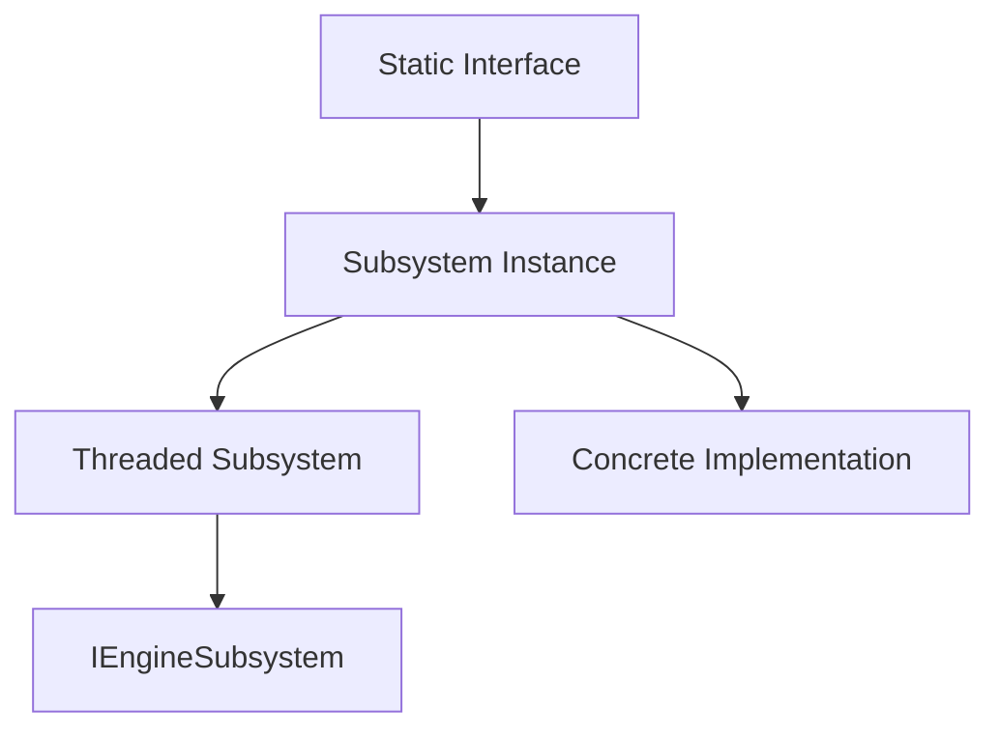

# Engine Subsystem Interfaces Documentation

## Overview

The TKD Engine implements a modular subsystem architecture that provides thread-safe, high-level interfaces for accessing core engine functionality. This architecture separates the internal implementation details from the public API, allowing for clean separation of concerns and easier maintenance.

### Architecture Overview

The subsystem architecture consists of three main layers:

1. **Base Interfaces** (`IEngineSubsystem`): Abstract base classes defining the subsystem lifecycle
2. **Threaded Subsystems** (`FThreadedSubsystem`): Base implementation for threaded subsystems
3. **Concrete Subsystems**: Specific implementations for different engine systems
4. **Static Interfaces**: Public API facades providing thread-safe access



### Key Design Principles

- **Thread Safety**: All interfaces are thread-safe with proper mutex protection
- **Singleton Pattern**: Static interfaces provide global access points
- **RAII Lifecycle**: Proper initialization and shutdown sequences
- **Abstract Interfaces**: Clean separation between interface and implementation
- **Template Metaprogramming**: Type-safe operations with compile-time checks

## Base Subsystem Interface

### IEngineSubsystem

The `IEngineSubsystem` class defines the fundamental interface that all engine subsystems must implement.

#### Class Declaration

```cpp
namespace tkd::__internal {
class IEngineSubsystem {
public:
    virtual ~IEngineSubsystem() = default;

    virtual Bool Initialize(void) = 0;
    virtual void Start(void) = 0;
    virtual void RequestShutdown(void) = 0;
    virtual void Shutdown(void) = 0;
    virtual Bool IsRunning(void) const noexcept = 0;
    virtual Bool IsInitialized(void) const noexcept = 0;
};
}
```

#### Lifecycle Methods

##### `virtual Bool Initialize(void) = 0`

Initializes the subsystem and allocates necessary resources.

**Returns:** `true` if initialization succeeded, `false` otherwise

**Thread Safety:** Must be called from the same thread that will call `Start()`

##### `virtual void Start(void) = 0`

Starts the subsystem's main processing loop.

**Behavior:**
- Transitions the subsystem from initialized to running state
- May spawn threads or begin processing
- Should be non-blocking

##### `virtual void RequestShutdown(void) = 0`

Requests graceful shutdown of the subsystem.

**Behavior:**
- Signals the subsystem to begin shutdown process
- Should be non-blocking
- Allows ongoing operations to complete

##### `virtual void Shutdown(void) = 0`

Forces immediate shutdown and cleanup of resources.

**Behavior:**
- Blocks until all resources are cleaned up
- Joins any running threads
- Releases allocated memory

##### `virtual Bool IsRunning(void) const noexcept = 0`

Checks if the subsystem is currently running.

**Returns:** `true` if running, `false` otherwise

**Thread Safety:** Thread-safe, can be called from any thread

##### `virtual Bool IsInitialized(void) const noexcept = 0`

Checks if the subsystem has been initialized.

**Returns:** `true` if initialized, `false` otherwise

**Thread Safety:** Thread-safe, can be called from any thread

## Threaded Subsystem Base

### FThreadedSubsystem

The `FThreadedSubsystem` provides a base implementation for subsystems that run on dedicated threads.

#### Class Declaration

```cpp
namespace tkd::__internal {
class FThreadedSubsystem : public IEngineSubsystem {
protected:
    TAtomic<bool> m_initialized{ false };
    TAtomic<bool> m_running{ false };
    std::thread m_thread;
    std::mutex m_mutex;
    std::shared_mutex m_dataMutex;
    std::condition_variable m_cv;

protected:
    FThreadedSubsystem(void) = default;

public:
    virtual ~FThreadedSubsystem() override;
    TKD_DISABLE_COPY_MOVE(FThreadedSubsystem)

    virtual Bool Initialize(void) override;
    virtual void Start(void) override;
    virtual void RequestShutdown(void) override;
    virtual void Shutdown(void) override;
    virtual Bool IsRunning(void) const noexcept override;
    virtual Bool IsInitialized(void) const noexcept override;

protected:
    virtual void ThreadLoop(void) = 0;
    template <typename D> bool WaitFor(D duration);
};
}
```

#### Key Features

- **Atomic State Management**: Thread-safe state tracking using atomic variables
- **Dedicated Thread**: Each subsystem runs on its own thread
- **Condition Variables**: Efficient waiting and notification mechanisms
- **Shared Mutex**: Allows multiple readers with exclusive writer access

#### Template Methods

##### `template <typename D> bool WaitFor(D duration)`

Waits for a specified duration or until shutdown is requested.

**Template Parameters:**
- `D`: Duration type (e.g., `std::chrono::milliseconds`)

**Parameters:**
- `duration`: Time to wait

**Returns:** `true` if the wait timed out, `false` if shutdown was requested

**Example:**
```cpp
// Wait for 16ms (60 FPS) or until shutdown
if (!WaitFor(std::chrono::milliseconds(16))) {
    // Shutdown was requested
    return;
}
```

#### Required Implementation

##### `virtual void ThreadLoop(void) = 0`

The main processing loop that runs on the subsystem's thread.

**Implementation Requirements:**
- Should be a loop that processes until shutdown is requested
- Use `WaitFor()` for timing control
- Handle exceptions gracefully
- Clean up resources on exit

**Example:**
```cpp
void MySubsystem::ThreadLoop(void) {
    while (m_running.load(std::memory_order_acquire)) {
        // Process work
        ProcessMessages();

        // Wait for next frame or shutdown
        if (!WaitFor(std::chrono::milliseconds(16))) {
            break; // Shutdown requested
        }
    }
}
```

## Engine Interface

### FEngineInterface

The main entry point for engine lifecycle management.

#### Class Declaration

```cpp
namespace tkd {
class FEngineInterface final {
private:
    static TUniquePtr<__internal::Engine> s_instance;
    static std::mutex s_mutex;

public:
    static bool Initialize(int argc, char* argv[]);
    static void Run(void);
    static bool Shutdown(void);
    static __internal::Engine& GetInstance(void);
    static bool IsRunning(void);
    static bool IsInitialized(void);
    static int GetExitCode(void);
    static void PrintExitMessage(void);
    static void RequestShutdown(void);
};
}
```

#### Primary Methods

##### `static bool Initialize(int argc, char* argv[])`

Initializes the engine with command line arguments.

**Parameters:**
- `argc`: Number of command line arguments
- `argv`: Array of command line argument strings

**Returns:** `true` if initialization succeeded

**Behavior:**
- Parses command line arguments
- Initializes all subsystems
- Sets up logging and configuration

##### `static void Run(void)`

Starts the main engine loop.

**Behavior:**
- Starts all subsystems
- Enters main processing loop
- Blocks until shutdown is requested

##### `static bool Shutdown(void)`

Shuts down the engine and cleans up resources.

**Returns:** `true` if shutdown was clean

**Behavior:**
- Requests shutdown of all subsystems
- Waits for subsystems to terminate
- Releases all resources

#### Status Methods

##### `static bool IsRunning(void)`

Checks if the engine is currently running.

**Returns:** `true` if the main loop is active

##### `static bool IsInitialized(void)`

Checks if the engine has been initialized.

**Returns:** `true` if initialization completed successfully

##### `static int GetExitCode(void)`

Gets the engine's exit code.

**Returns:** Exit code (0 for success, non-zero for errors)

#### Utility Methods

##### `static void PrintExitMessage(void)`

Prints an appropriate exit message based on the exit code.

##### `static void RequestShutdown(void)`

Requests graceful shutdown of the engine.

**Behavior:** Signals the main loop to exit cleanly

## World Interface

### FWorldInterface

Provides thread-safe access to the game world and actor management.

#### Class Declaration

```cpp
namespace tkd {
class FWorldInterface final {
private:
    static std::mutex s_mutex;

private:
    static __internal::FWorldSubsystem* GetWorldSubsystem(void);

public:
    template <typename T = AActor>
    static T* SpawnActor(const FTransform& transform = FTransform());

    template <typename T = AActor>
    static T* SpawnActor(UClass* actorClass, const FTransform& transform = FTransform::Identity);

    template <typename T = AActor>
    static T* SpawnActor(const FString& className, const FTransform& transform = FTransform());

    static std::vector<std::shared_ptr<AActor>> GetActors(void);
    static void DestroyActor(AActor* actor);

    static float GetTime(void);
    static double GetSimulationTime(void);
    static float GetAverageTickTime(void);
    static void SetTargetTickRate(float tickRate);

    template <typename Func>
    static auto WithWorld(Func&& func) -> decltype(func(std::declval<UWorld&>()));
};
}
```

#### Actor Management

##### `template <typename T = AActor> static T* SpawnActor(const FTransform& transform = FTransform())`

Spawns an actor of the specified type in the world.

**Template Parameters:**
- `T`: Actor type (must inherit from `AActor`)

**Parameters:**
- `transform`: Initial transform for the actor

**Returns:** Pointer to the spawned actor, or `nullptr` on failure

**Example:**
```cpp
// Spawn a player character
APlayerCharacter* player = World::SpawnActor<APlayerCharacter>(
    FTransform(FVector3(0, 0, 100))
);

// Spawn with specific class
UClass* enemyClass = UClass::FindClass("AEnemy");
AEnemy* enemy = World::SpawnActor<AEnemy>(enemyClass, transform);
```

##### `static void DestroyActor(AActor* actor)`

Destroys an actor and removes it from the world.

**Parameters:**
- `actor`: Pointer to the actor to destroy

**Behavior:**
- Calls the actor's `EndPlay()` method
- Removes from world's actor list
- Deallocates the actor

#### Query Methods

##### `template <typename T> static std::vector<T*> GetActorsOfClass(void)`

Gets all actors of a specific type.

**Template Parameters:**
- `T`: Actor type to query

**Returns:** Vector of pointers to actors of type T

**Example:**
```cpp
// Get all enemies
auto enemies = World::GetActorsOfClass<AEnemy>();

// Process each enemy
for (AEnemy* enemy : enemies) {
    enemy->TakeDamage(10.0f);
}
```

#### Time Management

##### `static float GetTime(void)`

Gets the current world time in seconds.

**Returns:** World time since startup

##### `static double GetSimulationTime(void)`

Gets the total simulation time.

**Returns:** High-precision simulation time

##### `static void SetTargetTickRate(float tickRate)`

Sets the target tick rate for the world.

**Parameters:**
- `tickRate`: Target ticks per second (0 for variable rate)

#### Thread-Safe World Access

##### `template <typename Func> static auto WithWorld(Func&& func)`

Executes a function with exclusive access to the world.

**Template Parameters:**
- `Func`: Function type that takes `UWorld&`

**Parameters:**
- `func`: Function to execute with world access

**Returns:** Return value of the function

**Example:**
```cpp
// Safe world access
World::WithWorld([](UWorld& world) {
    // Direct world manipulation
    world.SetGravity(FVector3(0, 0, -9.81f));

    // Spawn actors safely
    auto* actor = world.SpawnActor<AActor>();
    actor->SetPosition(FVector3(10, 0, 0));
});
```

## Window Interface

### FWindowInterface

Provides access to window management and rendering (client builds only).

#### Class Declaration

```cpp
namespace tkd {
#if TKD_ENGINE_CLIENT
class FWindowInterface final {
private:
    static std::mutex s_mutex;

private:
    static __internal::FWindowSubsystem* GetWindowSubsystem(void);

public:
    static bool IsOpen(void);
    static FVector2u GetDimensions(void);
    static UInt32 GetWidth(void);
    static UInt32 GetHeight(void);
    static void SetTitle(const FString& title);
    static float GetFPS(void);
    static float GetAverageFrameTime(void);
    static FInputManager* GetInputManager(void);
    static bool IsInitialized(void);
};
#endif
}
```

#### Window Properties

##### `static bool IsOpen(void)`

Checks if the window is currently open.

**Returns:** `true` if the window exists and is open

##### `static FVector2u GetDimensions(void)`

Gets the window dimensions.

**Returns:** Vector containing width and height

##### `static void SetTitle(const FString& title)`

Sets the window title.

**Parameters:**
- `title`: New window title

#### Performance Monitoring

##### `static float GetFPS(void)`

Gets the current frames per second.

**Returns:** Current FPS value

##### `static float GetAverageFrameTime(void)`

Gets the average frame time in milliseconds.

**Returns:** Average time per frame in ms

#### Input Management

##### `static FInputManager* GetInputManager(void)`

Gets the input manager for handling user input.

**Returns:** Pointer to the input manager, or `nullptr` if unavailable

**Example:**
```cpp
// Get input manager
FInputManager* input = Window::GetInputManager();
if (input) {
    // Check for key presses
    if (input->IsKeyPressed(EKey::Space)) {
        // Handle space key
        Jump();
    }
}
```

## Network Interface

### FNetworkInterface

Provides comprehensive network communication capabilities.

#### Class Declaration

```cpp
namespace tkd {
class FNetworkInterface final {
private:
    static std::mutex s_mutex;
    static __internal::FNetworkSubsystem* s_networkSubsystem;

public:
    static void Setup(__internal::FNetworkSubsystem* subsystem);
    static __internal::FNetworkSubsystem* GetSubsystem(void);
    static Bool IsInitialized(void);

    // Data transmission
    static Bool SendData(const std::vector<Byte>& data);
    static Bool SendData(const std::vector<Byte>& data, const FEndpoint& endpoint);
    static Bool SendData(const std::vector<Byte>& data, const std::vector<FEndpoint>& endpoints);

    // Packet transmission
    static Bool SendPacket(const IPacket& packet);
    static Bool SendPacket(const IPacket& packet, UInt32 clientID);
    static Bool SendPacket(const IPacket& packet, const FEndpoint& endpoint);
    static Bool SendPacket(const IPacket& packet, const std::vector<FEndpoint>& endpoints);

    // Reliable transmission
    static Bool SendReliablePacket(const IPacket& packet);
    static Bool SendReliablePacket(const IPacket& packet, UInt32 clientID);
    static Bool SendReliablePacket(const IPacket& packet, const FEndpoint& endpoint);
    static Bool SendReliablePacket(const IPacket& packet, const std::vector<FEndpoint>& endpoints);

    // Broadcasting
    static Bool BroadcastData(const std::vector<Byte>& data);
    static Bool BroadcastPacket(const IPacket& packet);

    // Connection management
    static Bool Connect(const FString& address, UInt16 port);
    static Bool Connect(const FEndpoint& endpoint);
    static Bool Disconnect(EDisconnectionReason reason = EDisconnectionReason::Unknown);
    static Bool IsConnected(void);
    static Bool IsClient(void);
    static Bool IsServer(void);

    // Client information
    static FConnectionInformation* GetClientInformation(UInt32 clientID);
    static UInt32 GetClientID(void);

    // Statistics
    static FNetworkStatistics GetStatistics(void);

    // RPC processing
    static void ProcessDeferredRPCs(UWorld& world);
};
}
```

#### Data Transmission

##### `static Bool SendData(const std::vector<Byte>& data)`

Sends raw data to all connected clients (server) or to server (client).

**Parameters:**
- `data`: Raw bytes to send

**Returns:** `true` if sent successfully

##### `static Bool SendPacket(const IPacket& packet)`

Sends a packet to all connected clients (server) or to server (client).

**Parameters:**
- `packet`: Packet to send (must implement `IPacket`)

**Returns:** `true` if sent successfully

**Example:**
```cpp
// Create and send a custom packet
FMyPacket packet;
packet.position = playerPosition;
packet.health = playerHealth;

if (Network::SendPacket(packet)) {
    // Packet sent successfully
}
```

#### Reliable Transmission

##### `static Bool SendReliablePacket(const IPacket& packet)`

Sends a packet with guaranteed delivery.

**Parameters:**
- `packet`: Packet to send reliably

**Returns:** `true` if queued for sending

**Note:** Reliable packets are guaranteed to arrive but may have higher latency

#### Connection Management

##### `static Bool Connect(const FString& address, UInt16 port)`

Connects to a remote server.

**Parameters:**
- `address`: Server address (IP or hostname)
- `port`: Server port

**Returns:** `true` if connection initiated successfully

##### `static Bool IsConnected(void)`

Checks if currently connected to a server.

**Returns:** `true` if connected

##### `static Bool IsClient(void)`

Checks if running in client mode.

**Returns:** `true` if in client mode

##### `static Bool IsServer(void)`

Checks if running in server mode.

**Returns:** `true` if in server mode

#### Network Statistics

##### `static FNetworkStatistics GetStatistics(void)`

Gets current network statistics.

**Returns:** Structure containing network metrics

**Statistics Include:**
- Bytes sent/received per second
- Packet loss rate
- Latency information
- Connection count

## Audio Interface

### FAudioInterface

Provides high-level audio management and playback.

#### Class Declaration

```cpp
namespace tkd {
class FAudioInterface final {
private:
    static TUniquePtr<IAudioManager> s_manager;
    static std::mutex s_mutex;

public:
    static Bool Initialize(void);
    static IAudioManager* GetAudioManager(void);
    static void PlaySound(const FilePath& filePath, Float32 volume = 1.0f, Bool loop = false);
};
}
```

#### Audio Playback

##### `static void PlaySound(const FilePath& filePath, Float32 volume = 1.0f, Bool loop = false)`

Plays a sound file.

**Parameters:**
- `filePath`: Path to the audio file
- `volume`: Playback volume (0.0 to 1.0)
- `loop`: Whether to loop the sound

**Example:**
```cpp
// Play background music
Audio::PlaySound("Assets/Audio/BackgroundMusic.ogg", 0.7f, true);

// Play sound effect
Audio::PlaySound("Assets/Audio/Jump.wav", 1.0f, false);
```

##### `static IAudioManager* GetAudioManager(void)`

Gets the underlying audio manager for advanced operations.

**Returns:** Pointer to the audio manager, or `nullptr` if not initialized

**Advanced Usage:**
```cpp
IAudioManager* audioMgr = Audio::GetAudioManager();
if (audioMgr) {
    // Create audio source
    IAudioSource* source = audioMgr->CreateAudioSource();
    source->SetBuffer(soundBuffer);
    source->Play();
}
```

## Usage Examples

### Engine Lifecycle

```cpp
#include <Engine.hpp>

// Initialize engine
int main(int argc, char* argv[]) {
    if (!Engine::Initialize(argc, argv)) {
        Engine::PrintExitMessage();
        return Engine::GetExitCode();
    }

    // Engine is now initialized
    // Subsystems are ready for use

    // Start main loop
    Engine::Run();

    // Cleanup
    if (!Engine::Shutdown()) {
        return 1;
    }

    return 0;
}
```

### World Management

```cpp
#include <Engine/Static/FWorldInterface.hpp>

// Spawn actors
void InitializeGame() {
    // Spawn player
    APlayerCharacter* player = World::SpawnActor<APlayerCharacter>(
        FTransform(FVector3(0, 0, 100))
    );

    // Spawn enemies
    for (int i = 0; i < 5; ++i) {
        AEnemy* enemy = World::SpawnActor<AEnemy>(
            FTransform(FVector3(i * 50, 0, 0))
        );
    }
}

// Update game logic
void UpdateGame(float deltaTime) {
    // Get all enemies
    auto enemies = World::GetActorsOfClass<AEnemy>();

    // Update enemy AI
    for (AEnemy* enemy : enemies) {
        enemy->UpdateAI(deltaTime);
    }
}
```

### Network Communication

```cpp
#include <Engine/Static/FNetworkInterface.hpp>

// Server: Broadcast game state
void BroadcastGameState(const FGameState& state) {
    FGameStatePacket packet;
    packet.state = state;
    packet.timestamp = World::GetTime();

    Network::BroadcastPacket(packet);
}

// Client: Send player input
void SendPlayerInput(const FPlayerInput& input) {
    FPlayerInputPacket packet;
    packet.input = input;
    packet.clientID = Network::GetClientID();

    Network::SendReliablePacket(packet);
}

// Handle network events
void ProcessNetworkEvents() {
    // Process deferred RPCs safely
    World::WithWorld([](UWorld& world) {
        Network::ProcessDeferredRPCs(world);
    });
}
```

### Window and Input

```cpp
#include <Engine/Static/FWindowInterface.hpp>

// Initialize window
void SetupWindow() {
    Window::SetTitle("My Game");

    // Get window dimensions
    FVector2u size = Window::GetDimensions();
    std::cout << "Window size: " << size.x << "x" << size.y << std::endl;
}

// Handle input
void ProcessInput() {
    FInputManager* input = Window::GetInputManager();
    if (!input) return;

    // Check keyboard input
    if (input->IsKeyPressed(EKey::W)) {
        MovePlayer(FVector3(0, 1, 0));
    }

    // Check mouse input
    FVector2i mousePos = input->GetMousePosition();
    // Process mouse movement...
}
```

## Performance Considerations

### Thread Safety

- All interface methods are thread-safe
- Use `WithWorld()` for complex world operations
- Avoid long-running operations in callbacks

### Memory Management

- Interfaces use smart pointers internally
- Actors are managed by the world subsystem
- Network packets are copied for transmission

### Optimization Tips

1. **Batch Operations**: Group related operations together
2. **Minimize Cross-Thread Calls**: Cache frequently accessed data
3. **Use Appropriate Transmission**: Choose reliable vs unreliable based on needs
4. **Profile Subsystem Usage**: Monitor performance impact of each subsystem

## Architecture Diagrams

### Subsystem Hierarchy

```
IEngineSubsystem (Abstract Base)
├── Initialize()
├── Start()
├── RequestShutdown()
├── Shutdown()
├── IsRunning()
└── IsInitialized()

FThreadedSubsystem (Threaded Base)
├── ThreadLoop() [Pure Virtual]
├── WaitFor<Duration>()
├── m_thread
├── m_running [Atomic]
├── m_initialized [Atomic]
├── m_dataMutex [Shared]
└── m_cv [Condition Variable]

Concrete Subsystems
├── FWorldSubsystem
│   ├── UWorld management
│   ├── Actor spawning/destruction
│   └── Time management
├── FWindowSubsystem [Client Only]
│   ├── IWindow management
│   ├── IRenderer management
│   └── FInputManager
├── FNetworkSubsystem
│   ├── FNetworkServer/FNetworkClient
│   ├── Packet transmission
│   └── Connection management
└── F*Subsystem (Others)
```

### Interface Layer

```
Static Interfaces (Public API)
├── Engine:: (FEngineInterface)
│   ├── Initialize/Run/Shutdown
│   └── Global engine control
├── World:: (FWorldInterface)
│   ├── SpawnActor/DestroyActor
│   └── World queries
├── Window:: (FWindowInterface) [Client]
│   ├── IsOpen/GetDimensions
│   └── Input management
├── Network:: (FNetworkInterface)
│   ├── SendPacket/BroadcastPacket
│   └── Connection management
└── Audio:: (FAudioInterface)
    ├── PlaySound
    └── Audio manager access
```

### Threading Model

```
Main Thread
├── Engine::Run()
├── User input processing
└── High-level game logic

World Thread (FWorldSubsystem)
├── Actor updates
├── Physics simulation
├── AI processing
└── World state management

Window Thread (FWindowSubsystem) [Client]
├── Window event processing
├── Rendering
├── Input polling
└── FPS calculation

Network Thread (FNetworkSubsystem)
├── Packet transmission/reception
├── Connection management
├── RPC processing
└── Network statistics

Audio Thread (Implied)
├── Sound playback
├── Audio mixing
└── Effect processing
```

## Troubleshooting

### Common Issues

#### Engine Won't Start

**Symptoms:** `Engine::Initialize()` returns `false`

**Possible Causes:**
- Invalid command line arguments
- Missing configuration files
- Subsystem initialization failure

**Solutions:**
```cpp
if (!Engine::Initialize(argc, argv)) {
    std::cerr << "Engine initialization failed" << std::endl;
    Engine::PrintExitMessage();
    return Engine::GetExitCode();
}
```

#### World Operations Fail

**Symptoms:** `World::*` methods return `nullptr` or empty results

**Possible Causes:**
- World subsystem not initialized
- Called during engine shutdown
- Threading issues

**Solutions:**
```cpp
// Check if world is available
if (!World::GetTime() >= 0.0f) { // Time is always valid if initialized
    // World is ready
    auto* actor = World::SpawnActor<AActor>();
}
```

#### Network Connection Issues

**Symptoms:** `Network::Connect()` fails or `Network::IsConnected()` returns `false`

**Possible Causes:**
- Invalid server address/port
- Firewall blocking connections
- Server not running

**Solutions:**
```cpp
if (!Network::Connect("127.0.0.1", 8080)) {
    std::cerr << "Failed to connect to server" << std::endl;
    // Try alternative connection or handle offline mode
}
```

#### Window Not Available

**Symptoms:** Window methods return invalid values or `nullptr`

**Possible Causes:**
- Running in server mode (no window)
- Window subsystem not initialized
- Platform-specific issues

**Solutions:**
```cpp
#if TKD_ENGINE_CLIENT
if (Window::IsInitialized()) {
    // Safe to use window functions
    FVector2u size = Window::GetDimensions();
}
#endif
```

### Debug Information

Enable detailed logging for subsystem operations:

```cpp
// Check subsystem states
std::cout << "Engine running: " << Engine::IsRunning() << std::endl;
std::cout << "World time: " << World::GetTime() << std::endl;
std::cout << "Network connected: " << Network::IsConnected() << std::endl;
#if TKD_ENGINE_CLIENT
std::cout << "Window open: " << Window::IsOpen() << std::endl;
std::cout << "FPS: " << Window::GetFPS() << std::endl;
#endif
```

## Future Enhancements

### Planned Features

1. **Subsystem Plugins**: Dynamic loading of custom subsystems
2. **Performance Monitoring**: Built-in profiling and metrics collection
3. **Configuration Management**: Runtime subsystem reconfiguration
4. **Error Recovery**: Automatic subsystem restart on failures
5. **Cross-Platform Improvements**: Enhanced platform-specific optimizations

### Extension Points

The subsystem architecture supports easy extension:

```cpp
// Custom subsystem
class FMySubsystem : public tkd::__internal::FThreadedSubsystem {
protected:
    void ThreadLoop() override {
        while (m_running.load()) {
            // Custom processing
            ProcessMyData();

            if (!WaitFor(std::chrono::milliseconds(100))) {
                break;
            }
        }
    }
};

// Custom interface
class FMyInterface final {
private:
    static TUniquePtr<FMySubsystem> s_instance;
    static std::mutex s_mutex;

public:
    static bool Initialize() {
        std::lock_guard lock(s_mutex);
        s_instance = std::make_unique<FMySubsystem>();
        return s_instance->Initialize();
    }

    static void DoSomething() {
        std::lock_guard lock(s_mutex);
        if (s_instance) {
            // Access subsystem safely
        }
    }
};
```

---

*This documentation covers the complete subsystem interface architecture as of TKD Engine v1.0.0. The modular design allows for easy extension and maintenance while providing thread-safe access to all engine systems.*
