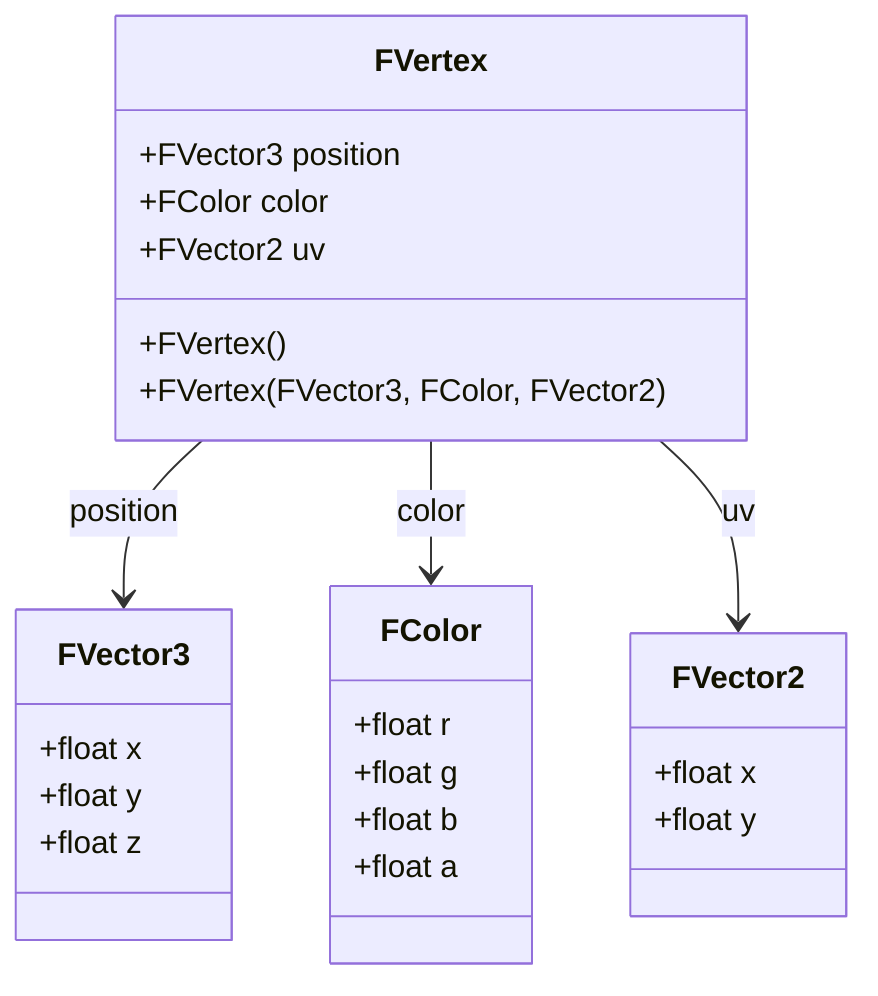

# Vertex

## Overview

In computer graphics and game development, a **vertex** (plural: vertices) represents a point in 3D space that serves as the fundamental building block for rendering geometric shapes. Vertices define the structure of meshes, which are collections of triangles or other polygons that form the visual representation of objects in a 3D scene.

The `FVertex` class in the TKD Engine encapsulates the essential attributes of a vertex required for modern graphics rendering pipelines, including position, color, and texture coordinates.

## Class Description

```cpp
namespace tkd
{
    class FVertex
    {
    public:
        FVector3 position;   // Position of the vertex
        FColor color;        // The color of the vertex
        FVector2 uv;         // Texture coordinates of the vertex

        FVertex(void);
        FVertex(const FVector3& position, const FColor& color = FColor::White, const FVector2& uv = FVector2::Zero);
    };
}
```

### Purpose

The `FVertex` class is designed to:
- Store vertex data in a format compatible with graphics APIs (OpenGL, Vulkan, DirectX)
- Provide a clean interface for creating and manipulating vertex attributes
- Support both colored and textured rendering workflows
- Enable efficient memory layout for GPU vertex buffers

## Member Variables

### position
```cpp
FVector3 position;
```
- **Type**: `FVector3` (alias for `TVector3<float>`)
- **Description**: Represents the 3D position of the vertex in world space or model space
- **Components**: x, y, z (floating-point coordinates)
- **Default Value**: `FVector3::Zero` (0.0f, 0.0f, 0.0f)

### color
```cpp
FColor color;
```
- **Type**: `FColor`
- **Description**: Defines the vertex color for per-vertex coloring or lighting calculations
- **Components**: r, g, b, a (red, green, blue, alpha as Float32 values)
- **Range**: Each component is in the range [0.0, 1.0]
- **Default Value**: `FColor::White` (1.0f, 1.0f, 1.0f, 1.0f)

### uv
```cpp
FVector2 uv;
```
- **Type**: `FVector2` (alias for `TVector2<float>`)
- **Description**: Texture coordinates for mapping 2D textures onto 3D geometry
- **Components**: u, v (horizontal and vertical texture coordinates)
- **Range**: Typically [0.0, 1.0] for normalized texture coordinates, but can extend beyond for advanced techniques
- **Default Value**: `FVector2::Zero` (0.0f, 0.0f)

## Constructors

### Default Constructor
```cpp
FVertex(void);
```
- **Description**: Creates a vertex with default values
- **Initialization**:
  - `position` = `FVector3::Zero`
  - `color` = `FColor::White`
  - `uv` = `FVector2::Zero`

### Parameterized Constructor
```cpp
FVertex(const FVector3& position, const FColor& color = FColor::White, const FVector2& uv = FVector2::Zero);
```
- **Description**: Creates a vertex with specified attributes
- **Parameters**:
  - `position`: The 3D position of the vertex
  - `color`: The color of the vertex (defaults to white if not specified)
  - `uv`: The texture coordinates (defaults to origin if not specified)

## Usage Examples

### Basic Vertex Creation
```cpp
#include <Engine/Core/Math/FVertex.hpp>

// Create a default vertex (origin, white, no texture)
FVertex defaultVertex;

// Create a red vertex at position (1, 2, 3)
FVertex redVertex(FVector3(1.0f, 2.0f, 3.0f), FColor(1.0f, 0.0f, 0.0f, 1.0f));

// Create a textured vertex
FVertex texturedVertex(
    FVector3(0.0f, 1.0f, 0.0f),  // Position
    FColor::White,                // Color
    FVector2(0.5f, 0.5f)          // UV coordinates
);
```

### Creating Triangle Vertices
```cpp
// Define vertices for a simple triangle
std::vector<FVertex> triangleVertices = {
    FVertex(FVector3(-0.5f, -0.5f, 0.0f), FColor::Red,   FVector2(0.0f, 0.0f)),
    FVertex(FVector3( 0.5f, -0.5f, 0.0f), FColor::Green, FVector2(1.0f, 0.0f)),
    FVertex(FVector3( 0.0f,  0.5f, 0.0f), FColor::Blue,  FVector2(0.5f, 1.0f))
};
```

### Modifying Vertex Attributes
```cpp
FVertex vertex;

// Modify position
vertex.position = FVector3(10.0f, 20.0f, 30.0f);

// Change color
vertex.color = FColor(0.5f, 0.5f, 0.5f, 1.0f);  // Gray

// Update texture coordinates
vertex.uv = FVector2(0.25f, 0.75f);
```

## Memory Layout and GPU Compatibility

The `FVertex` class is designed with a memory layout compatible with common graphics APIs:

```
struct VertexBufferLayout {
    float position[3];  // 12 bytes
    float color[4];     // 16 bytes
    float uv[2];        // 8 bytes
    // Total: 36 bytes per vertex
};
```

This layout ensures:
- Proper alignment for GPU vertex attributes
- Compatibility with vertex buffer objects (VBOs)
- Efficient data transfer to graphics hardware

## Integration with Rendering Pipeline

### Vertex Shader Input
In GLSL, the vertex attributes correspond to:

```glsl
layout(location = 0) in vec3 aPosition;
layout(location = 1) in vec4 aColor;
layout(location = 2) in vec2 aTexCoord;

uniform mat4 uModelViewProjection;

out vec4 vColor;
out vec2 vTexCoord;

void main() {
    gl_Position = uModelViewProjection * vec4(aPosition, 1.0);
    vColor = aColor;
    vTexCoord = aTexCoord;
}
```

### Usage in Mesh Classes
```cpp
class Mesh {
private:
    std::vector<FVertex> vertices;
    std::vector<unsigned int> indices;

public:
    void AddVertex(const FVertex& vertex) {
        vertices.push_back(vertex);
    }

    const FVertex* GetVertexData() const {
        return vertices.data();
    }

    size_t GetVertexCount() const {
        return vertices.size();
    }
};
```

## Performance Considerations

- **Memory Alignment**: The class uses 4-byte aligned floating-point types for optimal GPU performance
- **Cache Efficiency**: Sequential access to vertex arrays benefits from CPU cache locality
- **Copy Semantics**: Vertices can be efficiently copied and moved in containers
- **Size Optimization**: Minimal memory footprint (36 bytes per vertex) allows for large mesh data

## Related Classes

- `FVector3`: 3D vector mathematics
- `FVector2`: 2D vector mathematics
- `FColor`: Color representation and operations
- `Mesh`: Container for vertex collections
- `Renderer`: Graphics rendering system

## Diagram: Vertex Structure



## Diagram: Vertex in Triangle

```
Triangle Example:
          C (0.0, 0.5, 0.0)
         / \
        /   \
       /     \
      /       \
     /         \
A (-0.5,-0.5,0.0)-----------B (0.5,-0.5,0.0)

Vertex A: position=(-0.5,-0.5,0), color=Red, uv=(0,0)
Vertex B: position=(0.5,-0.5,0), color=Green, uv=(1,0)
Vertex C: position=(0,0.5,0), color=Blue, uv=(0.5,1)
```

This documentation provides a comprehensive overview of the `FVertex` class, covering its structure, usage, and integration within the TKD Engine's graphics pipeline.
