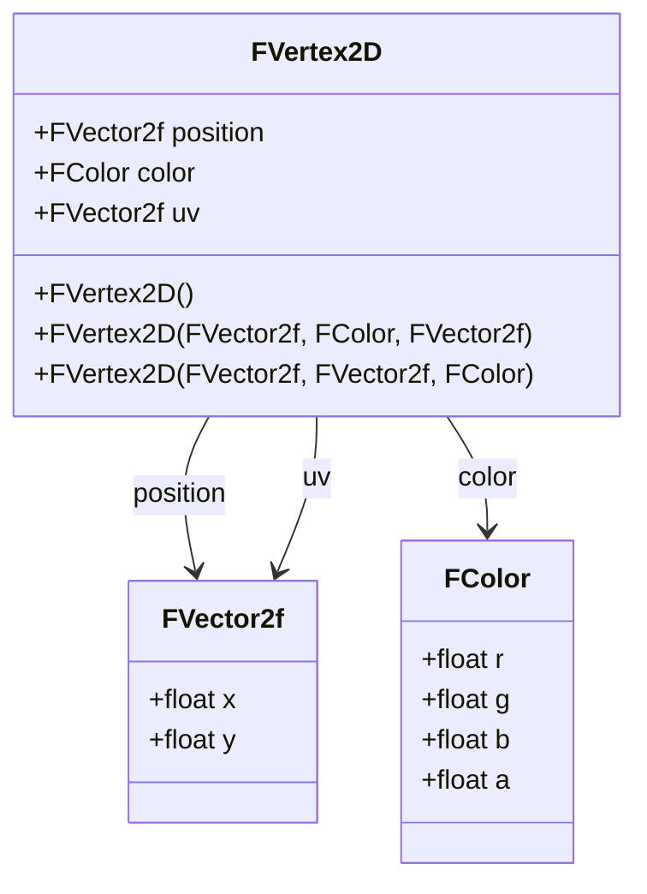

# Vertex2D

## Overview

In 2D computer graphics and game development, a **2D vertex** represents a point in 2D space that forms the foundation for rendering sprites, UI elements, and 2D geometric shapes. Unlike 3D vertices, 2D vertices operate in a plane, making them essential for orthographic projections, user interfaces, and 2D game worlds.

The `FVertex2D` class in the TKD Engine encapsulates the essential attributes of a 2D vertex required for 2D graphics rendering pipelines, including position, color, and texture coordinates.

## Class Description

```cpp
namespace tkd
{
    class FVertex2D
    {
    public:
        FVector2f position;   // Position of the vertex
        FColor color;         // Color of the vertex
        FVector2f uv;         // Texture coordinates of the vertex

        FVertex2D(void);
        FVertex2D(const FVector2f& position, const FColor& color = FColor::White, const FVector2f& uv = FVector2f::Zero);
        FVertex2D(const FVector2f& position, const FVector2f& uv = FVector2f::Zero, const FColor& color = FColor::White);
    };
}
```

### Purpose

The `FVertex2D` class is designed to:
- Store 2D vertex data for sprite rendering and UI elements
- Provide a clean interface for creating and manipulating 2D vertex attributes
- Support both colored and textured 2D rendering workflows
- Enable efficient memory layout for GPU vertex buffers in 2D contexts
- Facilitate orthographic rendering and screen-space operations

## Member Variables

### position
```cpp
FVector2f position;
```
- **Type**: `FVector2f` (alias for `TVector2<float>`)
- **Description**: Represents the 2D position of the vertex in screen space or world space
- **Components**: x, y (floating-point coordinates)
- **Default Value**: `FVector2f::Zero` (0.0f, 0.0f)

### color
```cpp
FColor color;
```
- **Type**: `FColor`
- **Description**: Defines the vertex color for per-vertex coloring or tinting in 2D rendering
- **Components**: r, g, b, a (red, green, blue, alpha as Float32 values)
- **Range**: Each component is in the range [0.0, 1.0]
- **Default Value**: `FColor::White` (1.0f, 1.0f, 1.0f, 1.0f)

### uv
```cpp
FVector2f uv;
```
- **Type**: `FVector2f` (alias for `TVector2<float>`)
- **Description**: Texture coordinates for mapping 2D textures onto 2D geometry
- **Components**: u, v (horizontal and vertical texture coordinates)
- **Range**: Typically [0.0, 1.0] for normalized texture coordinates
- **Default Value**: `FVector2f::Zero` (0.0f, 0.0f)

## Constructors

### Default Constructor
```cpp
FVertex2D(void);
```
- **Description**: Creates a 2D vertex with default values
- **Initialization**:
  - `position` = `FVector2f::Zero`
  - `color` = `FColor::White`
  - `uv` = `FVector2f::Zero`

### Parameterized Constructor (Color First)
```cpp
FVertex2D(const FVector2f& position, const FColor& color = FColor::White, const FVector2f& uv = FVector2f::Zero);
```
- **Description**: Creates a 2D vertex with position, color, and optional UV coordinates
- **Parameters**:
  - `position`: The 2D position of the vertex
  - `color`: The color of the vertex (defaults to white if not specified)
  - `uv`: The texture coordinates (defaults to origin if not specified)

### Parameterized Constructor (UV First)
```cpp
FVertex2D(const FVector2f& position, const FVector2f& uv = FVector2f::Zero, const FColor& color = FColor::White);
```
- **Description**: Creates a 2D vertex with position, UV coordinates, and optional color
- **Parameters**:
  - `position`: The 2D position of the vertex
  - `uv`: The texture coordinates (defaults to origin if not specified)
  - `color`: The color of the vertex (defaults to white if not specified)
- **Note**: This constructor prioritizes UV coordinates, useful for texture-focused workflows

## Usage Examples

### Basic 2D Vertex Creation
```cpp
#include <Engine/Core/Math/FVertex2D.hpp>

// Create a default vertex (origin, white, no texture)
FVertex2D defaultVertex;

// Create a red vertex at position (100, 200)
FVertex2D redVertex(FVector2f(100.0f, 200.0f), FColor(1.0f, 0.0f, 0.0f, 1.0f));

// Create a textured vertex
FVertex2D texturedVertex(
    FVector2f(50.0f, 75.0f),     // Position
    FVector2f(0.5f, 0.5f),       // UV coordinates
    FColor::White                // Color
);
```

### Creating Quad Vertices
```cpp
// Define vertices for a 2D quad (rectangle)
std::vector<FVertex2D> quadVertices = {
    // Bottom-left
    FVertex2D(FVector2f(0.0f, 0.0f), FVector2f(0.0f, 0.0f), FColor::White),
    // Bottom-right
    FVertex2D(FVector2f(100.0f, 0.0f), FVector2f(1.0f, 0.0f), FColor::White),
    // Top-right
    FVertex2D(FVector2f(100.0f, 100.0f), FVector2f(1.0f, 1.0f), FColor::White),
    // Top-left
    FVertex2D(FVector2f(0.0f, 100.0f), FVector2f(0.0f, 1.0f), FColor::White)
};
```

### Sprite Rendering Setup
```cpp
// Create vertices for a sprite with custom tint
FColor spriteTint(0.8f, 0.8f, 1.0f, 1.0f);  // Light blue tint

FVertex2D spriteVertices[4] = {
    FVertex2D(FVector2f(0.0f, 0.0f), FVector2f(0.0f, 0.0f), spriteTint),
    FVertex2D(FVector2f(64.0f, 0.0f), FVector2f(1.0f, 0.0f), spriteTint),
    FVertex2D(FVector2f(64.0f, 64.0f), FVector2f(1.0f, 1.0f), spriteTint),
    FVertex2D(FVector2f(0.0f, 64.0f), FVector2f(0.0f, 1.0f), spriteTint)
};
```

### Modifying Vertex Attributes
```cpp
FVertex2D vertex;

// Modify position
vertex.position = FVector2f(320.0f, 240.0f);  // Center of 640x480 screen

// Change color for highlighting
vertex.color = FColor(1.0f, 1.0f, 0.0f, 1.0f);  // Yellow

// Update texture coordinates for animation
vertex.uv = FVector2f(0.25f, 0.75f);  // Specific frame in sprite sheet
```

## Memory Layout and GPU Compatibility

The `FVertex2D` class maintains a memory layout optimized for 2D graphics APIs:

```
struct Vertex2DBufferLayout {
    float position[2];  // 8 bytes
    float color[4];     // 16 bytes
    float uv[2];        // 8 bytes
    // Total: 32 bytes per vertex
};
```

This layout ensures:
- Proper alignment for 2D GPU vertex attributes
- Compatibility with vertex buffer objects for 2D rendering
- Efficient data transfer for UI and sprite rendering

## Integration with 2D Rendering Pipeline

### 2D Vertex Shader Input
In GLSL for 2D rendering, the vertex attributes correspond to:

```glsl
layout(location = 0) in vec2 aPosition;
layout(location = 1) in vec4 aColor;
layout(location = 2) in vec2 aTexCoord;

uniform mat4 uProjection;  // Orthographic projection matrix

out vec4 vColor;
out vec2 vTexCoord;

void main() {
    gl_Position = uProjection * vec4(aPosition, 0.0, 1.0);
    vColor = aColor;
    vTexCoord = aTexCoord;
}
```

### Usage in Sprite Classes
```cpp
class Sprite {
private:
    std::vector<FVertex2D> vertices;
    FVector2f size;

public:
    Sprite(const FVector2f& size) : size(size) {
        // Initialize quad vertices
        vertices = {
            FVertex2D(FVector2f(0.0f, 0.0f), FVector2f(0.0f, 0.0f)),
            FVertex2D(FVector2f(size.x, 0.0f), FVector2f(1.0f, 0.0f)),
            FVertex2D(FVector2f(size.x, size.y), FVector2f(1.0f, 1.0f)),
            FVertex2D(FVector2f(0.0f, size.y), FVector2f(0.0f, 1.0f))
        };
    }

    void SetTint(const FColor& tint) {
        for (auto& vertex : vertices) {
            vertex.color = tint;
        }
    }

    const FVertex2D* GetVertexData() const {
        return vertices.data();
    }
};
```

## Performance Considerations

- **Memory Efficiency**: Compact 32-byte structure optimized for 2D workloads
- **Cache Friendly**: Sequential vertex processing benefits from CPU cache locality
- **Constructor Flexibility**: Multiple constructors for different initialization patterns
- **GPU Alignment**: Proper alignment for efficient GPU memory transfers
- **2D Optimization**: Reduced memory footprint compared to 3D vertices for UI-heavy applications

## Coordinate System Considerations

In 2D rendering:
- **Origin**: Typically bottom-left (0,0) for screen coordinates
- **Positive Y**: Usually points upward (unlike some graphics APIs)
- **Units**: Often pixels or normalized device coordinates
- **Projection**: Orthographic projection for 2D games and UI

## Related Classes

- `FVector2f`: 2D vector mathematics
- `FColor`: Color representation and operations
- `FVertex`: 3D vertex counterpart
- `Sprite`: 2D sprite rendering class
- `UIElement`: User interface components
- `Renderer2D`: 2D graphics rendering system

## Diagram: FVertex2D Class Structure



## Diagram: 2D Quad with Vertices

```
2D Quad Example (100x100 pixels):
(0,100)     C-----------D (100,100)
            |           |
            |           |
            |           |
            |           |
(0,0)       A-----------B (100,0)

Vertex A: position=(0,0), uv=(0,0), color=White
Vertex B: position=(100,0), uv=(1,0), color=White
Vertex C: position=(0,100), uv=(0,1), color=White
Vertex D: position=(100,100), uv=(1,1), color=White

Rendering Order: A, B, D, D, C, A (two triangles)
```

## Comparison with FVertex

| Aspect | FVertex2D | FVertex |
|--------|-----------|---------|
| Dimensions | 2D (x,y) | 3D (x,y,z) |
| Memory Size | 32 bytes | 36 bytes |
| Use Case | Sprites, UI, 2D games | 3D models, meshes |
| Projection | Orthographic | Perspective |
| Z-Coordinate | N/A | Required |

This documentation provides a comprehensive overview of the `FVertex2D` class, covering its structure, usage, and integration within the TKD Engine's 2D graphics pipeline.
