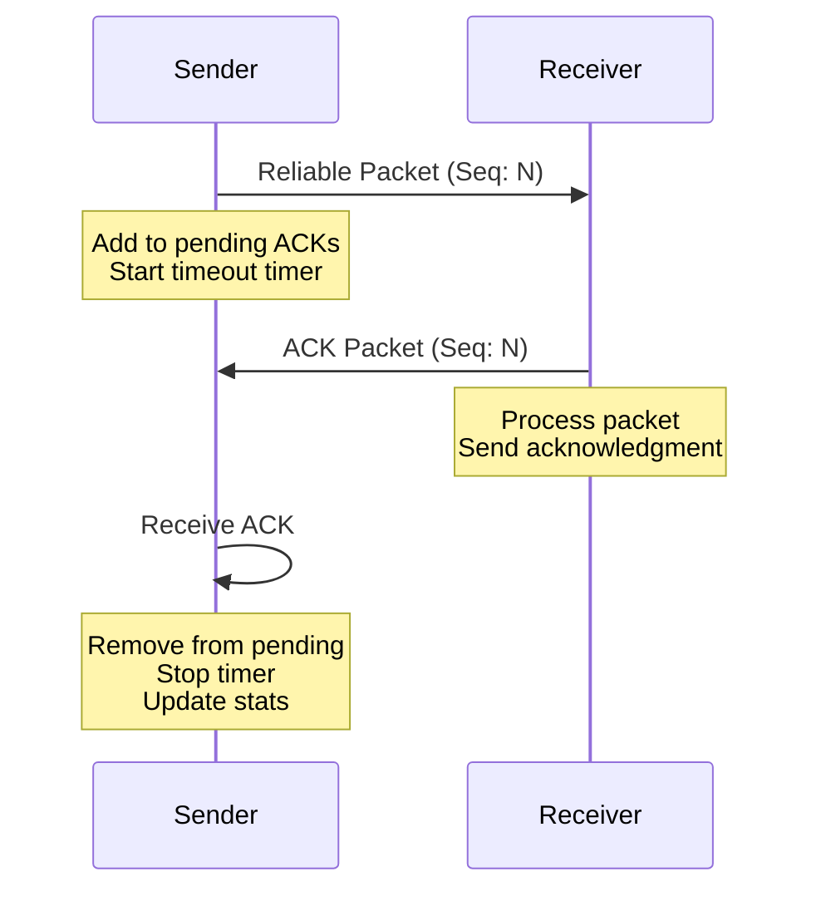

# Acknowledgment Packet

## Overview

In network programming, particularly for real-time applications like multiplayer games, reliable data transmission over unreliable protocols (such as UDP) requires acknowledgment mechanisms. The **Acknowledgment packet** (`Acknowledgment`) is a fundamental component of the TKD Engine's reliable networking system, implementing the ACK (acknowledgment) part of reliable UDP communication.

The acknowledgment packet serves as a confirmation that a previously sent packet has been successfully received by the remote endpoint. This enables the implementation of reliable packet delivery, congestion control, and flow control in the network layer.

## Purpose

The `Acknowledgment` packet is designed to:
- Confirm receipt of reliable packets
- Enable timeout and retransmission mechanisms
- Support sequence number validation
- Maintain connection reliability over UDP
- Provide feedback for network statistics and debugging

## Class Description

```cpp
namespace tkd::Packets
{
    class Acknowledgment : public TPacket<Acknowledgment>
    {
    public:
        UInt32 ackedSequenceNumber = 0;   // Sequence number being acknowledged

        bool Serialize(FBinaryWriter& writer) const override;
        bool Deserialize(FBinaryReader& reader) override;
        SizeT GetSize(void) const override;
    };
}
```

### Inheritance Hierarchy

```
IPacket (abstract interface)
├── TPacket<Acknowledgment> (template base)
    └── Acknowledgment (concrete implementation)
```

The `Acknowledgment` class inherits from `TPacket<Acknowledgment>`, which provides:
- Automatic type ID assignment
- Static type retrieval
- Base packet interface compliance

## Member Variables

### ackedSequenceNumber
```cpp
UInt32 ackedSequenceNumber = 0;
```
- **Type**: `UInt32` (32-bit unsigned integer)
- **Description**: The sequence number of the packet being acknowledged
- **Range**: 0 to 4,294,967,295 (full UInt32 range)
- **Default Value**: 0
- **Usage**: Matches the sequence number of the original reliable packet

## Methods

### Serialize
```cpp
bool Serialize(FBinaryWriter& writer) const override;
```
- **Description**: Serializes the acknowledgment packet data into a binary writer
- **Parameters**:
  - `writer`: Reference to `FBinaryWriter` for output serialization
- **Returns**: `true` if serialization succeeds, `false` otherwise
- **Implementation**: Writes the `ackedSequenceNumber` to the binary stream

### Deserialize
```cpp
bool Deserialize(FBinaryReader& reader) override;
```
- **Description**: Deserializes the acknowledgment packet data from a binary reader
- **Parameters**:
  - `reader`: Reference to `FBinaryReader` for input deserialization
- **Returns**: `true` if deserialization succeeds, `false` otherwise
- **Implementation**: Reads the `ackedSequenceNumber` from the binary stream

### GetSize
```cpp
SizeT GetSize(void) const override;
```
- **Description**: Returns the size of the packet in bytes
- **Returns**: Size in bytes (constant value)
- **Implementation**: Returns `sizeof(ackedSequenceNumber)` = 4 bytes

## Packet Structure

The acknowledgment packet has a simple binary structure:

```
┌─────────────────┬──────────────────────┐
│ Packet Header   │ Acknowledgment Data  │
├─────────────────┼──────────────────────┤
│ Type ID (2B)    │ Sequence Number (4B) │
│ Sequence (4B)   │                      │
│ Timestamp (4B)  │                      │
│ Size (2B)       │                      │
└─────────────────┴──────────────────────┘
```

- **Total Size**: 16 bytes (header) + 4 bytes (data) = 20 bytes
- **Header**: Standard `FPacketHeader` structure
- **Data**: Single `UInt32` value

## Usage in Reliable Communication

### Reliable Packet Flow

```
Sender                              Receiver
  │                                     │
  │  1. Send Reliable Packet (Seq: 42) │
  │ ───────────────────────────────────► │
  │                                     │
  │                                     │ 2. Process Packet
  │                                     │
  │                                     │ 3. Send ACK (Seq: 42)
  │ ◄─────────────────────────────────── │
  │                                     │
  │ 4. Receive ACK, Remove from Pending│
  │                                     │
```

### Timeout and Retransmission

```
Sender                              Receiver
  │                                     │
  │ 1. Send Reliable Packet (Seq: 42)  │
  │ ───────────────────────────────────► │
  │                                     │
  │ 2. Start ACK Timeout Timer          │
  │                                     │
  │  ... Timeout Expires ...            │
  │                                     │
  │ 3. Retransmit Packet (Seq: 42)     │
  │ ───────────────────────────────────► │
  │                                     │
  │                                     │ 4. Send ACK (Seq: 42)
  │ ◄─────────────────────────────────── │
  │                                     │
  │ 5. Receive ACK, Stop Timer          │
  │                                     │
```

## Integration with Network Base

The acknowledgment system is deeply integrated with `FNetworkBase`:

### Pending Acknowledgments
```cpp
std::vector<FAcknowledgment> m_pendingAcks;
```
- Stores reliable packets awaiting acknowledgment
- Each entry contains packet data, header, and destination endpoint
- Cleaned up when ACKs are received

### ACK Timeout
```cpp
static constexpr Float32 ACK_TIMEOUT = 0.5f;  // 500ms
```
- Maximum time to wait for acknowledgment
- Triggers retransmission if exceeded
- Balances responsiveness and network efficiency

### ACK Handler
```cpp
void HandleAcknowledgmentPacket(
    const Packets::Acknowledgment& packet,
    const FEndpoint& endpoint
);
```
- Processes incoming ACK packets
- Removes acknowledged packets from pending list
- Updates network statistics

## Usage Examples

### Creating and Sending Acknowledgments

```cpp
#include <Engine/Network/Packets/Acknowledgment.hpp>

// Create acknowledgment for sequence number 12345
tkd::Packets::Acknowledgment ack;
ack.ackedSequenceNumber = 12345;

// Send to remote endpoint
networkBase.SendPacket(ack, remoteEndpoint);
```

### Handling Acknowledgments

```cpp
// In network packet handler
void OnAcknowledgmentReceived(const Acknowledgment& ack, const FEndpoint& sender) {
    // Log acknowledgment
    FLogger::Debug("Received ACK for sequence {}", ack.ackedSequenceNumber);

    // Update statistics
    m_statistics.acksReceived++;

    // Remove from pending ACKs
    RemovePendingAcknowledgment(ack.ackedSequenceNumber);
}
```

### Reliable Packet Transmission

```cpp
bool SendReliablePacket(const IPacket& packet, const FEndpoint& endpoint) {
    // Assign sequence number
    UInt32 sequenceNumber = GetNextSequenceNumber();

    // Create pending ACK entry
    FAcknowledgment pendingAck;
    pendingAck.header.sequenceNumber = sequenceNumber;
    pendingAck.data = SerializePacket(packet);
    pendingAck.endpoint = endpoint;

    // Add to pending list
    m_pendingAcks.push_back(pendingAck);

    // Send the packet
    SendPacket(packet, endpoint);

    // Start timeout timer
    StartAckTimeout(sequenceNumber);

    return true;
}
```

### ACK Timeout Handling

```cpp
void UpdateAckTimeouts(Float32 deltaTime) {
    for (auto& pendingAck : m_pendingAcks) {
        pendingAck.timeout -= deltaTime;

        if (pendingAck.timeout <= 0.0f) {
            // Retransmit packet
            RetransmitPacket(pendingAck);

            // Reset timeout with backoff
            pendingAck.timeout = ACK_TIMEOUT * 2.0f;

            // Update statistics
            m_statistics.retransmissions++;
        }
    }
}
```

## Network Statistics Integration

Acknowledgments contribute to network monitoring:

```cpp
struct FNetworkStatistics {
    UInt32 packetsSent;
    UInt32 packetsReceived;
    UInt32 acksSent;
    UInt32 acksReceived;
    UInt32 retransmissions;
    Float32 packetLossRate;
    // ... other metrics
};
```

## Performance Considerations

- **Minimal Overhead**: Only 4 bytes of payload data
- **Efficient Processing**: Simple serialization/deserialization
- **Memory Management**: Pending ACKs stored efficiently
- **Timeout Optimization**: Configurable timeout values
- **Congestion Control**: Retransmission backoff prevents network flooding

## Error Handling

### Serialization Failures
- Binary writer/reader errors return `false`
- Network corruption or buffer issues
- Invalid data formats

### Invalid Sequence Numbers
- Out-of-range sequence numbers
- Duplicate or out-of-order ACKs
- Stale acknowledgments

### Timeout Management
- Excessive retransmissions indicate network issues
- Backoff strategies prevent congestion collapse
- Connection timeout vs packet timeout distinction

## Debugging and Monitoring

### Packet Logging
```cpp
// Enable ACK logging
FLogger::SetNamespace("Network");
FLogger::Debug("Sending ACK for sequence {}", ack.ackedSequenceNumber);
FLogger::Debug("Received ACK for sequence {}", ack.ackedSequenceNumber);
```

### Network Debug Visualization
```cpp
// Debug overlay showing pending ACKs
for (const auto& pending : m_pendingAcks) {
    debugRenderer.DrawPendingAck(pending.sequenceNumber, pending.timeout);
}
```

## Related Classes and Systems

- **`FNetworkBase`**: Core network management
- **`TPacket<T>`**: Template base for all packets
- **`IPacket`**: Packet interface definition
- **`FNetworkStatistics`**: Network performance metrics
- **`FEndpoint`**: Network endpoint representation
- **`FBinaryWriter/FBinaryReader`**: Serialization utilities

## Diagram: Reliable UDP Communication Flow



## Diagram: ACK Packet Structure

```
Acknowledgment Packet
├── Packet Header (16 bytes)
│   ├── Type ID: Acknowledgment type
│   ├── Sequence: ACK packet sequence
│   ├── Timestamp: Send time
│   └── Size: 4 bytes
└── Packet Data (4 bytes)
    └── ackedSequenceNumber: UInt32
```

## Best Practices

1. **Sequence Number Management**: Use monotonically increasing sequence numbers
2. **Timeout Tuning**: Adjust ACK_TIMEOUT based on network conditions
3. **Retransmission Limits**: Implement maximum retransmission attempts
4. **Congestion Control**: Use exponential backoff for retransmissions
5. **Statistics Monitoring**: Track ACK rates and retransmission frequencies
6. **Memory Bounds**: Limit pending ACK queue size
7. **Thread Safety**: Ensure ACK handling is thread-safe in multi-threaded environments

This documentation provides a comprehensive overview of the `Acknowledgment` packet system, covering its implementation, usage, and integration within the TKD Engine's reliable networking architecture.
