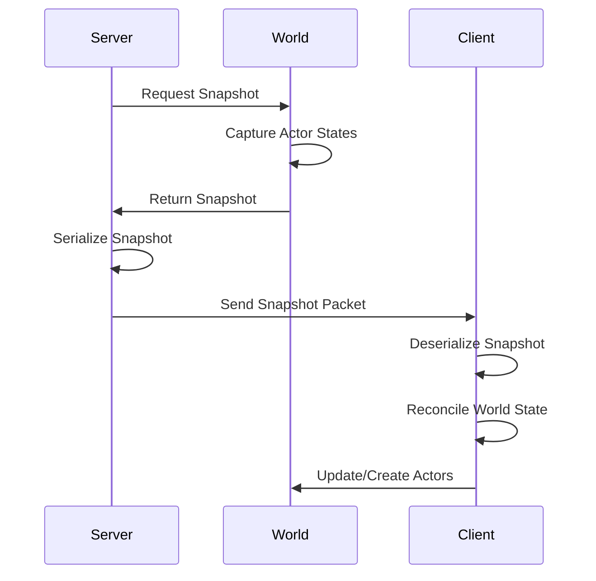

# Snapshot Packet

## Overview

In multiplayer game development, maintaining synchronized game state across all clients and the server is crucial for a consistent player experience. The **Snapshot packet** (`Snapshot`) is a fundamental component of the TKD Engine's state synchronization system, enabling efficient transmission of complete world states for initial client synchronization and periodic state updates.

Snapshots capture the complete state of all relevant actors in a game world at a specific point in time, allowing new clients to join with the current game state and existing clients to reconcile their local state with the authoritative server state.

## Purpose

The `Snapshot` packet is designed to:
- Capture complete world state for synchronization
- Enable seamless client joining with current game state
- Support periodic state reconciliation
- Handle actor spawning and property synchronization
- Provide efficient bulk state transfer
- Maintain consistency across distributed game instances

## Class Description

```cpp
namespace tkd::Packets
{
    class Snapshot : public TPacket<Snapshot>
    {
    public:
        struct ActorState {
            FString className;
            UUID id;
            FTransform transform;
            std::unordered_map<FString, std::vector<Byte>> properties;
            UInt32 owningClientID;
        };

        UInt32 snapshotID = 0;
        std::vector<ActorState> actors;

        Snapshot(void) = default;
        Snapshot(const UWorld& world);

        void SetupFromWorld(const UWorld& world);
        bool Serialize(FBinaryWriter& writer) const override;
        bool Deserialize(FBinaryReader& reader) override;
        SizeT GetSize(void) const override;
    };
}
```

### Inheritance Hierarchy

```
IPacket (abstract interface)
├── TPacket<Snapshot> (template base)
    └── Snapshot (concrete implementation)
```

## Nested Structure: ActorState

The `ActorState` structure encapsulates the complete state of a single actor:

### className
```cpp
FString className;
```
- **Type**: `FString`
- **Description**: The class name of the actor (e.g., "APlayer", "AEnemy")
- **Usage**: Identifies the actor type for instantiation on receiving clients

### id
```cpp
UUID id;
```
- **Type**: `UUID`
- **Description**: Unique identifier for the actor instance
- **Usage**: Matches actors across network peers and prevents duplicates

### transform
```cpp
FTransform transform;
```
- **Type**: `FTransform` (3D transform with position, rotation, scale)
- **Description**: Complete spatial transformation of the actor
- **Components**: Position (FVector3), Rotation (FRotator), Scale (FVector3)
- **Usage**: Places the actor correctly in 3D space

### properties
```cpp
std::unordered_map<FString, std::vector<Byte>> properties;
```
- **Type**: `std::unordered_map<FString, std::vector<Byte>>`
- **Description**: Serialized actor properties (health, ammo, state variables)
- **Key**: Property name (FString)
- **Value**: Serialized property data (binary blob)
- **Usage**: Synchronizes actor-specific state variables

### owningClientID
```cpp
UInt32 owningClientID;
```
- **Type**: `UInt32`
- **Description**: ID of the client that owns/controls this actor
- **Default Value**: 0 (server-owned)
- **Usage**: Determines network authority and prediction rights

## Member Variables

### snapshotID
```cpp
UInt32 snapshotID = 0;
```
- **Type**: `UInt32`
- **Description**: Unique identifier for this snapshot
- **Range**: 0 to 4,294,967,295
- **Usage**: Prevents processing of outdated or duplicate snapshots
- **Increment**: Monotonically increasing per world instance

### actors
```cpp
std::vector<ActorState> actors;
```
- **Type**: `std::vector<ActorState>`
- **Description**: Complete list of all actors in the snapshot
- **Size**: Variable (depends on world complexity)
- **Usage**: Contains all synchronized actors and their states

## Constructors

### Default Constructor
```cpp
Snapshot(void) = default;
```
- **Description**: Creates an empty snapshot with default values
- **Initialization**:
  - `snapshotID` = 0
  - `actors` = empty vector

### World Constructor
```cpp
Snapshot(const UWorld& world);
```
- **Description**: Creates a snapshot by capturing the current world state
- **Parameters**:
  - `world`: Reference to the `UWorld` instance to snapshot
- **Behavior**: Automatically calls `SetupFromWorld(world)`

## Methods

### SetupFromWorld
```cpp
void SetupFromWorld(const UWorld& world);
```
- **Description**: Populates the snapshot with current world state
- **Parameters**:
  - `world`: The world to capture
- **Process**:
  1. Clears existing actors
  2. Iterates through all world actors
  3. Filters active actors only
  4. Captures actor state (class, ID, transform, properties, ownership)
  5. Serializes all actor properties

### Serialize
```cpp
bool Serialize(FBinaryWriter& writer) const override;
```
- **Description**: Serializes the snapshot into binary format
- **Parameters**:
  - `writer`: Binary writer for output
- **Returns**: `true` if successful, `false` otherwise
- **Serialization Order**:
  1. `snapshotID` (4 bytes)
  2. Actor count (4 bytes)
  3. For each actor:
     - `className` (string)
     - `id` (UUID - 16 bytes)
     - `transform` (FTransform)
     - `owningClientID` (4 bytes)
     - Property count (4 bytes)
     - For each property: name (string) + data (bytes)

### Deserialize
```cpp
bool Deserialize(FBinaryReader& reader) override;
```
- **Description**: Deserializes the snapshot from binary format
- **Parameters**:
  - `reader`: Binary reader for input
- **Returns**: `true` if successful, `false` otherwise
- **Error Handling**: Returns `false` on any read failure
- **Validation**: Checks data integrity during deserialization

### GetSize
```cpp
SizeT GetSize(void) const override;
```
- **Description**: Calculates the total serialized size in bytes
- **Returns**: Total packet size
- **Calculation**: Sums sizes of all components including variable-length data

## Packet Structure

```
Snapshot Packet
├── Packet Header (16 bytes)
│   ├── Type ID: Snapshot packet type
│   ├── Sequence: Packet sequence number
│   ├── Timestamp: Send timestamp
│   └── Size: Variable (calculated)
└── Snapshot Data (variable size)
    ├── snapshotID: 4 bytes
    ├── Actor Count: 4 bytes
    └── Actor States (variable)
        ├── Actor 1
        │   ├── className: variable (FString)
        │   ├── id: 16 bytes (UUID)
        │   ├── transform: variable (FTransform)
        │   ├── owningClientID: 4 bytes
        │   ├── Property Count: 4 bytes
        │   └── Properties: variable
        ├── Actor 2
        │   └── ... (same structure)
        └── ... (continues for all actors)
```

## World State Capture Process

### Actor Filtering
```cpp
// Only active actors are included in snapshots
for (const auto& actorPtr : world.GetActors()) {
    if (!actorPtr || !actorPtr->IsActive()) {
        continue;  // Skip inactive/null actors
    }
    // Include actor in snapshot
}
```

### Property Serialization
```cpp
// Serialize all actor properties
const auto& properties = actorPtr->GetProperties();
for (const auto& [propName, propPtr] : properties) {
    if (propPtr == nullptr) continue;
    state.properties[propName] = propPtr->Serialize();
}
```

## Usage Examples

### Creating a World Snapshot
```cpp
#include <Engine/Network/Packets/Snapshot.hpp>

// Capture current world state
UWorld* world = GetCurrentWorld();
Packets::Snapshot snapshot(*world);

// The snapshot now contains all active actors and their states
FLogger::Info("Created snapshot with {} actors", snapshot.actors.size());
```

### Manual Snapshot Creation
```cpp
// Create empty snapshot
Packets::Snapshot snapshot;
snapshot.snapshotID = GetNextSnapshotID();

// Add actors manually
Snapshot::ActorState playerState;
playerState.className = "APlayer";
playerState.id = player->GetUUID();
playerState.transform = player->GetTransform();
playerState.owningClientID = player->GetOwningClientID();

// Serialize player health property
playerState.properties["Health"] = SerializeInt(player->GetHealth());

snapshot.actors.push_back(playerState);
```

### Processing Received Snapshots
```cpp
void OnSnapshotReceived(const Snapshot& snapshot) {
    // Validate snapshot ID (prevent old snapshots)
    if (snapshot.snapshotID <= m_lastProcessedSnapshotID) {
        return;  // Ignore outdated snapshot
    }

    m_lastProcessedSnapshotID = snapshot.snapshotID;

    // Process each actor in the snapshot
    for (const auto& actorState : snapshot.actors) {
        UpdateOrCreateActor(actorState);
    }
}
```

### Actor Reconciliation
```cpp
void UpdateOrCreateActor(const Snapshot::ActorState& state) {
    // Find existing actor
    AActor* existingActor = FindActorByID(state.id);

    if (existingActor) {
        // Update existing actor
        existingActor->SetTransform(state.transform);

        // Update properties
        for (const auto& [propName, propData] : state.properties) {
            existingActor->SetProperty(propName, propData);
        }
    } else {
        // Create new actor
        AActor* newActor = SpawnActor(state.className, state.transform);
        if (newActor) {
            newActor->SetUUID(state.id);
            newActor->SetOwningClientID(state.owningClientID);

            // Set initial properties
            for (const auto& [propName, propData] : state.properties) {
                newActor->SetProperty(propName, propData);
            }
        }
    }
}
```

## Network Transmission Strategies

### Initial Client Synchronization
```cpp
// When a new client joins
void OnClientJoined(UInt32 clientID) {
    // Create full world snapshot
    Packets::Snapshot fullSnapshot(*m_world);
    fullSnapshot.snapshotID = GetNextSnapshotID();

    // Send to new client
    Network::SendReliablePacket(fullSnapshot, clientID);

    // Spawn player for new client
    SpawnPlayerForClient(clientID);
}
```

### Periodic State Updates
```cpp
// Send periodic snapshots for critical state
void SendPeriodicSnapshots(float deltaTime) {
    m_snapshotTimer += deltaTime;

    if (m_snapshotTimer >= SNAPSHOT_INTERVAL) {
        Packets::Snapshot snapshot(*m_world);
        snapshot.snapshotID = GetNextSnapshotID();

        // Send to all clients
        Network::SendPacketToAll(snapshot);

        m_snapshotTimer = 0.0f;
    }
}
```

### Delta Snapshots
```cpp
// Send only changed actors (optimization)
Packets::Snapshot CreateDeltaSnapshot(const Snapshot& lastSnapshot) {
    Packets::Snapshot delta;

    for (const auto& currentActor : m_world->GetActors()) {
        auto lastState = FindActorInSnapshot(lastSnapshot, currentActor->GetUUID());

        if (!lastState || HasActorChanged(currentActor, *lastState)) {
            // Include changed actor in delta
            delta.actors.push_back(CreateActorState(currentActor));
        }
    }

    return delta;
}
```

## Performance Considerations

- **Memory Usage**: Snapshots can be large for complex worlds
- **Bandwidth**: Full snapshots require significant network bandwidth
- **Processing Time**: Serialization/deserialization of large actor lists
- **Frequency**: Balance update rate vs network load
- **Compression**: Consider compressing snapshot data
- **Filtering**: Only include relevant actors in snapshots

### Optimization Strategies
- **Incremental Updates**: Send only changed state
- **Area of Interest**: Limit snapshots to relevant regions
- **Level of Detail**: Reduce precision for distant objects
- **Prioritization**: Send critical actors first
- **Compression**: Use data compression algorithms
- **Chunking**: Split large snapshots into multiple packets

## Error Handling and Validation

### Snapshot Validation
```cpp
bool ValidateSnapshot(const Snapshot& snapshot) {
    // Check snapshot ID validity
    if (snapshot.snapshotID == 0) return false;

    // Validate actor data
    for (const auto& actor : snapshot.actors) {
        if (actor.className.Empty()) return false;
        if (actor.id.IsNil()) return false;
        // Additional validation...
    }

    return true;
}
```

### Deserialization Error Recovery
- **Partial Failures**: Discard entire snapshot on any error
- **Logging**: Log deserialization failures for debugging
- **Fallback**: Use last known good state if available
- **Timeouts**: Handle missing snapshots gracefully

## Security Considerations

### Server Authority
- Only server can create and send snapshots
- Clients cannot modify received snapshots
- Server validates all snapshot data

### Data Integrity
- Use checksums for snapshot validation
- Encrypt sensitive snapshot data
- Rate limit snapshot requests

## Debugging and Monitoring

### Snapshot Statistics
```cpp
struct SnapshotStats {
    UInt32 snapshotsSent;
    UInt32 snapshotsReceived;
    Float32 averageSnapshotSize;
    Float32 averageSerializationTime;
    UInt32 failedDeserializations;
};
```

### Logging
```cpp
// Enable snapshot debug logging
FLogger::SetNamespace("Snapshot");
FLogger::Debug("Sending snapshot {} with {} actors",
              snapshot.snapshotID, snapshot.actors.size());
FLogger::Debug("Processed snapshot {} in {} ms",
              snapshot.snapshotID, processingTime);
```

## Related Classes and Systems

- **`UWorld`**: World state management and snapshot creation
- **`AActor`**: Base class for all game objects
- **`FTransform`**: 3D transformation representation
- **`UProperty`**: Actor property system
- **`FNetworkBase`**: Core networking infrastructure
- **`Replication`**: Alternative state synchronization system

## Diagram: Snapshot Creation and Transmission



## Diagram: Actor State Structure

```
ActorState Structure
├── className: "APlayer" (FString)
├── id: UUID (16 bytes)
├── transform: FTransform
│   ├── position: FVector3
│   ├── rotation: FRotator
│   └── scale: FVector3
├── owningClientID: 12345 (UInt32)
└── properties: Map<FString, Bytes>
    ├── "Health": [100, 0, 0, 0] (int32)
    ├── "Ammo": [30, 0, 0, 0] (int32)
    └── "State": [1] (byte enum)
```

## Best Practices

1. **Snapshot Frequency**: Balance update rate with network capacity
2. **Actor Filtering**: Only include necessary actors in snapshots
3. **Property Selection**: Choose which properties to synchronize
4. **Compression**: Use compression for large snapshots
5. **Validation**: Always validate received snapshots
6. **Error Handling**: Implement robust error recovery
7. **Performance Monitoring**: Track snapshot size and timing
8. **Incremental Updates**: Prefer deltas over full snapshots when possible
9. **Client Prediction**: Use snapshots for reconciliation, not prediction
10. **Authority**: Server remains single source of truth

This documentation provides a comprehensive overview of the Snapshot system, covering its implementation, usage patterns, and integration within the TKD Engine's state synchronization architecture.
