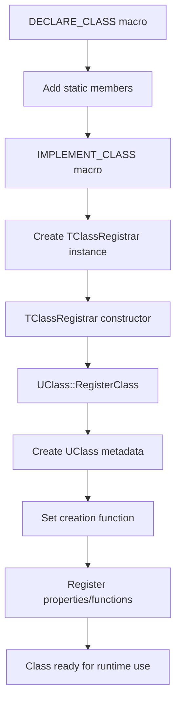

# Class Registrar

## Overview

In game engine development, reflection and runtime type information (RTTI) are essential for features like serialization, networking, scripting integration, and editor tooling. The **Class Registrar** system in the TKD Engine provides a comprehensive solution for automatic class registration, enabling runtime introspection and instantiation of game objects.

The system consists of the `TClassRegistrar` template class, a set of registration macros, and the `UClass` metadata container, working together to create a reflection system that allows classes to be registered at compile-time and queried at runtime.

## Purpose

The Class Registrar system is designed to:
- Enable runtime class instantiation and introspection
- Support inheritance hierarchies and polymorphism
- Provide automatic registration of classes and their members
- Facilitate serialization and deserialization workflows
- Enable editor tooling and debugging features
- Support dynamic object creation from class names
- Maintain type safety while providing reflection capabilities

## Core Components

### TClassRegistrar Template Class

```cpp
namespace tkd
{
    template <typename T>
    class TClassRegistrar
    {
    public:
        TClassRegistrar(const FString& className, UClass* superClass = nullptr);
    };
}
```

The `TClassRegistrar` is a template class that handles the automatic registration of classes during program initialization.

#### Constructor
```cpp
TClassRegistrar(const FString& className, UClass* superClass = nullptr);
```
- **Template Parameter**: `T` - The class type to register
- **Parameters**:
  - `className`: String name of the class
  - `superClass`: Pointer to superclass `UClass` (optional)
- **Behavior**:
  1. Registers the class with `UClass::RegisterClass()`
  2. Creates a temporary instance to register properties
  3. Sets the class as registered
  4. Configures the instance creation function

### UClass Metadata Class

```cpp
namespace tkd
{
    class UClass
    {
    public:
        enum class EDefinitionSource { Class, Super };

        using Definition = std::pair<FString, EDefinitionSource>;
        using DefinitionList = std::vector<Definition>;

        // Core functionality...
    };
}
```

`UClass` serves as the metadata container for registered classes.

#### Member Variables

##### m_name
```cpp
FString m_name;
```
- **Type**: `FString`
- **Description**: The registered name of the class
- **Usage**: Used for class lookup and identification

##### m_super
```cpp
UClass* m_super;
```
- **Type**: `UClass*`
- **Description**: Pointer to the superclass
- **Usage**: Enables inheritance hierarchy traversal

##### m_isRegistered
```cpp
bool m_isRegistered;
```
- **Type**: `bool`
- **Description**: Registration status flag
- **Usage**: Prevents duplicate registration and validates class state

##### m_properties
```cpp
DefinitionList m_properties;
```
- **Type**: `DefinitionList` (vector of `Definition` pairs)
- **Description**: List of property names and their definition sources
- **Usage**: Stores reflection information about class properties

##### m_functions
```cpp
DefinitionList m_functions;
```
- **Type**: `DefinitionList`
- **Description**: List of function names and their definition sources
- **Usage**: Stores reflection information about class functions

##### m_createInstance
```cpp
Creator m_createInstance;
```
- **Type**: `std::function<UObject*(void)>`
- **Description**: Function pointer for creating class instances
- **Usage**: Enables runtime instantiation of registered classes

#### Static Registry
```cpp
static std::unordered_map<FString, std::unique_ptr<UClass>> s_classRegistry;
```
- **Type**: `std::unordered_map<FString, std::unique_ptr<UClass>>`
- **Description**: Global registry of all registered classes
- **Thread Safety**: Not thread-safe (registration typically occurs at startup)

## Registration Macros

### DECLARE_CLASS

```cpp
#define DECLARE_CLASS(ClassName) \
public: static tkd::UClass* StaticClass(void); \
public: virtual tkd::UClass* GetClass(void) const { return StaticClass(); } \
private: static tkd::TClassRegistrar<ClassName> s_classRegistrar;
```

**Placement**: In the class header, inside the class body

**Purpose**: Declares the necessary static members for class registration

**Generated Members**:
- `StaticClass()`: Returns the `UClass` instance for this class
- `GetClass()`: Virtual method returning the class metadata
- `s_classRegistrar`: Static registrar instance

### DECLARE_CLASS_WITH_SUPER

```cpp
#define DECLARE_CLASS_WITH_SUPER(ClassName, SuperClass) \
public: static tkd::UClass* StaticClass(void); \
public: virtual tkd::UClass* GetClass(void) const { return StaticClass(); } \
private: static tkd::TClassRegistrar<ClassName> s_classRegistrar; \
public: using Super = SuperClass;
```

**Placement**: In the class header, inside the class body

**Purpose**: Declares registration members with explicit superclass specification

**Additional Members**:
- `Super`: Type alias for the superclass (enables `Super::Method()` calls)

### IMPLEMENT_CLASS

```cpp
#define IMPLEMENT_CLASS(ClassName) \
    tkd::UClass* ClassName::StaticClass(void) \
    { \
        return tkd::UClass::FindClass(#ClassName); \
    } \
    tkd::TClassRegistrar<ClassName> ClassName::s_classRegistrar( \
        #ClassName, \
        nullptr \
    );
```

**Placement**: In the class implementation (.cpp) file

**Purpose**: Implements the registration for classes without inheritance

**Parameters**:
- `ClassName`: The name of the class to implement

### IMPLEMENT_CLASS_WITH_SUPER

```cpp
#define IMPLEMENT_CLASS_WITH_SUPER(ClassName, SuperClassName) \
    tkd::UClass* ClassName::StaticClass(void) \
    { \
        return tkd::UClass::FindClass(#ClassName); \
    } \
    tkd::TClassRegistrar<ClassName> ClassName::s_classRegistrar( \
        #ClassName, \
        SuperClassName::StaticClass() \
    );
```

**Placement**: In the class implementation (.cpp) file

**Purpose**: Implements registration for classes with inheritance

**Parameters**:
- `ClassName`: The name of the class to implement
- `SuperClassName`: The name of the superclass

### Runtime Registration Macros

#### REGISTER_CLASS

```cpp
#define REGISTER_CLASS(ClassName) \
    tkd::UClass::RegisterClass(#ClassName)->SetCreateFunction<ClassName>()
```

**Purpose**: Manually register a class at runtime

**Use Case**: Classes that need delayed registration or conditional registration

#### REGISTER_CLASS_WITH_SUPER

```cpp
#define REGISTER_CLASS_WITH_SUPER(ClassName, SuperClassName) \
    tkd::UClass::RegisterClass(#ClassName, SuperClassName::StaticClass()) \
        ->SetCreateFunction<ClassName>()
```

**Purpose**: Manually register a class with inheritance at runtime

## Usage Examples

### Basic Class Registration

```cpp
// In AActor.hpp
class AActor : public UObject
{
    DECLARE_CLASS(AActor)
    // ... class members
};

// In AActor.cpp
IMPLEMENT_CLASS(AActor)
```

### Class with Inheritance

```cpp
// In APlayer.hpp
class APlayer : public AActor
{
    DECLARE_CLASS_WITH_SUPER(APlayer, AActor)
    // ... class members
};

// In APlayer.cpp
IMPLEMENT_CLASS_WITH_SUPER(APlayer, AActor)
```

### Runtime Registration

```cpp
// Register a class conditionally
if (enableExperimentalFeature) {
    REGISTER_CLASS(AExperimentalActor);
}
```

### Class Introspection

```cpp
// Get class information
UClass* actorClass = AActor::StaticClass();
FLogger::Info("Class name: {}", actorClass->GetName());

// Check inheritance
if (playerClass->IsChildOf(AActor::StaticClass())) {
    FLogger::Info("APlayer is derived from AActor");
}

// Get all registered classes
auto allClasses = UClass::GetAllClasses();
for (UClass* cls : allClasses) {
    FLogger::Info("Registered class: {}", cls->GetName());
}
```

### Runtime Instantiation

```cpp
// Create instance by class name
UClass* actorClass = UClass::FindClass("APlayer");
if (actorClass) {
    AActor* newActor = static_cast<AActor*>(actorClass->CreateInstance());
    if (newActor) {
        // Use the created actor
        world->AddActor(newActor);
    }
}
```

### Property and Function Registration

```cpp
class APlayer : public AActor
{
    DECLARE_CLASS_WITH_SUPER(APlayer, AActor)

public:
    UPROPERTY()
    int health = 100;

    UPROPERTY()
    FString playerName;

    UFUNCTION()
    void TakeDamage(int damage);
};

// During registration, properties and functions are automatically discovered
// and added to the UClass metadata
```

## UClass Methods

### Instance Management

#### SetCreateFunction
```cpp
template <typename T>
void SetCreateFunction(void);
```
- **Template Parameter**: `T` - The class type
- **Purpose**: Sets the function used to create instances of the class
- **Implementation**: Uses lambda to create new instances with `new T()`

#### CreateInstance
```cpp
UObject* CreateInstance(void) const;
```
- **Returns**: Pointer to new instance or `nullptr` if creation fails
- **Purpose**: Creates a new instance of the registered class
- **Error Handling**: Returns `nullptr` if no creation function is set

### Hierarchy Queries

#### IsChildOf
```cpp
bool IsChildOf(UClass* other) const;
```
- **Parameter**: `other` - The class to check inheritance against
- **Returns**: `true` if this class is derived from `other`
- **Implementation**: Traverses the inheritance chain

### Metadata Access

#### GetName
```cpp
const FString& GetName(void) const;
```
- **Returns**: Reference to the class name string

#### GetSuper
```cpp
const UClass* GetSuper(void) const;
```
- **Returns**: Pointer to superclass or `nullptr`

#### GetProperties
```cpp
const DefinitionList& GetProperties(void) const;
```
- **Returns**: List of property definitions with source information

#### GetFunctions
```cpp
const DefinitionList& GetFunctions(void) const;
```
- **Returns**: List of function definitions with source information

### Registration Management

#### IsRegistered
```cpp
bool IsRegistered(void) const;
```
- **Returns**: Registration status

#### SetRegistered
```cpp
void SetRegistered(bool registered);
```
- **Purpose**: Updates the registration status

#### AddProperty
```cpp
void AddProperty(IProperty* property);
```
- **Purpose**: Adds a property to the class metadata
- **Source**: Marked as `EDefinitionSource::Class`

#### AddFunction
```cpp
void AddFunction(const FString& functionName);
```
- **Purpose**: Adds a function to the class metadata
- **Source**: Marked as `EDefinitionSource::Class`

## Static Registry Methods

### RegisterClass
```cpp
static UClass* RegisterClass(const FString& name, UClass* super = nullptr);
```
- **Purpose**: Registers a new class in the global registry
- **Returns**: Pointer to the registered `UClass`
- **Behavior**: Creates new `UClass` if not exists, inherits properties/functions from superclass

### FindClass
```cpp
static UClass* FindClass(const FString& name);
```
- **Purpose**: Looks up a class by name
- **Returns**: Pointer to `UClass` or `nullptr` if not found

### GetAllClasses
```cpp
static std::vector<UClass*> GetAllClasses(void);
```
- **Returns**: Vector of all registered classes
- **Purpose**: Enumerates the entire class registry

### GetDerivedClasses
```cpp
static std::vector<UClass*> GetDerivedClasses(UClass* baseClass);
```
- **Parameter**: `baseClass` - The base class to find derivatives of
- **Returns**: Vector of classes derived from `baseClass`

### ClearRegistry
```cpp
static void ClearRegistry(void);
```
- **Purpose**: Clears all registered classes
- **Use Case**: Cleanup, testing, or reinitialization

## EDefinitionSource Enumeration

```cpp
enum class EDefinitionSource
{
    Class,   // Defined in the class itself
    Super    // Inherited from the parent class
};
```

- **Class**: Members defined directly in this class
- **Super**: Members inherited from parent classes
- **Purpose**: Distinguishes between owned and inherited class members

## Registration Process Flow

```
Compile Time Registration:
1. DECLARE_CLASS macro adds static members
2. IMPLEMENT_CLASS macro creates registrar instance
3. TClassRegistrar constructor called during static initialization
4. UClass registered in global registry
5. Properties and functions discovered and stored

Runtime Usage:
1. StaticClass() called to get UClass pointer
2. UClass methods used for introspection
3. CreateInstance() used for dynamic creation
4. Inheritance queries via IsChildOf()
```

## Performance Considerations

- **Static Initialization**: Registration occurs at program startup
- **Memory Overhead**: Registry stores metadata for all classes
- **Lookup Performance**: Hash map provides O(1) class lookup
- **Instance Creation**: Template-based creation avoids virtual dispatch
- **Inheritance Traversal**: Cached in registration process

## Error Handling

### Registration Failures
- **Duplicate Classes**: Existing class returned (not an error)
- **Invalid Superclass**: `nullptr` accepted for base classes
- **Memory Allocation**: Exceptions propagated from `std::make_unique`

### Runtime Errors
- **Class Not Found**: `FindClass()` returns `nullptr`
- **Creation Failure**: `CreateInstance()` returns `nullptr`
- **Invalid Casts**: User responsibility for correct casting

## Thread Safety

- **Registration**: Not thread-safe (typically done at startup)
- **Lookup**: Not thread-safe (consider mutex for multi-threaded access)
- **Instance Creation**: Depends on created class thread safety

## Integration with Other Systems

### Property System
```cpp
// Properties automatically registered during class registration
UPROPERTY()
int health = 100;  // Added to UClass property list
```

### Function System
```cpp
// Functions registered via UFUNCTION macro
UFUNCTION()
void TakeDamage(int damage);  // Added to UClass function list
```

### Serialization
```cpp
// UClass used for type-aware serialization
void SerializeObject(UObject* obj) {
    UClass* cls = obj->GetClass();
    for (const auto& [propName, source] : cls->GetProperties()) {
        // Serialize each property...
    }
}
```

### Networking
```cpp
// Class names used for network replication
void ReplicateActor(AActor* actor) {
    FString className = actor->GetClass()->GetName();
    // Send class name and properties...
}
```

## Best Practices

1. **Consistent Naming**: Use clear, descriptive class names
2. **Proper Inheritance**: Always use `DECLARE_CLASS_WITH_SUPER` for derived classes
3. **Property Registration**: Use `UPROPERTY()` for serializable members
4. **Function Registration**: Use `UFUNCTION()` for callable methods
5. **Error Checking**: Always check return values from `FindClass()` and `CreateInstance()`
6. **Memory Management**: Properly manage created instances
7. **Thread Safety**: Avoid concurrent registration/lookup if possible
8. **Documentation**: Document class purposes and relationships

## Common Patterns

### Factory Pattern
```cpp
UObject* CreateObjectByName(const FString& className) {
    UClass* cls = UClass::FindClass(className);
    return cls ? cls->CreateInstance() : nullptr;
}
```

### Type Checking
```cpp
bool IsActor(UObject* obj) {
    return obj && obj->GetClass()->IsChildOf(AActor::StaticClass());
}
```

### Class Iteration
```cpp
void LogAllActors() {
    auto derivedClasses = UClass::GetDerivedClasses(AActor::StaticClass());
    for (UClass* cls : derivedClasses) {
        FLogger::Info("Actor class: {}", cls->GetName());
    }
}
```

## Diagram: Class Registration Flow



## Diagram: Class Hierarchy Example

```
UObject (base)
├── AActor
│   ├── APlayer
│   │   ├── AHumanPlayer
│   │   └── AAIPlayer
│   └── AEnemy
│       ├── AGoblin
│       └── ADragon
└── ULevel
    ├── UGameLevel
    └── UMenuLevel
```

## Troubleshooting

### Common Issues

1. **Class Not Found**: Ensure `IMPLEMENT_CLASS` is in the .cpp file
2. **Inheritance Problems**: Use `DECLARE_CLASS_WITH_SUPER` for derived classes
3. **Static Initialization Order**: Be aware of global initialization order
4. **Memory Leaks**: Properly delete instances created with `CreateInstance()`
5. **Threading Issues**: Protect registry access in multi-threaded environments

### Debug Information

```cpp
// Log class registry contents
void DebugClassRegistry() {
    auto allClasses = UClass::GetAllClasses();
    for (UClass* cls : allClasses) {
        FLogger::Debug("Class: {}, Super: {}",
            cls->GetName(),
            cls ? cls->GetSuper()->GetName() : "None");
    }
}
```

This documentation provides a comprehensive overview of the Class Registrar system, covering its implementation, usage patterns, and integration within the TKD Engine's reflection and object management architecture.
