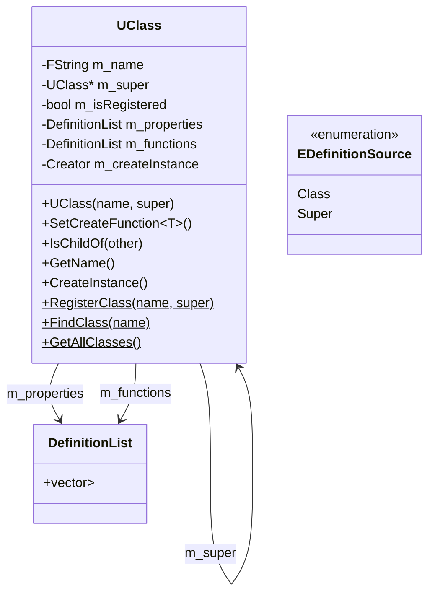

# UClass

## Overview

In object-oriented game engines, runtime type information (RTTI) and reflection are essential for implementing features like serialization, networking, scripting integration, and editor tooling. The **`UClass`** class in the TKD Engine serves as the foundational metadata container for the engine's reflection system, providing a comprehensive representation of classes at runtime.

`UClass` encapsulates all the metadata associated with a registered class, including its name, inheritance hierarchy, properties, functions, and instantiation capabilities. It forms the core of the engine's object system, enabling dynamic class discovery, instantiation, and introspection.

## Purpose

The `UClass` is designed to:
- Store metadata for registered classes
- Enable runtime class instantiation
- Support inheritance hierarchy queries
- Provide access to class properties and functions
- Facilitate serialization and deserialization workflows
- Enable editor tooling and debugging features
- Support dynamic object creation from class names
- Maintain type safety in reflection operations

## Class Definition

```cpp
namespace tkd
{
    class UClass
    {
    public:
        enum class EDefinitionSource { Class, Super };
        using Definition = std::pair<FString, EDefinitionSource>;
        using DefinitionList = std::vector<Definition>;

        // Core functionality...
    };
}
```

### Type Definitions

#### EDefinitionSource Enumeration
```cpp
enum class EDefinitionSource
{
    Class,   // Defined in the class itself
    Super    // Inherited from the parent class
};
```
- **Class**: Members defined directly in this class
- **Super**: Members inherited from parent classes
- **Purpose**: Distinguishes between owned and inherited class members

#### Definition Type Alias
```cpp
using Definition = std::pair<FString, EDefinitionSource>;
```
- **Type**: `std::pair<FString, EDefinitionSource>`
- **Description**: Represents a named definition with its source
- **Usage**: Used for properties and functions lists

#### DefinitionList Type Alias
```cpp
using DefinitionList = std::vector<Definition>;
```
- **Type**: `std::vector<Definition>`
- **Description**: Collection of definitions
- **Usage**: Stores properties and functions with their sources

## Member Variables

### Instance Members

#### m_name
```cpp
FString m_name;
```
- **Type**: `FString`
- **Description**: The registered name of the class
- **Access**: Private member
- **Usage**: Class identification and lookup

#### m_super
```cpp
UClass* m_super;
```
- **Type**: `UClass*`
- **Description**: Pointer to the superclass
- **Access**: Private member
- **Default**: `nullptr` for base classes
- **Usage**: Inheritance hierarchy traversal

#### m_isRegistered
```cpp
bool m_isRegistered;
```
- **Type**: `bool`
- **Description**: Registration status flag
- **Access**: Private member
- **Default**: `false`
- **Usage**: Prevents duplicate operations and validates class state

#### m_properties
```cpp
DefinitionList m_properties;
```
- **Type**: `DefinitionList`
- **Description**: List of property definitions with sources
- **Access**: Private member
- **Usage**: Stores reflection information about class properties
- **Content**: Property names paired with definition sources

#### m_functions
```cpp
DefinitionList m_functions;
```
- **Type**: `DefinitionList`
- **Description**: List of function definitions with sources
- **Access**: Private member
- **Usage**: Stores reflection information about class functions
- **Content**: Function names paired with definition sources

#### m_createInstance
```cpp
Creator m_createInstance;
```
- **Type**: `std::function<UObject*(void)>`
- **Description**: Function object for creating class instances
- **Access**: Private member
- **Default**: Empty function (no creation capability)
- **Usage**: Runtime instantiation of registered classes

### Static Members

#### s_classRegistry
```cpp
static std::unordered_map<FString, std::unique_ptr<UClass>> s_classRegistry;
```
- **Type**: `std::unordered_map<FString, std::unique_ptr<UClass>>`
- **Description**: Global registry of all registered classes
- **Access**: Private static member
- **Thread Safety**: Not thread-safe (registration typically occurs at startup)
- **Ownership**: Manages lifetime of all `UClass` instances

## Constructors

### UClass Constructor
```cpp
UClass(const FString& name, UClass* super = nullptr);
```
- **Parameters**:
  - `name`: The name of the class
  - `super`: Pointer to superclass (optional, defaults to `nullptr`)
- **Initialization**:
  - `m_name` = `name`
  - `m_super` = `super`
  - `m_isRegistered` = `false`
  - Other members default-initialized
- **Usage**: Called during class registration process

## Instance Methods

### Template Methods

#### SetCreateFunction
```cpp
template <typename T>
void SetCreateFunction(void)
```
- **Template Parameter**: `T` - The concrete class type
- **Purpose**: Configures the instance creation function
- **Implementation**: Sets `m_createInstance` to a lambda that creates `new T()`
- **Requirements**: `T` must be default-constructible
- **Usage**: Called during class registration to enable instantiation

### Hierarchy Queries

#### IsChildOf
```cpp
bool IsChildOf(UClass* other) const;
```
- **Parameter**: `other` - The class to check inheritance against
- **Returns**: `true` if this class is derived from `other`, `false` otherwise
- **Implementation**: Traverses the inheritance chain using `m_super`
- **Algorithm**:
  ```cpp
  const UClass* current = this;
  while (current) {
      if (current == other) return true;
      current = current->m_super;
  }
  return false;
  ```
- **Edge Cases**: Returns `false` if `other` is `nullptr`

### Metadata Accessors

#### GetName
```cpp
const FString& GetName(void) const;
```
- **Returns**: Constant reference to `m_name`
- **Purpose**: Retrieve the class name

#### IsRegistered
```cpp
bool IsRegistered(void) const;
```
- **Returns**: Value of `m_isRegistered`
- **Purpose**: Check registration status

#### SetRegistered
```cpp
void SetRegistered(bool registered);
```
- **Parameter**: `registered` - New registration status
- **Purpose**: Update the registration flag
- **Usage**: Called by the registration system

#### GetSuper
```cpp
const UClass* GetSuper(void) const;
```
- **Returns**: Pointer to superclass or `nullptr`
- **Purpose**: Access inheritance information

#### GetProperties
```cpp
const DefinitionList& GetProperties(void) const;
```
- **Returns**: Constant reference to `m_properties`
- **Purpose**: Access property definitions
- **Content**: Includes both owned and inherited properties

#### GetFunctions
```cpp
const DefinitionList& GetFunctions(void) const;
```
- **Returns**: Constant reference to `m_functions`
- **Purpose**: Access function definitions
- **Content**: Includes both owned and inherited functions

### Instance Management

#### CreateInstance
```cpp
UObject* CreateInstance(void) const;
```
- **Returns**: Pointer to new `UObject` instance or `nullptr`
- **Implementation**: Calls `m_createInstance()` if set
- **Error Handling**: Returns `nullptr` if no creation function is configured
- **Memory Management**: Caller responsible for deletion
- **Type Safety**: Returns base `UObject*`, requires casting

### Metadata Modification

#### AddProperty
```cpp
void AddProperty(IProperty* property);
```
- **Parameter**: `property` - Pointer to property to add
- **Behavior**: Adds property name with `EDefinitionSource::Class`
- **Validation**: Ignores `nullptr` properties
- **Implementation**:
  ```cpp
  if (property) {
      m_properties.push_back(
          std::make_pair(property->GetName(), EDefinitionSource::Class)
      );
  }
  ```

#### AddFunction
```cpp
void AddFunction(const FString& functionName);
```
- **Parameter**: `functionName` - Name of function to add
- **Behavior**: Adds function name with `EDefinitionSource::Class`
- **Validation**: Ignores empty function names
- **Implementation**:
  ```cpp
  if (!functionName.IsEmpty()) {
      m_functions.push_back(
          std::make_pair(functionName, EDefinitionSource::Class)
      );
  }
  ```

## Static Methods

### Registry Management

#### RegisterClass
```cpp
static UClass* RegisterClass(const FString& name, UClass* super = nullptr);
```
- **Parameters**:
  - `name`: Class name to register
  - `super`: Superclass pointer (optional)
- **Returns**: Pointer to registered `UClass`
- **Behavior**:
  1. Checks if class already exists in registry
  2. Returns existing class if found
  3. Creates new `UClass` instance
  4. Registers in `s_classRegistry`
  5. Inherits properties and functions from superclass
- **Inheritance Logic**: Copies definitions from registered superclasses
- **Thread Safety**: Not thread-safe

#### FindClass
```cpp
static UClass* FindClass(const FString& name);
```
- **Parameter**: `name` - Class name to find
- **Returns**: Pointer to `UClass` or `nullptr`
- **Implementation**: Hash map lookup in `s_classRegistry`
- **Complexity**: O(1) average case

#### GetAllClasses
```cpp
static std::vector<UClass*> GetAllClasses(void);
```
- **Returns**: Vector of all registered classes
- **Implementation**: Iterates through `s_classRegistry`
- **Order**: Unspecified (hash map iteration order)
- **Usage**: Class enumeration, debugging, tooling

#### GetDerivedClasses
```cpp
static std::vector<UClass*> GetDerivedClasses(UClass* baseClass);
```
- **Parameter**: `baseClass` - Base class to find derivatives of
- **Returns**: Vector of classes derived from `baseClass`
- **Implementation**: Iterates registry, uses `IsChildOf()` for each class
- **Filtering**: Excludes `baseClass` itself from results
- **Edge Cases**: Returns empty vector if `baseClass` is `nullptr`

#### ClearRegistry
```cpp
static void ClearRegistry(void);
```
- **Purpose**: Clear all registered classes
- **Implementation**: Calls `s_classRegistry.clear()`
- **Use Cases**: Cleanup, testing, reinitialization
- **Warning**: Invalidates all existing `UClass` pointers

## Usage Examples

### Basic Class Registration and Usage
```cpp
// Register a class
UClass* actorClass = UClass::RegisterClass("AActor");
actorClass->SetCreateFunction<AActor>();

// Find and use the class
UClass* foundClass = UClass::FindClass("AActor");
if (foundClass) {
    // Create instance
    UObject* instance = foundClass->CreateInstance();
    AActor* actor = static_cast<AActor*>(instance);

    // Query metadata
    FLogger::Info("Class: {}", foundClass->GetName());
}
```

### Inheritance Queries
```cpp
// Check inheritance
UClass* playerClass = UClass::FindClass("APlayer");
UClass* actorClass = UClass::FindClass("AActor");

if (playerClass && actorClass) {
    if (playerClass->IsChildOf(actorClass)) {
        FLogger::Info("APlayer is derived from AActor");
    }
}
```

### Class Enumeration
```cpp
// Get all registered classes
auto allClasses = UClass::GetAllClasses();
for (UClass* cls : allClasses) {
    FLogger::Info("Registered class: {}", cls->GetName());
}

// Get classes derived from AActor
UClass* actorBase = UClass::FindClass("AActor");
auto derivedClasses = UClass::GetDerivedClasses(actorBase);
for (UClass* cls : derivedClasses) {
    FLogger::Info("Actor subclass: {}", cls->GetName());
}
```

### Property and Function Inspection
```cpp
UClass* playerClass = UClass::FindClass("APlayer");
if (playerClass) {
    // Inspect properties
    const auto& properties = playerClass->GetProperties();
    for (const auto& [propName, source] : properties) {
        FString sourceStr = (source == UClass::EDefinitionSource::Class) ?
                           "own" : "inherited";
        FLogger::Info("Property: {} ({})", propName, sourceStr);
    }

    // Inspect functions
    const auto& functions = playerClass->GetFunctions();
    for (const auto& [funcName, source] : functions) {
        FLogger::Info("Function: {}", funcName);
    }
}
```

### Dynamic Object Creation
```cpp
// Factory function using UClass
UObject* CreateObjectByName(const FString& className) {
    UClass* cls = UClass::FindClass(className);
    if (!cls) {
        FLogger::Error("Class '{}' not found", className);
        return nullptr;
    }

    UObject* instance = cls->CreateInstance();
    if (!instance) {
        FLogger::Error("Failed to create instance of '{}'", className);
        return nullptr;
    }

    return instance;
}

// Usage
AActor* player = static_cast<AActor*>(
    CreateObjectByName("APlayer")
);
```

## Inheritance and Property Propagation

### Superclass Property Inheritance
When a class is registered with a superclass, the system automatically copies property and function definitions:

```cpp
// During RegisterClass, if superclass exists and is registered:
const UClass* superClass = classPtr->GetSuper();
while (superClass && superClass->IsRegistered()) {
    // Copy properties from superclass
    for (const auto& [propName, source] : superClass->GetProperties()) {
        if (source == EDefinitionSource::Super) continue;
        classPtr->m_properties.push_back(
            std::make_pair(propName, EDefinitionSource::Super)
        );
    }
    // Similar for functions...
    superClass = superClass->GetSuper();
}
```

### Definition Source Tracking
- **Class**: Properties/functions defined in the current class
- **Super**: Properties/functions inherited from parent classes
- **Purpose**: Enables distinction between owned and inherited members

## Performance Characteristics

### Time Complexity
- **FindClass**: O(1) average case (hash map lookup)
- **RegisterClass**: O(1) for registration + O(depth) for inheritance copying
- **IsChildOf**: O(depth) where depth is inheritance hierarchy depth
- **GetAllClasses**: O(n) where n is number of registered classes
- **GetDerivedClasses**: O(n × depth) in worst case

### Space Complexity
- **Per Class**: O(properties + functions) storage
- **Registry**: O(classes) storage
- **Inheritance**: Properties/functions stored in each derived class

### Memory Management
- **Ownership**: Registry owns all `UClass` instances
- **Lifetime**: Classes exist for program duration
- **Cleanup**: `ClearRegistry()` for testing/reinitialization

## Thread Safety Considerations

### Current Limitations
- **Registration**: Not thread-safe (use during initialization)
- **Lookup**: Not thread-safe (consider external synchronization)
- **Modification**: Instance methods not thread-safe

### Recommended Practices
```cpp
// Thread-safe lookup with mutex
std::mutex classRegistryMutex;
UClass* ThreadSafeFindClass(const FString& name) {
    std::lock_guard<std::mutex> lock(classRegistryMutex);
    return UClass::FindClass(name);
}
```

## Error Handling

### Common Error Conditions
- **Class Not Found**: `FindClass()` returns `nullptr`
- **Creation Failure**: `CreateInstance()` returns `nullptr`
- **Invalid Parameters**: Methods handle `nullptr` inputs gracefully
- **Registration Conflicts**: Duplicate names return existing class

### Validation Checks
```cpp
UClass* SafeFindClass(const FString& name) {
    if (name.IsEmpty()) {
        FLogger::Error("Empty class name provided");
        return nullptr;
    }

    UClass* cls = UClass::FindClass(name);
    if (!cls) {
        FLogger::Error("Class '{}' not found in registry", name);
        return nullptr;
    }

    return cls;
}
```

## Integration with Other Systems

### Object System
```cpp
class UObject {
public:
    virtual UClass* GetClass(void) const = 0;
    virtual const FString& GetName(void) const { return GetClass()->GetName(); }
};
```

### Property System
```cpp
// Properties register themselves with their owning class
class IProperty {
public:
    virtual const FString& GetName(void) const = 0;
    virtual void RegisterWithClass(UClass* cls) {
        if (cls) cls->AddProperty(this);
    }
};
```

### Serialization System
```cpp
void SerializeObject(UObject* obj, FBinaryWriter& writer) {
    UClass* cls = obj->GetClass();

    // Write class name for deserialization
    writer.Write(cls->GetName());

    // Serialize properties
    const auto& properties = cls->GetProperties();
    for (const auto& [propName, source] : properties) {
        // Serialize each property...
    }
}
```

### Networking System
```cpp
// Class names used for network replication
void ReplicateObject(UObject* obj) {
    FString className = obj->GetClass()->GetName();
    // Send class name and instance data...
}
```

## Best Practices

1. **Registration Timing**: Register classes during program initialization
2. **Error Checking**: Always validate return values from registry operations
3. **Memory Management**: Properly manage instances created with `CreateInstance()`
4. **Type Safety**: Use appropriate casting after instance creation
5. **Inheritance Design**: Keep inheritance hierarchies shallow for performance
6. **Naming Conventions**: Use consistent class naming (e.g., "A" prefix for actors)
7. **Documentation**: Document class purposes and relationships
8. **Testing**: Test class registration and instantiation thoroughly

## Common Patterns

### Singleton-like Class Access
```cpp
class AGameMode : public UObject {
public:
    static UClass* StaticClass(void) {
        return UClass::FindClass("AGameMode");
    }
};
```

### Factory Pattern Implementation
```cpp
class ObjectFactory {
public:
    static UObject* Create(const FString& className) {
        UClass* cls = UClass::FindClass(className);
        return cls ? cls->CreateInstance() : nullptr;
    }

    template <typename T>
    static T* Create(void) {
        UClass* cls = T::StaticClass();
        UObject* instance = cls ? cls->CreateInstance() : nullptr;
        return static_cast<T*>(instance);
    }
};
```

### Class Hierarchy Analysis
```cpp
void AnalyzeClassHierarchy(UClass* rootClass) {
    std::vector<UClass*> hierarchy;
    UClass* current = rootClass;

    // Build inheritance chain
    while (current) {
        hierarchy.push_back(current);
        current = const_cast<UClass*>(current->GetSuper());
    }

    // Analyze from base to derived
    for (auto it = hierarchy.rbegin(); it != hierarchy.rend(); ++it) {
        UClass* cls = *it;
        FLogger::Info("Level {}: {}", hierarchy.rend() - it, cls->GetName());
    }
}
```

## Diagram: UClass Architecture



## Diagram: Class Registry Flow

```
Class Registration Process
├── DECLARE_CLASS macro
│   └── Adds static members to class
├── IMPLEMENT_CLASS macro
│   └── Creates TClassRegistrar instance
├── TClassRegistrar constructor
│   ├── Calls UClass::RegisterClass
│   ├── Creates UClass instance
│   ├── Registers in s_classRegistry
│   └── Inherits superclass members
└── Runtime Usage
    ├── StaticClass() → UClass::FindClass
    ├── GetClass() → Returns UClass pointer
    └── CreateInstance() → Dynamic instantiation
```

## Troubleshooting

### Common Issues

1. **Class Not Found**: Ensure `IMPLEMENT_CLASS` is in the .cpp file
2. **Creation Failure**: Check that `SetCreateFunction` was called
3. **Inheritance Problems**: Verify superclass registration order
4. **Memory Leaks**: Delete instances created with `CreateInstance()`
5. **Threading Issues**: Avoid concurrent registry access

### Debug Information

```cpp
void DebugClassRegistry(void) {
    auto allClasses = UClass::GetAllClasses();
    FLogger::Info("Total registered classes: {}", allClasses.size());

    for (UClass* cls : allClasses) {
        FLogger::Info("Class: {}, Registered: {}, Super: {}",
            cls->GetName(),
            cls->IsRegistered(),
            cls->GetSuper() ? cls->GetSuper()->GetName() : "None"
        );

        const auto& props = cls->GetProperties();
        FLogger::Info("  Properties: {}", props.size());

        const auto& funcs = cls->GetFunctions();
        FLogger::Info("  Functions: {}", funcs.size());
    }
}
```

This documentation provides a comprehensive overview of the `UClass` system, covering its implementation, usage patterns, and integration within the TKD Engine's object and reflection architecture.
