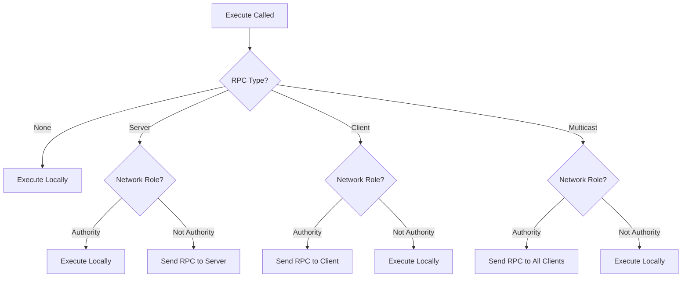

# UFunction and RPC System

## Overview

The **`UFunction`** system in the TKD Engine provides a powerful mechanism for function reflection, binding, and remote procedure calls (RPCs). It enables seamless execution of functions across network boundaries, supporting both local and distributed game logic. The system combines compile-time type safety with runtime flexibility, allowing functions to be invoked dynamically and transmitted over the network.

`UFunction` serves as the bridge between the engine's object system and networking layer, enabling multiplayer features like server-authoritative gameplay, client prediction, and synchronized events.

## Purpose

The UFunction and RPC system is designed to:
- Enable runtime function binding and execution
- Support remote procedure calls across network peers
- Provide type-safe parameter serialization and deserialization
- Integrate with the object ownership and authority system
- Enable both reliable and unreliable network transmission
- Support different RPC patterns (Server, Client, Multicast)
- Maintain performance while providing reflection capabilities

## Core Components

### IFunction Interface

```cpp
namespace tkd
{
    class IFunction
    {
    public:
        virtual ~IFunction() = default;

        virtual bool IsBound(void) const = 0;
        virtual const FString& GetName(void) const = 0;
        virtual const UObject& GetOwner(void) const = 0;
        virtual UObject& GetOwner(void) = 0;
        virtual ERPCType GetRPCType(void) const = 0;
        virtual void SetRPCType(ERPCType type) = 0;
        virtual void ExecuteSerialized(const std::vector<Byte>& parameters) = 0;
    };
}
```

The `IFunction` interface defines the contract for all function objects in the system.

#### Pure Virtual Methods

##### IsBound
```cpp
virtual bool IsBound(void) const = 0;
```
- **Returns**: `true` if a function is bound, `false` otherwise
- **Purpose**: Check if the function object is valid

##### GetName
```cpp
virtual const FString& GetName(void) const = 0;
```
- **Returns**: Reference to the function name
- **Purpose**: Identify the function for reflection and RPC

##### GetOwner (const and non-const)
```cpp
virtual const UObject& GetOwner(void) const = 0;
virtual UObject& GetOwner(void) = 0;
```
- **Returns**: Reference to the owning object
- **Purpose**: Access the object that contains this function

##### GetRPCType / SetRPCType
```cpp
virtual ERPCType GetRPCType(void) const = 0;
virtual void SetRPCType(ERPCType type) = 0;
```
- **Purpose**: Manage RPC behavior (local vs remote execution)

##### ExecuteSerialized
```cpp
virtual void ExecuteSerialized(const std::vector<Byte>& parameters) = 0;
```
- **Parameter**: `parameters` - Serialized function arguments
- **Purpose**: Execute function with deserialized network data

### ERPCType Enumeration

```cpp
enum class ERPCType : UInt8
{
    None,       // Not an RPC (local execution only)
    Server,     // Client->Server, requires validation
    Client,     // Server->Client
    Multicast   // Server->All Clients
};
```

Defines the network execution patterns for RPCs.

#### None
- **Direction**: Local only
- **Use Case**: Regular function calls, no network involvement
- **Authority**: No network authority requirements

#### Server
- **Direction**: Client → Server
- **Use Case**: Client requests server-side actions (movement, item pickup)
- **Authority**: Server validates and executes
- **Security**: Requires server-side validation

#### Client
- **Direction**: Server → Specific Client
- **Use Case**: Server sending updates to individual clients
- **Authority**: Server initiates, target client executes
- **Targeting**: Uses object ownership for recipient selection

#### Multicast
- **Direction**: Server → All Clients
- **Use Case**: Broadcast events (game state changes, global notifications)
- **Authority**: Server initiates, all clients execute
- **Efficiency**: Single transmission, replicated to all peers

### UFunction Template Class

```cpp
namespace tkd
{
    template <typename... TArgs>
    class UFunction : public IFunction
    {
    public:
        using Type = std::function<void(TArgs...)>;

        // Core functionality...
    };
}
```

The `UFunction` template class provides the concrete implementation of function binding and RPC execution.

## UFunction Member Variables

### Instance Members

#### m_name
```cpp
FString m_name;
```
- **Type**: `FString`
- **Description**: The registered name of the function
- **Usage**: Function identification and RPC dispatch

#### m_owner
```cpp
UObject& m_owner;
```
- **Type**: `UObject&` (reference)
- **Description**: The object that owns this function
- **Usage**: Context for execution and network authority checks

#### m_function
```cpp
Type m_function;
```
- **Type**: `std::function<void(TArgs...)>`
- **Description**: The bound function object
- **Default**: `nullptr` (unbound)
- **Usage**: Actual function execution

#### m_rpc
```cpp
ERPCType m_rpc;
```
- **Type**: `ERPCType`
- **Description**: RPC execution mode
- **Default**: `ERPCType::None`
- **Usage**: Determines local vs remote execution behavior

#### m_reliable
```cpp
bool m_reliable;
```
- **Type**: `bool`
- **Description**: Whether RPC uses reliable network transmission
- **Default**: `false`
- **Usage**: Reliable (ACK-based) vs unreliable (fire-and-forget) delivery

## UFunction Constructors

### Primary Constructor
```cpp
UFunction(
    UObject& owner,
    const FString& name,
    ERPCType rpc = ERPCType::None,
    const Type& function = nullptr,
    bool reliable = false
);
```
- **Parameters**:
  - `owner`: Reference to the owning object
  - `name`: Function name for identification
  - `rpc`: RPC type (default: None)
  - `function`: Initial function to bind (default: nullptr)
  - `reliable`: Use reliable transmission (default: false)
- **Behavior**:
  1. Initializes all member variables
  2. Registers function with owner object
  3. Adds function to owner's class metadata if not registered

## UFunction Operators

### Assignment Operators

#### Function Assignment
```cpp
UFunction& operator=(const Type& function);
UFunction& operator=(Type&& function);
```
- **Purpose**: Bind or rebind the function object
- **Usage**: `myFunction = []() { /* code */ };`

#### Function Call Operator
```cpp
void operator()(TArgs... args);
```
- **Purpose**: Syntactic sugar for function execution
- **Implementation**: Calls `Execute(args...)`

## UFunction Public Methods

### Execution Methods

#### Execute
```cpp
void Execute(TArgs... args);
```
- **Parameters**: `args` - Function arguments (variadic)
- **Behavior**:
  - If `m_rpc == None` or network not initialized: Execute locally
  - For `Server` RPC: Execute locally if authority, send RPC otherwise
  - For `Client/Multicast` RPC: Send RPC if authority, execute locally otherwise

#### ExecuteSerialized
```cpp
virtual void ExecuteSerialized(const std::vector<Byte>& parameters) override;
```
- **Implementation**:
  1. Create tuple for deserialized arguments
  2. Deserialize parameters using `FBinaryReader`
  3. Apply tuple to execute function with unpacked arguments

### State Query Methods

#### IsBound
```cpp
virtual bool IsBound(void) const override;
```
- **Returns**: `true` if `m_function` is not null

#### GetName
```cpp
virtual const FString& GetName(void) const override;
```
- **Returns**: Reference to `m_name`

#### GetOwner
```cpp
virtual const UObject& GetOwner(void) const override;
virtual UObject& GetOwner(void) override;
```
- **Returns**: Reference to `m_owner`

#### GetRPCType / SetRPCType
```cpp
virtual ERPCType GetRPCType(void) const override;
virtual void SetRPCType(ERPCType type) override;
```
- **Purpose**: Access and modify RPC behavior

### Function Binding Methods

#### SetFunction
```cpp
void SetFunction(const Type& function);
void SetFunction(Type&& function);
```
- **Purpose**: Bind function object (explicit versions)

#### Bind
```cpp
void Bind(const Type& function);
void Bind(Type&& function);
```
- **Purpose**: Bind function object (alternative naming)

## UFunction Private Methods

### SendRPC
```cpp
void SendRPC(TArgs... args);
```
- **Purpose**: Handle RPC transmission logic
- **Behavior**:
  1. Validate RPC conditions (network initialized, valid role)
  2. Serialize parameters using `FBinaryWriter`
  3. Create `RemoteProcedureCall` packet
  4. Fill packet with metadata (actor ID, RPC type, function name)
  5. Send via appropriate network method (reliable/unreliable, unicast/multicast)

### Deserialization Helpers

#### DeserializeArgs
```cpp
template <typename... Args, typename Indices>
static void DeserializeArgs(FBinaryReader& reader, std::tuple<Args...>& args, Indices);
```
- **Purpose**: Template helper for parameter deserialization

#### DeserializeArgsImpl
```cpp
template <typename... Args, std::size_t... I>
static void DeserializeArgsImpl(FBinaryReader& reader, std::tuple<Args...>& args, std::index_sequence<I...>);
```
- **Purpose**: Implementation of argument deserialization using fold expressions

## Usage Examples

### Basic Function Declaration and Usage
```cpp
class APlayer : public AActor
{
public:
    // Declare function member
    UFunction<void> Jump;

    APlayer()
        : Jump(*this, "Jump")  // Initialize with owner and name
    {}
};

// Bind function
player->Jump = [player]() {
    // Jump logic
    player->SetVelocity(FVector3(0, 0, 500));
};

// Execute function
player->Jump();  // Calls bound lambda
```

### Server RPC
```cpp
class APlayer : public AActor
{
public:
    UFunction<void(int)> TakeDamage;

    APlayer()
        : TakeDamage(*this, "TakeDamage", ERPCType::Server, nullptr, true)
    {}
};

// Server-side implementation
void APlayer::TakeDamageImpl(int damage) {
    health -= damage;
    if (health <= 0) {
        // Death logic
    }
}

// Bind on server
player->TakeDamage = [player](int damage) {
    player->TakeDamageImpl(damage);
};

// Client calls server
player->TakeDamage(50);  // Sends RPC to server
```

### Client RPC
```cpp
class AGameMode : public UObject
{
public:
    UFunction<void(const FString&)> ShowMessage;

    AGameMode()
        : ShowMessage(*this, "ShowMessage", ERPCType::Client)
    {}
};

// Server sends to specific client
gameMode->ShowMessage("Welcome to the game!");
// Automatically sent to client that owns the GameMode's target object
```

### Multicast RPC
```cpp
class AGameMode : public UObject
{
public:
    UFunction<void()> GameOver;

    AGameMode()
        : GameOver(*this, "GameOver", ERPCType::Multicast)
    {}
};

// Server broadcasts to all clients
gameMode->GameOver();  // All clients execute GameOver
```

### Function with Parameters
```cpp
class AWeapon : public AActor
{
public:
    UFunction<void(FVector3, FRotator)> FireAt;

    AWeapon()
        : FireAt(*this, "FireAt", ERPCType::Multicast)
    {}
};

// Bind with complex parameters
weapon->FireAt = [weapon](FVector3 target, FRotator direction) {
    // Fire projectile at target
    weapon->SpawnProjectile(target, direction);
};

// Execute with parameters
FVector3 target(100, 200, 0);
FRotator direction(0, 45, 0);
weapon->FireAt(target, direction);
```

### Dynamic Function Binding
```cpp
// Runtime function binding
UFunction<void(int)> dynamicFunc(player, "DynamicFunc");

if (someCondition) {
    dynamicFunc.Bind([](int value) {
        FLogger::Info("Dynamic function called with: {}", value);
    });
} else {
    dynamicFunc.Bind([](int value) {
        FLogger::Warning("Alternative behavior: {}", value);
    });
}

dynamicFunc(42);  // Executes bound function
```

### RPC with Reliability Control
```cpp
// Reliable RPC (uses ACK system)
UFunction<void()> CriticalAction(player, "CriticalAction",
                                ERPCType::Server, nullptr, true);

// Unreliable RPC (fire and forget)
UFunction<void()> UpdatePosition(player, "UpdatePosition",
                                ERPCType::Multicast, nullptr, false);
```

## RPC Execution Flow

### Server RPC (Client → Server)
```
Client                          Server
  │                               │
  │  1. Call RPC locally?         │
  │  ───────────────────────────► │  2. Validate authority
  │                               │  3. Execute on server
  │                               │  4. Optional: Send response
  │ ◄───────────────────────────── │
  │  5. Receive response           │
  │                               │
```

### Client RPC (Server → Client)
```
Server                          Client
  │                               │
  │  1. Check ownership           │
  │  2. Send RPC to target client │
  │  ───────────────────────────► │  3. Receive and execute
  │                               │
```

### Multicast RPC (Server → All Clients)
```
Server                          Clients
  │                               │
  │  1. Send RPC to all clients   │
  │  ───────────────────────────► │  2. All clients execute
  │  ───────────────────────────► │
  │  ───────────────────────────► │
```

## Serialization and Network Transmission

### Parameter Serialization
```cpp
// Automatic serialization in SendRPC
std::vector<Byte> parameters;
FBinaryWriter writer(parameters);
(writer.Write(args), ...);  // Fold expression for all arguments
```

### Packet Creation
```cpp
// RPC packet assembly
Packets::RemoteProcedureCall rpc;
rpc.actorID = m_owner.GetUUID().Data();
rpc.rpcType = m_rpc;
rpc.functionName = m_name;
rpc.parameters = std::move(parameters);
```

### Transmission Selection
```cpp
// Reliable vs Unreliable transmission
if (m_reliable) {
    Network::SendReliablePacket(rpc, endpoint);
} else {
    Network::SendPacket(rpc, endpoint);
}
```

## Authority and Security

### Network Roles
- **Authority**: Server has authority over `Server` and `Multicast` RPCs
- **Autonomous Proxy**: Client controls its own objects
- **Simulated Proxy**: Client simulates server-authoritative objects

### RPC Validation
```cpp
// Server-side validation for Server RPCs
if (rpc.rpcType == ERPCType::Server) {
    // Validate client has permission
    // Check parameter ranges
    // Verify game state allows action
}
```

## Performance Considerations

- **Template Instantiation**: Each function signature creates new template instantiation
- **Serialization Overhead**: Parameter copying and binary conversion
- **Network Latency**: Round-trip time for RPC execution
- **Memory Usage**: Function objects and serialized parameters
- **Lookup Performance**: Function dispatch via string names

### Optimization Strategies
- **Parameter Packing**: Minimize data types and sizes
- **Batching**: Combine multiple RPCs when possible
- **Caching**: Reuse serialized parameter buffers
- **Frequency Limiting**: Rate-limit frequent RPCs
- **Compression**: Compress large parameter sets

## Error Handling

### Common Error Conditions
- **Unbound Function**: Calling unbound function (no operation)
- **Network Unavailable**: RPC fails silently if network not initialized
- **Invalid Authority**: RPC ignored if authority requirements not met
- **Serialization Failure**: Network transmission fails
- **Deserialization Errors**: Malformed network data

### Debugging Support
```cpp
// RPC logging
FLogger::Debug("Executing RPC '{}' on actor {} with {} parameters",
              functionName, actorID, parameterCount);

// Network debugging
if (networkDebug) {
    networkDebug->LogRPC(rpc, endpoint);
}
```

## Integration with Other Systems

### Object System
```cpp
// Functions register with their owner objects
owner.RegisterFunction(this);

// Class metadata integration
if (ownerClass && !ownerClass->IsRegistered()) {
    ownerClass->AddFunction(this->GetName());
}
```

### Networking System
```cpp
// RPC packets handled by network layer
void OnRemoteProcedureCall(const Packets::RemoteProcedureCall& rpc) {
    // Find target actor
    AActor* actor = FindActorByID(rpc.actorID);

    // Find function
    IFunction* function = actor->FindFunction(rpc.functionName);

    // Execute with parameters
    function->ExecuteSerialized(rpc.parameters);
}
```

### Property System
```cpp
// Functions complement properties for object behavior
UPROPERTY()
int health = 100;

UFUNCTION()
void TakeDamage(int damage) {
    health -= damage;
}
```

## Best Practices

1. **RPC Type Selection**: Choose appropriate RPC type for security and performance
2. **Parameter Design**: Keep parameters simple and serializable
3. **Authority Awareness**: Understand network roles and ownership
4. **Reliability Choice**: Use reliable RPCs only when necessary
5. **Error Handling**: Implement robust error handling for network failures
6. **Performance Monitoring**: Track RPC frequency and size
7. **Security**: Validate server-side RPCs thoroughly
8. **Documentation**: Document RPC purposes and parameter meanings

## Common Patterns

### Command Pattern with RPC
```cpp
class Command {
public:
    virtual void Execute() = 0;
};

class RPCCommand : public Command {
public:
    UFunction<void()> rpcFunction;

    void Execute() override {
        rpcFunction();  // May send RPC or execute locally
    }
};
```

### Event System Integration
```cpp
class EventDispatcher {
public:
    UFunction<void()> onGameStart;
    UFunction<void(int)> onScoreChanged;
    UFunction<void()> onGameOver;

    void StartGame() {
        onGameStart();  // Multicast to all clients
    }
};
```

### State Synchronization
```cpp
class APlayer : public AActor {
public:
    UFunction<void(int)> SetHealth;      // Server RPC
    UFunction<void(FVector3)> SetPosition; // Multicast

    void UpdateFromServer(int newHealth, FVector3 newPos) {
        health = newHealth;
        position = newPos;
    }
};
```

## Diagram: RPC Execution Decision Tree



## Diagram: UFunction Architecture

```
UFunction<T...> Class Hierarchy
├── IFunction (interface)
│   ├── IsBound()
│   ├── GetName()
│   ├── GetOwner()
│   ├── GetRPCType()/SetRPCType()
│   └── ExecuteSerialized()
└── UFunction<T...> (implementation)
    ├── Member Variables
    │   ├── m_name
    │   ├── m_owner
    │   ├── m_function
    │   ├── m_rpc
    │   └── m_reliable
    ├── Public Methods
    │   ├── Execute()
    │   ├── operator=()
    │   ├── operator()()
    │   ├── SetFunction()/Bind()
    │   └── IFunction overrides
    └── Private Methods
        ├── SendRPC()
        └── Deserialization helpers
```

## Troubleshooting

### Common Issues

1. **RPC Not Executing**: Check network initialization and authority
2. **Parameters Not Serializing**: Ensure parameter types are serializable
3. **Function Not Found**: Verify function registration and naming
4. **Authority Conflicts**: Check network roles and ownership
5. **Performance Issues**: Monitor RPC frequency and parameter sizes

### Debug Checklist

- [ ] Network system initialized
- [ ] Function properly bound
- [ ] Correct RPC type set
- [ ] Valid network role
- [ ] Serializable parameters
- [ ] Proper object ownership
- [ ] Reliable vs unreliable transmission appropriate

This documentation provides a comprehensive overview of the UFunction and RPC system, covering its implementation, usage patterns, and integration within the TKD Engine's networking and object architecture.
