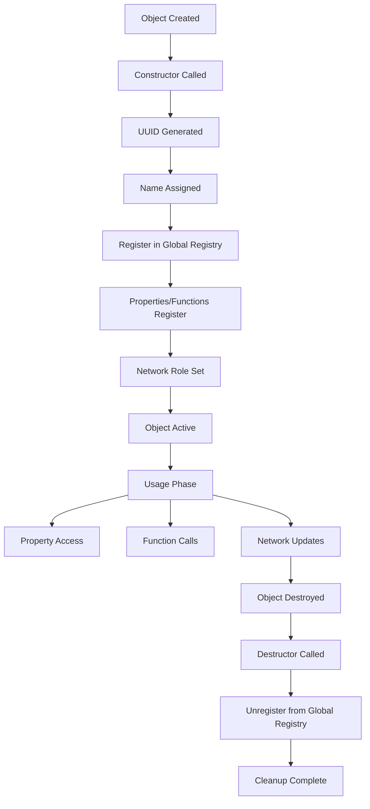

# UObject System

## Overview

The **`UObject`** class is the fundamental base class for all objects in the TKD Engine. It provides core functionality for object identification, reflection, networking, and lifecycle management. Every game object, actor, component, and system derives from UObject, making it the cornerstone of the engine's object model.

UObject serves as the bridge between the engine's low-level systems and high-level gameplay logic, providing essential services like unique identification, property reflection, function binding, and network synchronization.

## Purpose

The UObject system is designed to:
- Provide unique identification for all engine objects
- Enable runtime reflection and introspection
- Support property and function registration
- Manage network roles and ownership
- Enable object discovery and lookup
- Provide thread-safe object registry
- Support serialization and replication
- Enable dynamic casting and type checking
- Integrate with the class metadata system

## Core Architecture

### Class Hierarchy
```
UObject (base class)
├── AActor (game actors)
├── UComponent (actor components)
├── UGameMode (game rules)
├── UPlayerController (player input)
├── UWorld (game world)
└── ... (all engine objects)
```

### Key Design Principles

1. **Universal Base Class**: All engine objects inherit from UObject
2. **Unique Identity**: Each object has a UUID and name
3. **Reflection Support**: Properties and functions are discoverable at runtime
4. **Network Awareness**: Built-in support for multiplayer synchronization
5. **Thread Safety**: Registry operations are protected with mutexes
6. **Memory Management**: Automatic registration and cleanup

## UObject Member Variables

### Static Members

#### s_registeredObjects
```cpp
static std::vector<UObject*> s_registeredObjects;
```
- **Type**: `std::vector<UObject*>`
- **Purpose**: Global registry of all UObject instances
- **Thread Safety**: Protected by `s_objectMutex`
- **Usage**: Object discovery and iteration

#### s_objectMutex
```cpp
static std::mutex s_objectMutex;
```
- **Type**: `std::mutex`
- **Purpose**: Thread synchronization for object registry operations
- **Usage**: Protects `s_registeredObjects` from concurrent access

### Instance Members

#### m_objectID
```cpp
UUID m_objectID;
```
- **Type**: `UUID`
- **Purpose**: Unique identifier for the object
- **Initialization**: Generated via `UUID::V4()` by default
- **Usage**: Object lookup, serialization, networking

#### m_name
```cpp
FString m_name;
```
- **Type**: `FString`
- **Purpose**: Human-readable object name
- **Default**: `"<Unnamed>"`
- **Usage**: Debugging, editor display, object lookup

#### m_properties
```cpp
std::unordered_map<FString, IProperty*> m_properties;
```
- **Type**: `std::unordered_map<FString, IProperty*>`
- **Purpose**: Registry of object's reflected properties
- **Usage**: Runtime property access, serialization, replication

#### m_functions
```cpp
std::unordered_map<FString, IFunction*> m_functions;
```
- **Type**: `std::unordered_map<FString, IFunction*>`
- **Purpose**: Registry of object's reflected functions
- **Usage**: Runtime function calls, RPC system

#### m_netRole
```cpp
ENetRole m_netRole;
```
- **Type**: `ENetRole`
- **Purpose**: Network authority and simulation mode
- **Default**: `ENetRole::None`
- **Usage**: Determines local vs remote execution behavior

#### m_networkID
```cpp
UInt32 m_networkID;
```
- **Type**: `UInt32`
- **Purpose**: Network identifier for replication
- **Default**: `0`
- **Usage**: Network packet addressing

#### m_owningClientID
```cpp
UInt32 m_owningClientID;
```
- **Type**: `UInt32`
- **Purpose**: ID of client that owns this object
- **Default**: `0`
- **Usage**: Client ownership validation, RPC targeting

#### m_netUpdateFrequency
```cpp
Float32 m_netUpdateFrequency;
```
- **Type**: `Float32`
- **Purpose**: How often to replicate object state
- **Default**: `10.0f` (10 updates per second)
- **Usage**: Network bandwidth optimization

#### m_timeSinceLastUpdate
```cpp
Float32 m_timeSinceLastUpdate;
```
- **Type**: `Float32`
- **Purpose**: Time accumulator for update frequency
- **Default**: `0.0f`
- **Usage**: Tracks time since last network update

#### m_hasSetUpdateFrequency
```cpp
Bool m_hasSetUpdateFrequency;
```
- **Type**: `Bool`
- **Purpose**: Whether update frequency was explicitly set
- **Default**: `false`
- **Usage**: Distinguishes default vs custom frequency

## UObject Constructors and Destructor

### Constructor
```cpp
UObject(const FString& name = "<Unnamed>", const UUID& uuid = UUID::V4());
```
- **Parameters**:
  - `name`: Object name (default: `"<Unnamed>"`)
  - `uuid`: Unique identifier (default: auto-generated)
- **Behavior**:
  1. Initializes all member variables
  2. Registers object in global registry (`s_registeredObjects`)
  3. Thread-safe registration with mutex lock

### Destructor
```cpp
virtual ~UObject();
```
- **Behavior**:
  1. Removes object from global registry
  2. Thread-safe deregistration with mutex lock
  3. Cleans up property and function references

## Conversion Operators

### UUID Conversion
```cpp
operator UUID::DataType(void) const;
```
- **Returns**: `UUID::DataType` (underlying UUID data)
- **Usage**: Direct UUID access in network packets

### FString Conversion
```cpp
operator FString(void) const;
```
- **Returns**: `FString` reference to object name
- **Usage**: String operations on object names

### std::string Conversion
```cpp
operator std::string(void) const;
```
- **Returns**: `std::string` copy of object name
- **Usage**: C++ standard library string operations

## Identity Methods

### GetUUID / SetUUID
```cpp
const UUID& GetUUID(void) const;
void SetUUID(const UUID& uuid);
```
- **Purpose**: Access and modify object UUID
- **Usage**: Object identification, serialization

### GetObjectID
```cpp
std::string GetObjectID(void) const;
```
- **Returns**: String representation of UUID
- **Purpose**: Human-readable object identification
- **Implementation**: Calls `m_objectID.ToString()`

### GetName / SetName
```cpp
const FString& GetName(void) const;
void SetName(const FString& name);
```
- **Purpose**: Access and modify object name
- **Usage**: Debugging, editor display, object lookup

## Property Management

### RegisterProperty
```cpp
void RegisterProperty(IProperty* property);
```
- **Parameter**: `property` - Property to register
- **Behavior**: Adds property to `m_properties` map if valid
- **Usage**: Automatic property registration during object construction

### GetProperties
```cpp
const std::unordered_map<FString, IProperty*>& GetProperties(void) const;
```
- **Returns**: Reference to property map
- **Purpose**: Access all registered properties
- **Usage**: Reflection, serialization, editor inspection

### GetLifetimeReplicatedProperties
```cpp
void GetLifetimeReplicatedProperties(TVector<IProperty*>& outProperties);
```
- **Parameter**: `outProperties` - Output vector for replicated properties
- **Behavior**: Iterates properties and collects those with `EPropertyFlags::Replicated`
- **Purpose**: Network replication system integration

### GetProperty
```cpp
IProperty* GetProperty(const FString& name) const;
```
- **Parameter**: `name` - Property name to find
- **Returns**: Property pointer or `nullptr` if not found
- **Purpose**: Runtime property access by name

## Function Management

### RegisterFunction
```cpp
void RegisterFunction(IFunction* function);
```
- **Parameter**: `function` - Function to register
- **Behavior**: Adds function to `m_functions` map if valid
- **Usage**: Automatic function registration during object construction

### GetFunctions
```cpp
const std::unordered_map<FString, IFunction*>& GetFunctions(void) const;
```
- **Returns**: Reference to function map
- **Purpose**: Access all registered functions
- **Usage**: Reflection, RPC system, editor inspection

### GetFunction
```cpp
IFunction* GetFunction(const FString& name) const;
```
- **Parameter**: `name` - Function name to find
- **Returns**: Function pointer or `nullptr` if not found
- **Purpose**: Runtime function access by name

## Network Role Methods

### Network Role Queries

#### IsLocallyControlled
```cpp
Bool IsLocallyControlled(void) const;
```
- **Returns**: `true` if `m_netRole == ENetRole::AutonomousProxy`
- **Purpose**: Check if object is controlled by local player

#### IsAuthority
```cpp
Bool IsAuthority(void) const;
```
- **Returns**: `true` if `m_netRole == ENetRole::Authority`
- **Purpose**: Check if object has server authority

#### IsSimulated
```cpp
Bool IsSimulated(void) const;
```
- **Returns**: `true` if `m_netRole == ENetRole::SimulatedProxy`
- **Purpose**: Check if object is simulated (no local control)

### GetNetRole / SetNetRole
```cpp
ENetRole GetNetRole(void) const;
void SetNetRole(ENetRole role);
```
- **Purpose**: Access and modify network role
- **Usage**: Authority management, replication control

## Network Configuration Methods

### SetNetUpdateFrequency / GetNetUpdateFrequency
```cpp
void SetNetUpdateFrequency(Float32 frequency);
Float32 GetNetUpdateFrequency(void) const;
```
- **Parameter**: `frequency` - Updates per second
- **Purpose**: Control network replication frequency
- **Usage**: Bandwidth optimization, performance tuning

### SetOwningClientID / GetOwningClientID
```cpp
void SetOwningClientID(UInt32 id);
UInt32 GetOwningClientID(void) const;
```
- **Purpose**: Manage client ownership
- **Usage**: RPC targeting, authority validation

### SetNetworkID / GetNetworkID
```cpp
void SetNetworkID(UInt32 id);
UInt32 GetNetworkID(void) const;
```
- **Purpose**: Network addressing for replication
- **Usage**: Packet routing, object synchronization

## RTTI (Runtime Type Information)

### As<T> Template Method
```cpp
template <typename T>
T* As(void)
{
    static_assert(std::is_base_of<UObject, T>::value,
                  "T must be derived from UObject");
    return dynamic_cast<T*>(this);
}
```
- **Template Parameter**: `T` - Target type (must derive from UObject)
- **Returns**: Pointer to cast object or `nullptr` if invalid
- **Purpose**: Safe dynamic casting to derived types

### Is<T> Template Method
```cpp
template <typename T>
Bool Is(void) const
{
    static_assert(std::is_base_of<UObject, T>::value,
                  "T must be derived from UObject");
    return dynamic_cast<const T*>(this) != nullptr;
}
```
- **Template Parameter**: `T` - Type to check against
- **Returns**: `true` if object is of type T
- **Purpose**: Type checking without casting

## Static Registry Methods

### GetRegisteredObjects
```cpp
static const std::vector<UObject*>& GetRegisteredObjects(void);
```
- **Returns**: Reference to global object registry
- **Thread Safety**: Protected by mutex
- **Purpose**: Iterate all objects, debugging, editor tools

### FindByUUID
```cpp
static UObject* FindByUUID(const UUID& uuid);
```
- **Parameter**: `uuid` - UUID to search for
- **Returns**: Object pointer or `nullptr` if not found
- **Thread Safety**: Protected by mutex
- **Purpose**: Object lookup by unique identifier

### FindByName
```cpp
static UObject* FindByName(const FString& name);
```
- **Parameter**: `name` - Name to search for
- **Returns**: Object pointer or `nullptr` if not found
- **Thread Safety**: Protected by mutex
- **Purpose**: Object lookup by name (first match)

## Class Metadata

### DECLARE_CLASS Macro
```cpp
DECLARE_CLASS(UObject)
```
- **Purpose**: Registers class with reflection system
- **Implementation**: Creates static class metadata
- **Usage**: Enables runtime class information

## Usage Examples

### Basic Object Creation
```cpp
// Create a basic UObject
UObject* myObject = new UObject("MyObject");

// Access identity
UUID id = myObject->GetUUID();
FString name = myObject->GetName();

// Conversion operators
std::string nameStr = *myObject;  // operator std::string()
UUID::DataType rawID = *myObject; // operator UUID::DataType()
```

### Property Registration
```cpp
class APlayer : public UObject
{
public:
    UPROPERTY()
    int health = 100;

    UPROPERTY(Replicated)
    FVector3 position;

    APlayer()
        : UObject("Player")
    {
        // Properties automatically registered via UPROPERTY macro
    }
};

// Access properties at runtime
APlayer* player = new APlayer();
IProperty* healthProp = player->GetProperty("health");
IProperty* posProp = player->GetProperty("position");

// Get all properties
const auto& allProps = player->GetProperties();
for (const auto& [name, prop] : allProps) {
    FLogger::Info("Property: {}", name);
}
```

### Function Registration
```cpp
class AWeapon : public UObject
{
public:
    UFUNCTION()
    void Fire() {
        // Fire logic
    }

    UFUNCTION(Server, Reliable)
    void TakeDamage(int damage) {
        health -= damage;
    }

    AWeapon()
        : UObject("Weapon")
    {
        // Functions automatically registered via UFUNCTION macro
    }
};

// Access functions at runtime
AWeapon* weapon = new AWeapon();
IFunction* fireFunc = weapon->GetFunction("Fire");
IFunction* damageFunc = weapon->GetFunction("TakeDamage");
```

### Network Role Management
```cpp
class AActor : public UObject
{
public:
    AActor()
        : UObject("Actor")
    {
        // Set network properties
        SetNetUpdateFrequency(20.0f);  // 20 updates/sec
    }

    void UpdateNetworkRole(ENetRole newRole) {
        SetNetRole(newRole);

        if (IsAuthority()) {
            FLogger::Info("This actor has server authority");
        } else if (IsLocallyControlled()) {
            FLogger::Info("This actor is locally controlled");
        } else if (IsSimulated()) {
            FLogger::Info("This actor is simulated");
        }
    }
};
```

### Object Lookup and Casting
```cpp
// Find objects by UUID
UUID targetID = someUUID;
UObject* found = UObject::FindByUUID(targetID);

// Find objects by name
UObject* player = UObject::FindByName("Player1");

// Safe casting
APlayer* playerObj = found->As<APlayer>();
if (playerObj) {
    // Successfully cast to APlayer
    playerObj->Jump();
}

// Type checking
if (found->Is<APlayer>()) {
    FLogger::Info("Object is a player");
}
```

### Replication Setup
```cpp
class AReplicatedActor : public UObject
{
public:
    UPROPERTY(Replicated)
    FVector3 position;

    UPROPERTY(Replicated)
    int score;

    AReplicatedActor()
        : UObject("ReplicatedActor")
    {
        SetNetUpdateFrequency(10.0f);
    }

    // Get properties that need replication
    TVector<IProperty*> GetReplicatedProps() {
        TVector<IProperty*> props;
        GetLifetimeReplicatedProperties(props);
        return props;
    }
};
```

### Global Object Iteration
```cpp
// Iterate all objects (thread-safe)
const auto& allObjects = UObject::GetRegisteredObjects();

for (UObject* obj : allObjects) {
    if (obj->Is<AActor>()) {
        AActor* actor = obj->As<AActor>();
        FLogger::Info("Found actor: {}", actor->GetName());
    }
}

// Count objects by type
size_t actorCount = 0;
size_t componentCount = 0;

for (UObject* obj : allObjects) {
    if (obj->Is<AActor>()) actorCount++;
    else if (obj->Is<UComponent>()) componentCount++;
}

FLogger::Info("Actors: {}, Components: {}", actorCount, componentCount);
```

### Custom Object with Full Features
```cpp
class AGameCharacter : public UObject
{
public:
    // Properties
    UPROPERTY(Replicated)
    FString characterName;

    UPROPERTY(Replicated)
    int level = 1;

    UPROPERTY()
    bool isAlive = true;

    // Functions
    UFUNCTION()
    void LevelUp() {
        level++;
        FLogger::Info("{} leveled up to {}", characterName, level);
    }

    UFUNCTION(Server, Reliable)
    void TakeDamage(int damage) {
        if (!isAlive) return;

        // Damage logic
        if (level < 10) {
            // Apply damage
        }

        // Check death
        if (/* death condition */) {
            Die();
        }
    }

    UFUNCTION(Multicast)
    void Die() {
        isAlive = false;
        // Death effects, broadcast to all clients
    }

public:
    AGameCharacter(const FString& name)
        : UObject(name)
    {
        characterName = name;
        SetNetUpdateFrequency(15.0f);  // Custom update rate
    }

    // Custom methods
    void InitializeForNetwork(ENetRole role, UInt32 ownerID) {
        SetNetRole(role);
        SetOwningClientID(ownerID);

        if (IsAuthority()) {
            // Server initialization
            SetNetworkID(/* assign network ID */);
        }
    }
};
```

## Network Role System

### ENetRole Enumeration Integration

The UObject's network role system integrates with the engine's networking layer:

- **None**: Object not networked
- **Authority**: Server has control (can modify replicated properties)
- **AutonomousProxy**: Client controls its own objects
- **SimulatedProxy**: Client simulates server-authoritative objects

### Authority Flow
```
Server (Authority)
├── Creates objects with Authority role
├── Modifies replicated properties
└── Sends updates to clients

Client (AutonomousProxy)
├── Controls owned objects
├── Sends input to server
└── Receives state updates

Client (SimulatedProxy)
├── Receives object state
├── Simulates physics/visuals
└── Cannot modify replicated properties
```

## Property Replication System

### Replication Flags
```cpp
enum class EPropertyFlags {
    None = 0,
    Replicated = 1 << 0,    // Property is replicated
    // ... other flags
};
```

### Replication Process
1. **Authority Check**: Only authority can modify replicated properties
2. **Change Detection**: System tracks property changes
3. **Update Frequency**: Respects `m_netUpdateFrequency`
4. **Serialization**: Properties serialized for network transmission
5. **Distribution**: Updates sent to relevant clients

## Performance Considerations

### Memory Usage
- **Object Registry**: Global vector stores all UObject pointers
- **Property/Function Maps**: Unordered maps for fast lookup
- **UUID Storage**: 16 bytes per object for unique identification

### Thread Safety
- **Mutex Overhead**: Registry operations acquire locks
- **Atomic Operations**: Consider for high-frequency operations
- **Lock Contention**: Minimize registry access in hot paths

### Network Optimization
- **Update Frequency**: Balance between responsiveness and bandwidth
- **Property Selection**: Only replicate necessary data
- **Compression**: Consider data compression for large updates

## Integration with Other Systems

### Reflection System
```cpp
// UObject integrates with UClass for metadata
UClass* objectClass = GetClass();  // From DECLARE_CLASS
const FString& className = objectClass->GetName();
```

### Networking System
```cpp
// Network packets reference objects by UUID
Packets::ReplicateProperty packet;
packet.objectID = GetUUID().Data();
packet.propertyName = "position";
// ... send packet
```

### Serialization System
```cpp
// Objects can be serialized for save/load
FBinaryWriter writer(data);
writer.Write(GetUUID());
writer.Write(GetName());
// ... serialize properties
```

## Best Practices

### Object Creation
1. **Use Descriptive Names**: Choose meaningful object names
2. **UUID Management**: Let system auto-generate UUIDs unless needed
3. **Proper Cleanup**: Ensure objects are properly deleted

### Property Management
1. **Selective Replication**: Only replicate necessary properties
2. **Appropriate Flags**: Use correct property flags for networking
3. **Type Safety**: Use proper property types for serialization

### Network Configuration
1. **Role Assignment**: Set correct network roles during initialization
2. **Update Frequency**: Tune based on object importance and movement speed
3. **Ownership**: Properly manage client ownership for RPCs

### Performance
1. **Registry Access**: Minimize calls to global registry methods
2. **Lookup Caching**: Cache frequently accessed objects
3. **Batch Operations**: Group related operations to reduce lock contention

## Common Patterns

### Singleton Objects
```cpp
class UGameInstance : public UObject
{
public:
    static UGameInstance* Get() {
        static UGameInstance* instance = nullptr;
        if (!instance) {
            instance = new UGameInstance("GameInstance");
        }
        return instance;
    }
};
```

### Object Pooling
```cpp
class UObjectPool : public UObject
{
private:
    TVector<UObject*> m_available;
    TVector<UObject*> m_inUse;

public:
    template<typename T>
    T* Acquire() {
        if (m_available.empty()) {
            // Create new object
            T* obj = new T();
            m_inUse.PushBack(obj);
            return obj;
        } else {
            // Reuse existing object
            T* obj = m_available.back()->As<T>();
            m_available.PopBack();
            m_inUse.PushBack(obj);
            return obj;
        }
    }

    void Release(UObject* obj) {
        auto it = std::find(m_inUse.begin(), m_inUse.end(), obj);
        if (it != m_inUse.end()) {
            m_inUse.erase(it);
            m_available.PushBack(obj);
        }
    }
};
```

### Component-Based Architecture
```cpp
class UComponent : public UObject
{
public:
    UPROPERTY()
    UObject* owner = nullptr;

    virtual void Initialize() {}
    virtual void Update(float deltaTime) {}
    virtual void Destroy() {}
};

class AActor : public UObject
{
private:
    TVector<UComponent*> m_components;

public:
    template<typename T>
    T* AddComponent() {
        T* component = new T();
        component->owner = this;
        m_components.PushBack(component);
        component->Initialize();
        return component;
    }

    void UpdateComponents(float deltaTime) {
        for (UComponent* comp : m_components) {
            comp->Update(deltaTime);
        }
    }
};
```

## Diagram: UObject Architecture

```
UObject Class Architecture
├── Identity System
│   ├── UUID (m_objectID)
│   ├── Name (m_name)
│   └── Conversion operators
├── Reflection System
│   ├── Properties (m_properties)
│   ├── Functions (m_functions)
│   └── Registration methods
├── Network System
│   ├── Role (m_netRole)
│   ├── Ownership (m_owningClientID)
│   ├── Update frequency (m_netUpdateFrequency)
│   └── Network ID (m_networkID)
├── RTTI System
│   ├── As<T>() template method
│   └── Is<T>() template method
└── Global Registry
    ├── Static object list
    ├── Thread-safe access
    └── Lookup methods
```

## Diagram: Object Lifecycle



## Troubleshooting

### Common Issues

1. **Object Not Found**: Check UUID/name spelling, object lifetime
2. **Casting Failures**: Verify inheritance hierarchy, use `Is<T>()` first
3. **Threading Issues**: Ensure registry access is properly synchronized
4. **Network Problems**: Verify role assignment, ownership, update frequency
5. **Memory Leaks**: Check object deletion, registry cleanup

### Debug Information
```cpp
// Log object information
void DebugObject(UObject* obj) {
    FLogger::Debug("Object: {} ({})", obj->GetName(), obj->GetObjectID());
    FLogger::Debug("Role: {}", static_cast<int>(obj->GetNetRole()));
    FLogger::Debug("Properties: {}", obj->GetProperties().size());
    FLogger::Debug("Functions: {}", obj->GetFunctions().size());
}

// Count objects by type
void LogObjectStats() {
    const auto& objects = UObject::GetRegisteredObjects();
    std::unordered_map<std::string, size_t> typeCounts;

    for (UObject* obj : objects) {
        UClass* cls = obj->GetClass();
        if (cls) {
            typeCounts[cls->GetName().CStr()]++;
        }
    }

    for (const auto& [type, count] : typeCounts) {
        FLogger::Info("Type {}: {} objects", type, count);
    }
}
```

This documentation provides a comprehensive overview of the UObject system, covering its implementation, usage patterns, and integration within the TKD Engine's architecture.
