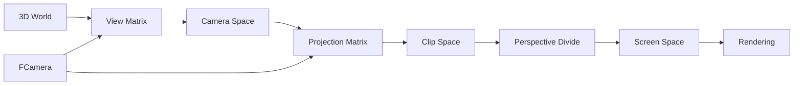

# FCamera System

## Overview

The **`FCamera`** class in the TKD Engine provides a complete 3D camera implementation for rendering scenes from different perspectives. It combines position, orientation, and projection parameters to create view and projection matrices essential for 3D graphics rendering. The camera supports both free movement and orbital controls, making it suitable for games, editors, and visualization applications.

`FCamera` serves as the foundation for the engine's rendering pipeline, providing the necessary transformations to convert 3D world coordinates into 2D screen coordinates through view and projection matrices.

## Purpose

The FCamera system is designed to:
- Provide 3D camera positioning and orientation
- Support Euler angle-based rotation system
- Generate view and projection matrices for rendering
- Enable camera movement and controls
- Support different projection types (perspective)
- Integrate with the rendering pipeline
- Provide configurable camera parameters
- Support both programmatic and user input control

## Core Architecture

### Class Design
```cpp
namespace tkd
{
    class FCamera
    {
    public:
        // Position and orientation vectors
        FVector3 position;
        FVector3 front;
        FVector3 up;
        FVector3 right;

        // Euler angles
        Float32 yaw;
        Float32 pitch;

        // Movement parameters
        Float32 moveSpeed;
        Float32 mouseSensitivity;

        // Projection parameters
        Float32 fov;
        Float32 aspectRatio;
        Float32 nearPlane;
        Float32 farPlane;

        // Methods
        void UpdateCameraVectors(void);
    };
}
```

### Key Design Principles

1. **Vector-Based Orientation**: Uses forward, up, and right vectors for orientation
2. **Euler Angle Control**: Yaw and pitch angles for intuitive rotation
3. **Automatic Updates**: Vectors automatically recalculated from angles
4. **Configurable Parameters**: Customizable movement and projection settings
5. **Performance Focused**: Minimal computation for real-time updates
6. **Integration Ready**: Designed for rendering pipeline integration

## FCamera Member Variables

### Position and Orientation Vectors

#### position
```cpp
FVector3 position;
```
- **Type**: `FVector3`
- **Purpose**: 3D position of the camera in world space
- **Default**: `(0.0f, 2.0f, 10.0f)`
- **Usage**: Camera translation, view matrix calculation

#### front
```cpp
FVector3 front;
```
- **Type**: `FVector3`
- **Purpose**: Forward direction vector (where camera is looking)
- **Default**: `(0.0f, 0.0f, -1.0f)` (negative Z-axis)
- **Usage**: View direction, look-at calculations

#### up
```cpp
FVector3 up;
```
- **Type**: `FVector3`
- **Purpose**: Up direction vector (camera's local up)
- **Default**: `(0.0f, 1.0f, 0.0f)` (positive Y-axis)
- **Usage**: View matrix orientation, roll control

#### right
```cpp
FVector3 right;
```
- **Type**: `FVector3`
- **Purpose**: Right direction vector (camera's local right)
- **Default**: `(1.0f, 0.0f, 0.0f)` (positive X-axis)
- **Usage**: Strafe movement, view matrix construction

### Euler Angles

#### yaw
```cpp
Float32 yaw;
```
- **Type**: `Float32`
- **Purpose**: Horizontal rotation angle in degrees
- **Default**: `-90.0f`
- **Range**: Typically `-180.0f` to `180.0f` (can exceed for multiple rotations)
- **Usage**: Left/right camera rotation

#### pitch
```cpp
Float32 pitch;
```
- **Type**: `Float32`
- **Purpose**: Vertical rotation angle in degrees
- **Default**: `0.0f`
- **Range**: Typically `-89.0f` to `89.0f` (to prevent gimbal lock)
- **Usage**: Up/down camera rotation

### Movement Parameters

#### moveSpeed
```cpp
Float32 moveSpeed;
```
- **Type**: `Float32`
- **Purpose**: Camera movement speed multiplier
- **Default**: `5.0f`
- **Units**: Units per second
- **Usage**: Forward/backward and strafe movement speed

#### mouseSensitivity
```cpp
Float32 mouseSensitivity;
```
- **Type**: `Float32`
- **Purpose**: Mouse input sensitivity multiplier
- **Default**: `0.05f`
- **Usage**: Rotation speed from mouse movement

### Projection Parameters

#### fov
```cpp
Float32 fov;
```
- **Type**: `Float32`
- **Purpose**: Vertical field of view in degrees
- **Default**: `60.0f`
- **Range**: Typically `30.0f` to `120.0f`
- **Usage**: Perspective projection, zoom control

#### aspectRatio
```cpp
Float32 aspectRatio;
```
- **Type**: `Float32`
- **Purpose**: Width-to-height ratio of the viewport
- **Default**: `4.0f / 3.0f ≈ 1.333f`
- **Calculation**: `viewportWidth / viewportHeight`
- **Usage**: Perspective projection correction

#### nearPlane
```cpp
Float32 nearPlane;
```
- **Type**: `Float32`
- **Purpose**: Near clipping plane distance
- **Default**: `0.1f`
- **Constraints**: Must be > 0 and < farPlane
- **Usage**: Near depth clipping, precision optimization

#### farPlane
```cpp
Float32 farPlane;
```
- **Type**: `Float32`
- **Purpose**: Far clipping plane distance
- **Default**: `1000.0f`
- **Constraints**: Must be > nearPlane
- **Usage**: Far depth clipping, rendering distance

## FCamera Constructor

### Primary Constructor
```cpp
FCamera(
    Float32 fov = 60.0f,
    Float32 aspect = 4.0f / 3.0f,
    Float32 near = 0.1f,
    Float32 far = 1000.0f
);
```
- **Parameters**:
  - `fov`: Vertical field of view in degrees (default: 60.0f)
  - `aspect`: Aspect ratio (default: 4.0f/3.0f)
  - `near`: Near clipping plane (default: 0.1f)
  - `far`: Far clipping plane (default: 1000.0f)
- **Initialization**:
  - Sets projection parameters
  - Initializes position to `(0, 2, 10)`
  - Sets default orientation vectors
  - Initializes yaw to -90° (looking down negative Z)
  - Sets movement parameters
  - Calls `UpdateCameraVectors()`

## FCamera Methods

### UpdateCameraVectors
```cpp
void UpdateCameraVectors(void);
```
- **Purpose**: Recalculates direction vectors from yaw and pitch angles
- **Algorithm**:
  1. Convert yaw/pitch from degrees to radians
  2. Calculate new front vector using spherical coordinates
  3. Normalize the front vector
  4. Calculate right vector as cross product of front and world up
  5. Calculate up vector as cross product of right and front
  6. Normalize all vectors
- **Usage**: Called after changing yaw or pitch angles

## Mathematical Foundation

### Vector Calculation Algorithm
```cpp
// Convert angles to radians
Float32 yawRad = yaw * M_PI / 180.0f;
Float32 pitchRad = pitch * M_PI / 180.0f;

// Calculate front vector using spherical coordinates
FVector3 newFront;
newFront.x = std::cos(yawRad) * std::cos(pitchRad);
newFront.y = std::sin(pitchRad);
newFront.z = std::sin(yawRad) * std::cos(pitchRad);

// Normalize and calculate right/up vectors
front = FVector3::Normalize(newFront);
right = FVector3::Normalize(FVector3::Cross(front, FVector3::Up));
up = FVector3::Normalize(FVector3::Cross(right, front));
```

### Coordinate System
- **Right-handed**: X right, Y up, Z backward (out of screen)
- **Front vector**: Points in viewing direction
- **Up vector**: Local up relative to camera orientation
- **Right vector**: Local right relative to camera orientation

## Matrix Generation

### View Matrix
```cpp
FMatrix4x4 GetViewMatrix() const {
    // Look-at matrix calculation
    FVector3 target = position + front;
    return FMatrix4x4::LookAt(position, target, up);
}
```
- **Purpose**: Transforms world coordinates to camera space
- **Components**: Translation and rotation combined

### Projection Matrix
```cpp
FMatrix4x4 GetProjectionMatrix() const {
    return FMatrix4x4::Perspective(fov, aspectRatio, nearPlane, farPlane);
}
```
- **Purpose**: Projects 3D camera space to 2D screen space
- **Type**: Perspective projection
- **Parameters**: FOV, aspect ratio, clipping planes

### View-Projection Matrix
```cpp
FMatrix4x4 GetViewProjectionMatrix() const {
    return GetProjectionMatrix() * GetViewMatrix();
}
```
- **Purpose**: Complete transformation from world to screen space
- **Usage**: Primary matrix for vertex shader transformations

## Usage Examples

### Basic Camera Setup
```cpp
// Create camera with default parameters
FCamera camera;

// Create camera with custom parameters
FCamera customCamera(75.0f, 16.0f/9.0f, 0.01f, 5000.0f);

// Access camera properties
FVector3 camPos = camera.position;
FVector3 camDir = camera.front;
```

### Camera Movement
```cpp
class CameraController
{
private:
    FCamera& camera;
    Float32 deltaTime;

public:
    void MoveForward(Float32 distance) {
        camera.position += camera.front * distance;
    }

    void MoveRight(Float32 distance) {
        camera.position += camera.right * distance;
    }

    void MoveUp(Float32 distance) {
        camera.position += camera.up * distance;
    }

    void UpdateMovement(Float32 dt) {
        deltaTime = dt;

        // Example: Move forward at constant speed
        if (input.IsKeyPressed(Key::W)) {
            MoveForward(camera.moveSpeed * deltaTime);
        }

        // Strafe right
        if (input.IsKeyPressed(Key::D)) {
            MoveRight(camera.moveSpeed * deltaTime);
        }
    }
};
```

### Mouse Look Controls
```cpp
class CameraController
{
public:
    void ProcessMouseMovement(Float32 xOffset, Float32 yOffset) {
        // Apply sensitivity
        xOffset *= camera.mouseSensitivity;
        yOffset *= camera.mouseSensitivity;

        // Update yaw and pitch
        camera.yaw += xOffset;
        camera.pitch += yOffset;

        // Constrain pitch to prevent flipping
        camera.pitch = std::clamp(camera.pitch, -89.0f, 89.0f);

        // Update camera vectors
        camera.UpdateCameraVectors();
    }

    void HandleMouseInput(Float32 dt) {
        // Get mouse delta from input system
        FVector2 mouseDelta = input.GetMouseDelta();

        if (mouseDelta.x != 0.0f || mouseDelta.y != 0.0f) {
            ProcessMouseMovement(mouseDelta.x, mouseDelta.y);
        }
    }
};
```

### Camera Zoom Control
```cpp
class CameraController
{
public:
    void Zoom(Float32 zoomFactor) {
        camera.fov -= zoomFactor;

        // Constrain FOV
        camera.fov = std::clamp(camera.fov, 1.0f, 120.0f);
    }

    void HandleScroll(Float32 scrollDelta) {
        // Zoom in/out based on scroll
        Zoom(scrollDelta * 5.0f);
    }
};
```

### Orbital Camera
```cpp
class OrbitalCamera
{
private:
    FVector3 target;
    Float32 distance;
    Float32 orbitYaw;
    Float32 orbitPitch;

public:
    void UpdateCamera() {
        // Calculate camera position around target
        Float32 x = target.x + distance * std::cos(orbitYaw) * std::cos(orbitPitch);
        Float32 y = target.y + distance * std::sin(orbitPitch);
        Float32 z = target.z + distance * std::sin(orbitYaw) * std::cos(orbitPitch);

        camera.position = FVector3(x, y, z);

        // Look at target
        camera.front = FVector3::Normalize(target - camera.position);

        // Update other vectors
        camera.right = FVector3::Normalize(FVector3::Cross(camera.front, FVector3::Up));
        camera.up = FVector3::Normalize(FVector3::Cross(camera.right, camera.front));
    }

    void Orbit(Float32 yawDelta, Float32 pitchDelta) {
        orbitYaw += yawDelta;
        orbitPitch += pitchDelta;
        orbitPitch = std::clamp(orbitPitch, -89.0f, 89.0f);
        UpdateCamera();
    }
};
```

### First-Person Camera
```cpp
class FirstPersonCamera
{
public:
    void Update(Float32 dt) {
        // Handle keyboard input
        HandleKeyboardInput(dt);

        // Handle mouse input
        HandleMouseInput(dt);

        // Update camera vectors
        camera.UpdateCameraVectors();
    }

private:
    void HandleKeyboardInput(Float32 dt) {
        Float32 velocity = camera.moveSpeed * dt;

        if (input.IsKeyPressed(Key::W)) {
            camera.position += camera.front * velocity;
        }
        if (input.IsKeyPressed(Key::S)) {
            camera.position -= camera.front * velocity;
        }
        if (input.IsKeyPressed(Key::A)) {
            camera.position -= camera.right * velocity;
        }
        if (input.IsKeyPressed(Key::D)) {
            camera.position += camera.right * velocity;
        }
        if (input.IsKeyPressed(Key::Space)) {
            camera.position += camera.up * velocity;
        }
        if (input.IsKeyPressed(Key::Shift)) {
            camera.position -= camera.up * velocity;
        }
    }

    void HandleMouseInput(Float32 dt) {
        if (input.IsMouseButtonPressed(MouseButton::Right)) {
            FVector2 mouseDelta = input.GetMouseDelta();
            camera.yaw += mouseDelta.x * camera.mouseSensitivity;
            camera.pitch -= mouseDelta.y * camera.mouseSensitivity;

            camera.pitch = std::clamp(camera.pitch, -89.0f, 89.0f);
        }
    }
};
```

### Camera Interpolation
```cpp
class CameraInterpolator
{
private:
    FCamera startCamera;
    FCamera endCamera;
    Float32 duration;
    Float32 elapsedTime;

public:
    void StartInterpolation(const FCamera& targetCamera, Float32 time) {
        startCamera = currentCamera;
        endCamera = targetCamera;
        duration = time;
        elapsedTime = 0.0f;
    }

    void Update(Float32 dt) {
        if (elapsedTime < duration) {
            elapsedTime += dt;
            Float32 t = std::min(elapsedTime / duration, 1.0f);

            // Interpolate position
            currentCamera.position = FVector3::Lerp(startCamera.position, endCamera.position, t);

            // Interpolate angles
            currentCamera.yaw = Lerp(startCamera.yaw, endCamera.yaw, t);
            currentCamera.pitch = Lerp(startCamera.pitch, endCamera.pitch, t);

            // Interpolate FOV
            currentCamera.fov = Lerp(startCamera.fov, endCamera.fov, t);

            // Update vectors
            currentCamera.UpdateCameraVectors();
        }
    }
};
```

### Multi-Camera System
```cpp
class CameraManager
{
private:
    std::vector<FCamera> cameras;
    size_t activeCameraIndex;

public:
    void AddCamera(const FCamera& camera) {
        cameras.push_back(camera);
    }

    void SetActiveCamera(size_t index) {
        if (index < cameras.size()) {
            activeCameraIndex = index;
        }
    }

    FCamera& GetActiveCamera() {
        return cameras[activeCameraIndex];
    }

    void SwitchToNextCamera() {
        activeCameraIndex = (activeCameraIndex + 1) % cameras.size();
    }

    // Camera presets
    void SetupCameras() {
        // Main camera
        FCamera mainCam(60.0f, 16.0f/9.0f, 0.1f, 1000.0f);
        mainCam.position = FVector3(0, 5, 10);
        AddCamera(mainCam);

        // Overhead camera
        FCamera overheadCam(45.0f, 16.0f/9.0f, 0.1f, 2000.0f);
        overheadCam.position = FVector3(0, 50, 0);
        overheadCam.pitch = -90.0f;
        overheadCam.UpdateCameraVectors();
        AddCamera(overheadCam);

        // Side camera
        FCamera sideCam(60.0f, 16.0f/9.0f, 0.1f, 1000.0f);
        sideCam.position = FVector3(20, 5, 0);
        sideCam.yaw = -90.0f;
        sideCam.UpdateCameraVectors();
        AddCamera(sideCam);
    }
};
```

## Rendering Integration

### Shader Usage
```glsl
// Vertex shader
uniform mat4 viewProjectionMatrix;

void main() {
    gl_Position = viewProjectionMatrix * vec4(position, 1.0);
}
```

### Rendering Pipeline Integration
```cpp
class Renderer
{
public:
    void RenderScene(const FCamera& camera) {
        // Get matrices
        FMatrix4x4 viewMatrix = camera.GetViewMatrix();
        FMatrix4x4 projectionMatrix = camera.GetProjectionMatrix();
        FMatrix4x4 viewProjectionMatrix = projectionMatrix * viewMatrix;

        // Set shader uniforms
        shader.SetUniform("viewProjectionMatrix", viewProjectionMatrix);

        // Render objects
        for (auto& object : sceneObjects) {
            object.Render();
        }
    }
};
```

## Performance Considerations

### Update Frequency
- **Vector Updates**: Only call `UpdateCameraVectors()` when angles change
- **Matrix Caching**: Cache view/projection matrices when possible
- **Dirty Flags**: Use dirty flags to avoid unnecessary recalculations

### Memory Layout
- **Vector Alignment**: FVector3 is aligned for SIMD operations
- **Cache Coherence**: Group camera data for better cache performance
- **Minimal Footprint**: Small memory footprint (28 floats = 112 bytes)

### Optimization Strategies
```cpp
class OptimizedCamera : public FCamera
{
private:
    mutable FMatrix4x4 cachedViewMatrix;
    mutable FMatrix4x4 cachedProjectionMatrix;
    mutable bool viewDirty = true;
    mutable bool projectionDirty = true;

public:
    const FMatrix4x4& GetViewMatrix() const {
        if (viewDirty) {
            cachedViewMatrix = CalculateViewMatrix();
            viewDirty = false;
        }
        return cachedViewMatrix;
    }

    void SetPosition(const FVector3& pos) {
        position = pos;
        viewDirty = true;
    }

    void SetYaw(Float32 newYaw) {
        yaw = newYaw;
        UpdateCameraVectors();
        viewDirty = true;
    }
};
```

## Coordinate System Conventions

### World Space
- **Origin**: (0, 0, 0)
- **X-axis**: Right (positive), Left (negative)
- **Y-axis**: Up (positive), Down (negative)
- **Z-axis**: Forward (negative), Backward (positive)

### Camera Space
- **Origin**: Camera position
- **X-axis**: Camera right
- **Y-axis**: Camera up
- **Z-axis**: Camera forward (negative Z into screen)

### Screen Space
- **Origin**: Bottom-left corner
- **X-axis**: Right (0 to width)
- **Y-axis**: Up (0 to height)
- **Z-axis**: Depth (0 to 1, 0 = near, 1 = far)

## Common Issues and Solutions

### Gimbal Lock
```cpp
// Problem: Pitch at ±90° causes gimbal lock
void SafePitchUpdate(Float32 deltaPitch) {
    camera.pitch += deltaPitch;
    camera.pitch = std::clamp(camera.pitch, -89.9f, 89.9f);
}
```

### Camera Jitter
```cpp
// Problem: Floating point precision issues
void StabilizeCamera() {
    // Snap small values to zero
    if (std::abs(camera.yaw) < 0.001f) camera.yaw = 0.0f;
    if (std::abs(camera.pitch) < 0.001f) camera.pitch = 0.0f;
}
```

### Aspect Ratio Changes
```cpp
// Handle window resize
void OnWindowResize(int width, int height) {
    camera.aspectRatio = static_cast<Float32>(width) / height;
    // Recalculate projection matrix if cached
}
```

## Best Practices

### Initialization
1. **Set Appropriate Defaults**: Choose FOV and clipping planes for your use case
2. **Initialize Position**: Place camera at a reasonable starting position
3. **Set Orientation**: Initialize yaw/pitch for desired initial view
4. **Update Vectors**: Always call `UpdateCameraVectors()` after angle changes

### Movement
1. **Frame Rate Independence**: Multiply movements by delta time
2. **Input Normalization**: Normalize input vectors for consistent speed
3. **Collision Detection**: Implement camera collision with world geometry
4. **Smooth Movement**: Use interpolation for cinematic camera moves

### Controls
1. **Sensitivity Adjustment**: Allow users to customize mouse sensitivity
2. **Invertible Controls**: Support inverted Y-axis for mouse look
3. **Key Binding**: Make movement keys configurable
4. **Smooth Transitions**: Use easing functions for camera transitions

### Rendering
1. **Matrix Updates**: Update matrices only when camera changes
2. **Frustum Culling**: Use camera frustum for visibility culling
3. **LOD Selection**: Adjust level of detail based on distance
4. **Post Processing**: Apply camera-based effects (depth of field, etc.)

## Diagram: Camera Coordinate System

```
World Space → Camera Space → Screen Space
     │              │              │
     ▼              ▼              ▼
   (X,Y,Z)   →   (X,Y,Z)    →   (X,Y,Z)
   World      Camera origin   Bottom-left
   coords     at (0,0,0)     corner (0,0)
```

## Diagram: Camera Vector Relationships

```mermaid
graph TD
    A[Yaw & Pitch Angles] --> B[UpdateCameraVectors()]
    B --> C[Calculate Front Vector]
    C --> D[Normalize Front]
    D --> E[Calculate Right = Cross(Front, WorldUp)]
    E --> F[Normalize Right]
    F --> G[Calculate Up = Cross(Right, Front)]
    G --> H[Normalize Up]

    I[Movement Input] --> J[Position Updates]
    J --> K[View Matrix Recalculation]

    L[Mouse Input] --> M[Yaw/Pitch Updates]
    M --> B
```

## Diagram: Camera Pipeline



## Troubleshooting

### Common Issues

1. **Inverted Controls**: Check pitch calculation sign
2. **Camera Flipping**: Ensure pitch constraints prevent gimbal lock
3. **Jittery Movement**: Use frame-rate independent movement
4. **Clipping Issues**: Adjust near/far planes appropriately
5. **Aspect Ratio Problems**: Update aspect ratio on window resize

### Debug Visualization
```cpp
void DebugDrawCamera(const FCamera& camera) {
    // Draw camera position
    Debug::DrawPoint(camera.position, Color::Red);

    // Draw forward vector
    Debug::DrawLine(camera.position,
                   camera.position + camera.front * 5.0f,
                   Color::Blue);

    // Draw up vector
    Debug::DrawLine(camera.position,
                   camera.position + camera.up * 2.0f,
                   Color::Green);

    // Draw right vector
    Debug::DrawLine(camera.position,
                   camera.position + camera.right * 2.0f,
                   Color::Yellow);

    // Draw frustum (simplified)
    DrawFrustum(camera);
}
```

This documentation provides a comprehensive overview of the FCamera system, covering its implementation, usage patterns, and integration within the TKD Engine's rendering pipeline.
