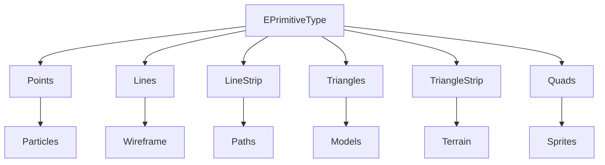

# UPrimitive System

## Overview

The **`UPrimitive`** class is the base class for all 3D drawable geometric primitives in the TKD Engine. It provides the fundamental infrastructure for creating, managing, and rendering 3D shapes such as cubes, spheres, cylinders, and other geometric objects. `UPrimitive` combines vertex data management, transformation capabilities, and rendering functionality into a cohesive base class that derived primitives can extend.

`UPrimitive` serves as the foundation for the engine's 3D graphics pipeline, bridging the gap between geometric data and the rendering system while providing essential features like color management, transformation support, and efficient rendering.

## Purpose

The UPrimitive system is designed to:
- Provide a base class for all 3D geometric primitives
- Manage vertex data and primitive topology
- Support color and material properties
- Enable transformation operations (position, rotation, scale)
- Integrate with the rendering pipeline
- Provide efficient rendering of geometric shapes
- Support both simple and complex geometric objects
- Enable extensibility for custom primitive types

## Core Architecture

### Class Hierarchy
```
UPrimitive (base class)
├── Inherits from IDrawable
├── Inherits from FTransformable
└── Extended by specific primitives:
    ├── UCube
    ├── USphere
    ├── UCylinder
    ├── UPlane
    ├── UCustomPrimitive
    └── ... (other geometric shapes)
```

### Inheritance Structure
```cpp
class UPrimitive : public IDrawable, public FTransformable
{
    // Vertex data and primitive properties
};
```

### Key Design Principles

1. **Composition over Inheritance**: Uses composition with IDrawable and FTransformable
2. **Vertex-Centric Design**: Stores vertices in a vector for flexibility
3. **Color Management**: Unified color handling across all vertices
4. **Transformation Support**: Position, rotation, and scale through FTransformable
5. **Rendering Integration**: Direct integration with IRenderer interface
6. **Extensibility**: Designed as a base class for derived primitives
7. **Performance Focused**: Efficient vertex storage and rendering

## UPrimitive Member Variables

### Instance Members

#### m_primitiveType
```cpp
EPrimitiveType m_primitiveType;
```
- **Type**: `EPrimitiveType`
- **Purpose**: Defines the geometric topology (Points, Lines, Triangles, etc.)
- **Usage**: Determines how vertices are interpreted during rendering
- **Default**: Set in constructor based on derived class

#### m_vertices
```cpp
std::vector<FVertex> m_vertices;
```
- **Type**: `std::vector<FVertex>`
- **Purpose**: Storage for all vertex data (position, color, UV, normals)
- **Usage**: Contains the geometric definition of the primitive
- **Default**: Empty vector, populated by derived classes

#### m_color
```cpp
FColor m_color;
```
- **Type**: `FColor`
- **Purpose**: Base color applied to the primitive
- **Default**: `FColor::White`
- **Usage**: Sets color for all vertices when changed

## UPrimitive Constructor

### Primary Constructor
```cpp
UPrimitive(EPrimitiveType type, const FColor& color = FColor::White);
```
- **Parameters**:
  - `type`: The primitive topology type
  - `color`: Initial color (default: white)
- **Behavior**:
  1. Initializes `m_primitiveType` with the provided type
  2. Initializes `m_color` with the provided color
  3. Initializes `m_vertices` as empty vector
- **Usage**: Called by derived primitive constructors

## UPrimitive Destructor

### Virtual Destructor
```cpp
virtual ~UPrimitive() = default;
```
- **Purpose**: Ensures proper cleanup in inheritance hierarchy
- **Behavior**: Default implementation, can be overridden by derived classes

## Rendering Methods

### Draw Method
```cpp
virtual void Draw(IRenderer& renderer, FRenderStates states = FRenderStates()) const override;
```
- **Parameters**:
  - `renderer`: Reference to the rendering interface
  - `states`: Additional render states (currently unused)
- **Behavior**:
  1. Calls `renderer.Draw()` with vertex data, primitive type, and transform
  2. Uses `GetTransform()` to get the current transformation matrix
- **Implementation**:
```cpp
void UPrimitive::Draw(IRenderer& renderer, FRenderStates states) const {
    TKD_UNUSED(states);
    renderer.Draw(m_vertices, m_primitiveType, GetTransform());
}
```

## Data Access Methods

### GetVertices
```cpp
TKD_NODISCARD const std::vector<FVertex>& GetVertices(void) const;
```
- **Returns**: Const reference to the vertex vector
- **Purpose**: Read-only access to vertex data
- **Usage**: For inspection, debugging, or read-only operations

### GetPrimitiveType
```cpp
TKD_NODISCARD EPrimitiveType GetPrimitiveType(void) const;
```
- **Returns**: The primitive topology type
- **Purpose**: Query the geometric interpretation of vertices
- **Usage**: Rendering decisions, serialization, debugging

## Color Management

### GetColor
```cpp
TKD_NODISCARD const FColor& GetColor(void) const;
```
- **Returns**: Const reference to the current color
- **Purpose**: Query the primitive's base color
- **Usage**: UI, debugging, color synchronization

### SetColor
```cpp
virtual void SetColor(const FColor& color);
```
- **Parameters**: `color` - New color to apply
- **Behavior**:
  1. Updates `m_color` member
  2. Iterates through all vertices and sets their color
- **Implementation**:
```cpp
void UPrimitive::SetColor(const FColor& color) {
    m_color = color;
    for (FVertex& vertex : m_vertices) {
        vertex.color = color;
    }
}
```
- **Usage**: Change primitive color at runtime

## EPrimitiveType Enumeration

The `EPrimitiveType` enum defines how vertices are interpreted during rendering:

```cpp
enum class EPrimitiveType {
    Points,         // Individual points
    Lines,          // Line segments (2 vertices each)
    LineStrip,      // Connected line segments
    LineLoop,       // Closed loop of lines
    Triangles,      // Triangle primitives (3 vertices each)
    TriangleStrip,  // Connected triangle strip
    TriangleFan,    // Triangle fan from first vertex
    Quads,          // Quad primitives (4 vertices each)
    QuadStrip,      // Connected quad strip
    Polygon         // Complex polygon
};
```

### Primitive Type Usage

#### Points
- **Vertices**: 1 per point
- **Use Case**: Particle systems, debug markers
- **Performance**: Low vertex count

#### Lines
- **Vertices**: 2 per line segment
- **Use Case**: Debug lines, wireframe rendering
- **Performance**: Efficient for sparse geometry

#### Triangles
- **Vertices**: 3 per triangle
- **Use Case**: Most 3D models, terrain, complex geometry
- **Performance**: Hardware-optimized, best for fill rate

#### TriangleStrip
- **Vertices**: N+2 for N triangles
- **Use Case**: Terrain, ribbons, continuous surfaces
- **Performance**: Reduced vertex count for connected geometry

#### Quads
- **Vertices**: 4 per quad
- **Use Case**: 2D sprites, UI elements, billboards
- **Performance**: Simple geometry, good for 2D rendering

## FVertex Structure

The `FVertex` structure used in `m_vertices`:

```cpp
struct FVertex {
    FVector3 position;    // 3D position
    FColor color;         // Vertex color
    FVector2 uv;          // Texture coordinates
    FVector3 normal;      // Surface normal
};
```

### Vertex Components

#### position
- **Type**: `FVector3`
- **Purpose**: 3D spatial coordinates
- **Usage**: Defines shape geometry

#### color
- **Type**: `FColor`
- **Purpose**: Per-vertex color
- **Default**: Set by `SetColor()`
- **Usage**: Vertex coloring, gradients

#### uv
- **Type**: `FVector2`
- **Purpose**: Texture coordinate mapping
- **Range**: Typically 0.0 to 1.0
- **Usage**: Texture mapping, UV unwrapping

#### normal
- **Type**: `FVector3`
- **Purpose**: Surface normal vector
- **Usage**: Lighting calculations, normal mapping

## Transformation Integration

### FTransformable Inheritance

`UPrimitive` inherits from `FTransformable`, providing:

```cpp
class FTransformable {
public:
    // Position
    void SetPosition(const FVector3& position);
    const FVector3& GetPosition() const;

    // Rotation
    void SetRotation(const FVector3& rotation);
    const FVector3& GetRotation() const;

    // Scale
    void SetScale(const FVector3& scale);
    const FVector3& GetScale() const;

    // Origin
    void SetOrigin(const FVector3& origin);
    const FVector3& GetOrigin() const;

    // Transform matrix
    const FMatrix4x4& GetTransform() const;
};
```

### Transform Usage
```cpp
UPrimitive* primitive = new UCube();

// Position the primitive
primitive->SetPosition(FVector3(10.0f, 5.0f, 0.0f));

// Rotate around Y-axis
primitive->SetRotation(FVector3(0.0f, 45.0f, 0.0f));

// Scale uniformly
primitive->SetScale(FVector3(2.0f, 2.0f, 2.0f));

// The transform matrix is automatically used in Draw()
```

## Usage Examples

### Basic Primitive Creation
```cpp
// Create a red cube
UCube* cube = new UCube();
cube->SetColor(FColor::Red);
cube->SetPosition(FVector3(0.0f, 0.0f, -5.0f));

// Create a blue sphere
USphere* sphere = new USphere(1.0f, 16, 16);  // radius, stacks, slices
sphere->SetColor(FColor::Blue);
sphere->SetPosition(FVector3(3.0f, 0.0f, -5.0f));

// Create a green cylinder
UCylinder* cylinder = new UCylinder(0.5f, 2.0f, 16);  // radius, height, segments
cylinder->SetColor(FColor::Green);
cylinder->SetPosition(FVector3(-3.0f, 0.0f, -5.0f));
```

### Primitive Rendering
```cpp
class SceneRenderer {
private:
    IRenderer& renderer;
    std::vector<UPrimitive*> primitives;

public:
    void AddPrimitive(UPrimitive* primitive) {
        primitives.push_back(primitive);
    }

    void Render() {
        for (UPrimitive* primitive : primitives) {
            primitive->Draw(renderer);
        }
    }
};

// Usage
SceneRenderer sceneRenderer(renderer);
sceneRenderer.AddPrimitive(cube);
sceneRenderer.AddPrimitive(sphere);
sceneRenderer.Render();
```

### Dynamic Color Changes
```cpp
class PulsingPrimitive {
private:
    UPrimitive* primitive;
    float time = 0.0f;

public:
    void Update(float deltaTime) {
        time += deltaTime;

        // Pulse between red and blue
        float intensity = (std::sin(time * 2.0f) + 1.0f) * 0.5f;
        FColor pulseColor = FColor::Lerp(FColor::Red, FColor::Blue, intensity);
        primitive->SetColor(pulseColor);
    }
};
```

### Custom Primitive Creation
```cpp
class UCustomTriangle : public UPrimitive {
public:
    UCustomTriangle() : UPrimitive(EPrimitiveType::Triangles) {
        // Define triangle vertices
        m_vertices = {
            {FVector3(-1.0f, -1.0f, 0.0f), FColor::Red,   FVector2(0.0f, 0.0f)},
            {FVector3( 1.0f, -1.0f, 0.0f), FColor::Green, FVector2(1.0f, 0.0f)},
            {FVector3( 0.0f,  1.0f, 0.0f), FColor::Blue,  FVector2(0.5f, 1.0f)}
        };
    }
};

// Usage
auto triangle = std::make_unique<UCustomTriangle>();
triangle->SetPosition(FVector3(0.0f, 2.0f, -3.0f));
triangle->Draw(renderer);
```

### Primitive Animation
```cpp
class AnimatedPrimitive {
private:
    UPrimitive* primitive;
    FVector3 startPos;
    FVector3 endPos;
    float animationTime = 0.0f;
    float duration = 2.0f;

public:
    AnimatedPrimitive(UPrimitive* prim, const FVector3& start, const FVector3& end)
        : primitive(prim), startPos(start), endPos(end) {}

    void Update(float deltaTime) {
        animationTime += deltaTime;
        float t = std::min(animationTime / duration, 1.0f);

        // Interpolate position
        FVector3 currentPos = FVector3::Lerp(startPos, endPos, t);
        primitive->SetPosition(currentPos);

        // Add some rotation
        primitive->SetRotation(FVector3(0.0f, t * 360.0f, 0.0f));

        // Scale pulsing effect
        float scale = 1.0f + std::sin(t * 10.0f) * 0.2f;
        primitive->SetScale(FVector3(scale, scale, scale));
    }

    bool IsFinished() const {
        return animationTime >= duration;
    }
};
```

### Primitive Instancing
```cpp
class PrimitiveInstancer {
private:
    UPrimitive* templatePrimitive;
    std::vector<FMatrix4x4> instanceTransforms;

public:
    PrimitiveInstancer(UPrimitive* primitive) : templatePrimitive(primitive) {}

    void AddInstance(const FVector3& position, const FVector3& rotation, const FVector3& scale) {
        FMatrix4x4 transform = FMatrix4x4::Identity;
        transform = FMatrix4x4::Translate(transform, position);
        transform = FMatrix4x4::Rotate(transform, rotation);
        transform = FMatrix4x4::Scale(transform, scale);
        instanceTransforms.push_back(transform);
    }

    void RenderInstanced(IRenderer& renderer) {
        for (const FMatrix4x4& transform : instanceTransforms) {
            // Temporarily modify primitive transform
            FMatrix4x4 originalTransform = templatePrimitive->GetTransform();
            templatePrimitive->SetTransform(transform);
            templatePrimitive->Draw(renderer);
            templatePrimitive->SetTransform(originalTransform);
        }
    }
};
```

### Primitive Serialization
```cpp
class PrimitiveSerializer {
public:
    void Serialize(const UPrimitive* primitive, FBinaryWriter& writer) {
        // Serialize primitive type
        writer.Write(static_cast<UInt8>(primitive->GetPrimitiveType()));

        // Serialize color
        writer.Write(primitive->GetColor());

        // Serialize vertices
        const auto& vertices = primitive->GetVertices();
        writer.Write(static_cast<UInt32>(vertices.size()));
        for (const FVertex& vertex : vertices) {
            writer.Write(vertex.position);
            writer.Write(vertex.color);
            writer.Write(vertex.uv);
            writer.Write(vertex.normal);
        }

        // Serialize transform (from FTransformable)
        writer.Write(primitive->GetPosition());
        writer.Write(primitive->GetRotation());
        writer.Write(primitive->GetScale());
        writer.Write(primitive->GetOrigin());
    }

    std::unique_ptr<UPrimitive> Deserialize(FBinaryReader& reader) {
        // Read primitive type
        EPrimitiveType type = static_cast<EPrimitiveType>(reader.Read<UInt8>());

        // Read color
        FColor color = reader.Read<FColor>();

        // Create primitive
        auto primitive = std::make_unique<UPrimitive>(type, color);

        // Read vertices
        UInt32 vertexCount = reader.Read<UInt32>();
        primitive->m_vertices.resize(vertexCount);
        for (FVertex& vertex : primitive->m_vertices) {
            vertex.position = reader.Read<FVector3>();
            vertex.color = reader.Read<FColor>();
            vertex.uv = reader.Read<FVector2>();
            vertex.normal = reader.Read<FVector3>();
        }

        // Read transform
        primitive->SetPosition(reader.Read<FVector3>());
        primitive->SetRotation(reader.Read<FVector3>());
        primitive->SetScale(reader.Read<FVector3>());
        primitive->SetOrigin(reader.Read<FVector3>());

        return primitive;
    }
};
```

### Advanced Vertex Manipulation
```cpp
class VertexModifier {
public:
    static void ApplyWaveEffect(UPrimitive* primitive, float time, float amplitude, float frequency) {
        auto& vertices = const_cast<std::vector<FVertex>&>(primitive->GetVertices());

        for (FVertex& vertex : vertices) {
            // Apply sine wave displacement
            float wave = std::sin(vertex.position.x * frequency + time) * amplitude;
            vertex.position.y += wave;
        }
    }

    static void ApplyColorGradient(UPrimitive* primitive, const FColor& startColor, const FColor& endColor) {
        auto& vertices = const_cast<std::vector<FVertex>&>(primitive->GetVertices());

        for (size_t i = 0; i < vertices.size(); ++i) {
            float t = static_cast<float>(i) / (vertices.size() - 1);
            vertices[i].color = FColor::Lerp(startColor, endColor, t);
        }
    }

    static void GenerateNormals(UPrimitive* primitive) {
        // For triangle primitives, generate face normals
        if (primitive->GetPrimitiveType() == EPrimitiveType::Triangles) {
            auto& vertices = const_cast<std::vector<FVertex>&>(primitive->GetVertices());

            for (size_t i = 0; i < vertices.size(); i += 3) {
                FVector3 v1 = vertices[i + 1].position - vertices[i].position;
                FVector3 v2 = vertices[i + 2].position - vertices[i].position;
                FVector3 normal = FVector3::Normalize(FVector3::Cross(v1, v2));

                vertices[i].normal = normal;
                vertices[i + 1].normal = normal;
                vertices[i + 2].normal = normal;
            }
        }
    }
};
```

## Performance Considerations

### Memory Usage
- **Vertex Storage**: Each FVertex is ~40 bytes (12+4+8+12)
- **Vector Overhead**: std::vector has some overhead for dynamic sizing
- **Transform Matrix**: 64 bytes for 4x4 matrix cached in FTransformable

### Rendering Performance
- **Draw Calls**: Each primitive requires a separate draw call
- **Vertex Count**: Triangle count affects fill rate
- **State Changes**: Primitive type changes can cause pipeline flushes
- **Transform Updates**: Matrix recalculation on transform changes

### Optimization Strategies
```cpp
class PrimitiveBatch {
private:
    std::vector<FVertex> batchedVertices;
    std::vector<EPrimitiveType> primitiveTypes;
    std::vector<FMatrix4x4> transforms;

public:
    void AddPrimitive(const UPrimitive* primitive) {
        // Collect vertices
        const auto& vertices = primitive->GetVertices();
        batchedVertices.insert(batchedVertices.end(), vertices.begin(), vertices.end());

        // Store primitive type and transform
        primitiveTypes.push_back(primitive->GetPrimitiveType());
        transforms.push_back(primitive->GetTransform());
    }

    void RenderBatched(IRenderer& renderer) {
        // Render all primitives in a single batch
        // (Implementation depends on renderer capabilities)
        renderer.DrawBatched(batchedVertices, primitiveTypes, transforms);
    }
};
```

## Integration with Rendering Pipeline

### Renderer Interface Usage
```cpp
void IRenderer::Draw(const std::vector<FVertex>& vertices,
                    EPrimitiveType type,
                    const FMatrix4x4& transform) {
    // Set up vertex buffers
    // Apply transformation matrix
    // Set primitive topology
    // Issue draw call
}
```

### Render States Integration
```cpp
struct FRenderStates {
    ITexture* texture = nullptr;
    IShader* shader = nullptr;
    BlendMode blendMode = BlendMode::Alpha;
    // ... other render states
};

// Future enhancement: pass render states to Draw
void UPrimitive::Draw(IRenderer& renderer, FRenderStates states) const {
    // Apply texture if set
    if (states.texture) {
        // Bind texture
    }

    // Apply shader if set
    if (states.shader) {
        // Bind shader
    }

    renderer.Draw(m_vertices, m_primitiveType, GetTransform());
}
```

## Best Practices

### Primitive Creation
1. **Choose Appropriate Types**: Select primitive types based on geometry complexity
2. **Optimize Vertex Count**: Use strips and fans for connected geometry
3. **Set Colors Efficiently**: Use `SetColor()` for uniform coloring
4. **Initialize Transforms**: Set position, rotation, and scale appropriately

### Memory Management
1. **RAII Usage**: Use smart pointers for primitive ownership
2. **Pool Pattern**: Consider object pooling for frequently created primitives
3. **Vertex Reuse**: Share vertex data when possible
4. **Cleanup**: Ensure primitives are properly destroyed

### Rendering Optimization
1. **Batching**: Group similar primitives for batched rendering
2. **Culling**: Implement frustum culling for off-screen primitives
3. **LOD**: Use level-of-detail for distance-based optimization
4. **State Sorting**: Sort by render state to minimize changes

### Performance Monitoring
```cpp
class PrimitiveProfiler {
private:
    struct PrimitiveStats {
        size_t vertexCount = 0;
        size_t triangleCount = 0;
        size_t drawCalls = 0;
    };

public:
    void TrackPrimitive(const UPrimitive* primitive) {
        stats.vertexCount += primitive->GetVertices().size();

        if (primitive->GetPrimitiveType() == EPrimitiveType::Triangles) {
            stats.triangleCount += primitive->GetVertices().size() / 3;
        }

        stats.drawCalls++;
    }

    void Report() {
        FLogger::Info("Primitives - Vertices: {}, Triangles: {}, Draw Calls: {}",
                     stats.vertexCount, stats.triangleCount, stats.drawCalls);
    }
};
```

## Common Patterns

### Factory Pattern for Primitives
```cpp
class PrimitiveFactory {
public:
    static std::unique_ptr<UPrimitive> CreateCube(float size = 1.0f) {
        return std::make_unique<UCube>(size);
    }

    static std::unique_ptr<UPrimitive> CreateSphere(float radius = 1.0f, int stacks = 16, int slices = 16) {
        return std::make_unique<USphere>(radius, stacks, slices);
    }

    static std::unique_ptr<UPrimitive> CreatePlane(float width = 1.0f, float height = 1.0f) {
        return std::make_unique<UPlane>(width, height);
    }

    static std::unique_ptr<UPrimitive> CreateCylinder(float radius = 1.0f, float height = 2.0f, int segments = 16) {
        return std::make_unique<UCylinder>(radius, height, segments);
    }
};
```

### Decorator Pattern for Primitive Features
```cpp
class PrimitiveDecorator : public UPrimitive {
protected:
    UPrimitive* decoratedPrimitive;

public:
    PrimitiveDecorator(UPrimitive* primitive)
        : UPrimitive(primitive->GetPrimitiveType(), primitive->GetColor())
        , decoratedPrimitive(primitive) {}

    void Draw(IRenderer& renderer, FRenderStates states) const override {
        // Add decoration logic (outline, glow, etc.)
        decoratedPrimitive->Draw(renderer, states);
        DrawDecoration(renderer, states);
    }

private:
    void DrawDecoration(IRenderer& renderer, FRenderStates states) const {
        // Draw outline, glow, or other effects
    }
};
```

### Composite Pattern for Complex Objects
```cpp
class CompositePrimitive : public UPrimitive {
private:
    std::vector<std::unique_ptr<UPrimitive>> components;

public:
    void AddComponent(std::unique_ptr<UPrimitive> component) {
        components.push_back(std::move(component));
    }

    void Draw(IRenderer& renderer, FRenderStates states) const override {
        for (const auto& component : components) {
            // Apply composite transform
            FMatrix4x4 componentTransform = GetTransform() * component->GetTransform();
            // Temporarily set component transform
            component->Draw(renderer, states);
        }
    }
};
```

## Diagram: UPrimitive Architecture

```
UPrimitive Class Architecture
├── Inheritance
│   ├── IDrawable (rendering interface)
│   └── FTransformable (transformation support)
├── Core Data
│   ├── m_primitiveType (EPrimitiveType)
│   ├── m_vertices (std::vector<FVertex>)
│   └── m_color (FColor)
├── Rendering
│   └── Draw() method
├── Data Access
│   ├── GetVertices()
│   ├── GetPrimitiveType()
│   └── GetColor()/SetColor()
└── Transformation
    └── Inherited from FTransformable
        ├── Position/Rotation/Scale
        ├── Origin management
        └── Transform matrix
```

## Diagram: Primitive Rendering Flow

```mermaid
graph TD
    A[Draw() Called] --> B[Get Transform Matrix]
    B --> C[Call renderer.Draw()]
    C --> D[Renderer Processes Vertices]
    D --> E[Apply Primitive Type]
    E --> F[Apply Transform Matrix]
    F --> G[Send to GPU]
    G --> H[Render to Screen]

    I[UPrimitive] --> A
    I --> J[FTransformable]
    J --> B
    I --> K[IDrawable]
    K --> A
```

## Diagram: Primitive Type Usage



## Troubleshooting

### Common Issues

1. **No Rendering**: Check if renderer is properly initialized
2. **Wrong Colors**: Ensure `SetColor()` is called after vertex initialization
3. **Transform Issues**: Verify FTransformable methods are used correctly
4. **Memory Leaks**: Ensure primitive pointers are properly managed
5. **Performance Problems**: Check vertex count and draw call frequency

### Debug Techniques
```cpp
void DebugPrimitive(const UPrimitive* primitive) {
    FLogger::Debug("Primitive Type: {}", static_cast<int>(primitive->GetPrimitiveType()));
    FLogger::Debug("Vertex Count: {}", primitive->GetVertices().size());
    FLogger::Debug("Color: {}", primitive->GetColor().ToString());
    FLogger::Debug("Position: {}", primitive->GetPosition().ToString());
    FLogger::Debug("Rotation: {}", primitive->GetRotation().ToString());
    FLogger::Debug("Scale: {}", primitive->GetScale().ToString());

    // Check vertex data
    const auto& vertices = primitive->GetVertices();
    for (size_t i = 0; i < std::min(vertices.size(), size_t(5)); ++i) {
        FLogger::Debug("Vertex {}: Pos={}, Color={}",
                      i, vertices[i].position.ToString(), vertices[i].color.ToString());
    }
}

bool ValidatePrimitive(const UPrimitive* primitive) {
    if (!primitive) {
        FLogger::Error("Primitive is null");
        return false;
    }

    const auto& vertices = primitive->GetVertices();
    if (vertices.empty()) {
        FLogger::Warning("Primitive has no vertices");
        return false;
    }

    // Check for valid primitive type
    EPrimitiveType type = primitive->GetPrimitiveType();
    if (type < EPrimitiveType::Points || type > EPrimitiveType::Polygon) {
        FLogger::Error("Invalid primitive type");
        return false;
    }

    FLogger::Info("Primitive validation passed");
    return true;
}
```

This documentation provides a comprehensive overview of the UPrimitive system, covering its implementation, usage patterns, and integration within the TKD Engine's rendering architecture.
